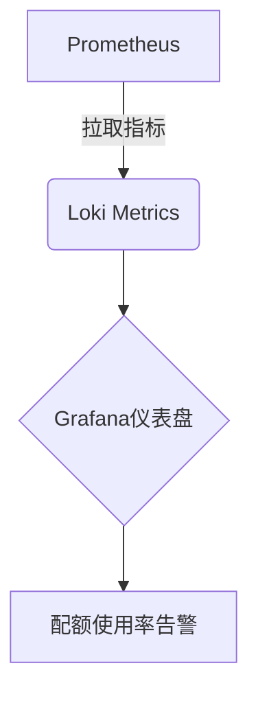

# 租户配额管理

## 介绍

在Grafana Loki的多租户架构中，**租户配额管理**是确保不同租户公平使用系统资源的关键机制。通过配额管理，管理员可以限制每个租户的日志摄入量、存储空间或查询负载，防止单一租户过度消耗资源而影响其他租户的服务质量。本指南将介绍Loki中配额管理的核心概念、配置方法和实际案例。

---

## 配额管理基础

Loki通过以下两种方式实现配额管理：
1. **摄入限制**：控制每个租户的日志推送速率（如每秒字节数或日志条目数）。
2. **存储限制**：限制每个租户在存储中占用的总空间。

:::note
配额管理需要Loki运行在**多租户模式**下，并通过`X-Scope-OrgID`请求头标识租户。
:::

---

## 配置租户配额

### 1. 全局配额配置
在Loki的配置文件（通常是`loki.yaml`）中定义默认配额规则：

```yaml
limits_config:
  ingestion_rate_mb: 10          # 默认每秒摄入限制（MB）
  ingestion_burst_size_mb: 15    # 突发流量允许的峰值
  max_global_streams_per_tenant: 1000  # 每个租户的最大日志流数
  retention_period: 720h         # 日志保留时间（30天）
```

### 2. 租户级覆盖配置
通过`runtime_config.yaml`为特定租户设置独立限制：

```yaml
overrides:
  "tenant-a":
    ingestion_rate_mb: 50        # tenant-a获得更高配额
  "tenant-b":
    max_global_streams_per_tenant: 500
```

使用以下命令动态加载配置变更：
```bash
curl -XPOST http://localhost:3100/runtime_config?mode=diff
```

---

## 实际案例

### 场景：电商平台的多租户日志管理
假设一个电商平台有以下租户：
- `frontend`：高频但低容量的应用日志
- `payment`：低频但高安全性的交易日志

**配置方案**：
```yaml
overrides:
  "frontend":
    ingestion_rate_mb: 20
    max_global_streams_per_tenant: 2000
  "payment":
    ingestion_rate_mb: 5
    max_chunks_per_query: 100     # 严格限制查询复杂度
```

---

## 监控与告警

通过Grafana监控租户配额使用情况：
1. 使用`loki_overrides`指标查看配额配置
2. 通过`log_ingestion_rate`跟踪实际摄入量



---

## 总结

关键要点：
- 配额管理是多租户环境中资源隔离的核心手段
- 支持全局默认值和租户级覆盖配置
- 动态加载机制无需重启服务

---

## 扩展练习
1. 在测试环境中为两个租户设置不同的`ingestion_rate_mb`，使用`logcli`模拟日志推送并观察限制效果。
2. 尝试通过`/runtime_config`接口动态修改配额值。

## 附加资源
- [官方文档：Loki多租户配置](https://grafana.com/docs/loki/latest/configuration/#limits_config)
- [GitHub示例：runtime_config.yaml](https://github.com/grafana/loki/blob/main/pkg/runtime/config.example.yaml)