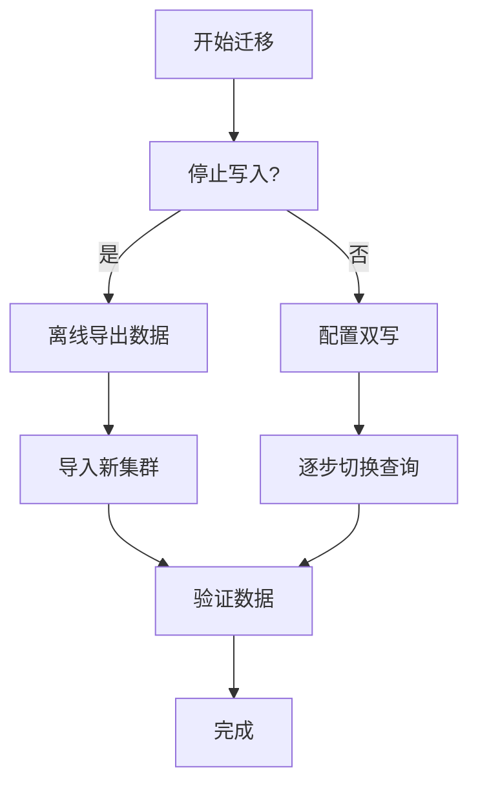

# 租户迁移策略

## 介绍

在多租户的Grafana Loki环境中，租户迁移是指将某个租户的数据和配置从一个Loki集群迁移到另一个集群的过程。这种操作可能因业务需求（如租户隔离、资源优化）或技术升级（如版本迁移）而产生。本文将介绍常见的迁移策略、操作步骤和注意事项。

:::note 关键概念
- **租户（Tenant）**：Loki中逻辑隔离的数据单元，每个租户拥有独立的日志存储和查询权限。
- **迁移策略**：包括离线迁移（停机维护）和在线迁移（最小化中断）两种主要方式。
:::

---

## 迁移策略类型

### 1. 离线迁移（冷迁移）
**适用场景**：允许短暂停机维护的迁移。

**步骤**：
1. 停止源集群的写入操作。
2. 使用 `loki-logcli` 工具导出租户数据：
   ```bash
   logcli query '{job="your-app"}' --tenant=tenant-1 --since=24h --output=jsonl > tenant-1-data.jsonl
   ```
3. 将数据导入目标集群：
   ```bash
   cat tenant-1-data.jsonl | logcli push --tenant=tenant-1 --url=http://new-loki:3100/loki/api/v1/push
   ```

:::caution 注意
离线迁移会导致该租户在迁移期间不可用，需提前通知用户。
:::

### 2. 在线迁移（热迁移）
**适用场景**：要求业务连续性的迁移。

**实现方式**：通过双写（Dual-Write）或日志代理转发实现。

**示例流程**：
1. 配置日志代理（如Fluentd）同时写入新旧集群：
   ```ruby
   <match tenant-1.**>
     @type loki
     url http://old-loki:3100
     # 新增目标集群
     <buffer>
       @type file
       path /var/log/fluent/loki
     </buffer>
   </match>

   <match tenant-1.**>
     @type loki
     url http://new-loki:3100
     # 相同配置
   </match>
   ```
2. 验证数据一致性后，切换查询流量到新集群。

---

## 实际案例：跨集群租户迁移

**场景**：公司A需要将 `tenant-2` 从旧集群（v2.4）迁移到新集群（v2.8）以利用新特性。

**操作步骤**：
1. **准备阶段**：
   - 在新集群创建相同的租户配置：
     ```yaml
     # new-loki-config.yaml
     auth_enabled: true
     multitenancy_enabled: true
     ```
2. **数据迁移**：
   - 使用 `loki-migrate` 工具批量转移数据：
     ```bash
     loki-migrate --source-address=http://old-loki:3100 \
                  --target-address=http://new-loki:3100 \
                  --tenant-id=tenant-2 \
                  --time-range=2023-01-01T00:00:00Z,2023-06-01T00:00:00Z
     ```
3. **验证阶段**：
   - 对比新旧集群的日志条目数：
     ```bash
     logcli series --tenant=tenant-2 --count | grep "total streams"
     ```

---

## 数据一致性验证

迁移后必须验证以下内容：
1. **日志完整性**：确保时间范围内的所有日志已迁移。
2. **标签一致性**：检查标签（如 `job`, `instance`）是否保留原结构。
3. **查询性能**：在新集群执行典型查询，对比响应时间。



---

## 总结与练习

**总结**：
- 离线迁移简单但影响业务，适合小型租户。
- 在线迁移复杂度高，但能实现无缝过渡。
- 始终验证数据完整性和查询功能。

**练习建议**：
1. 使用Loki的Demo模式创建两个租户，尝试离线迁移。
2. 修改Promtail配置，模拟双写场景。

**扩展阅读**：
- [Loki官方文档：多租户管理](https://grafana.com/docs/loki/latest/operations/multi-tenancy/)
- 《云原生日志系统设计》第5章（虚构书籍，仅作示例）