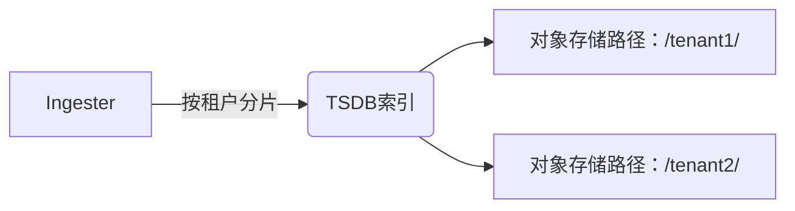

# 租户隔离机制

## 概述

在Grafana Loki中，**租户隔离机制**是多租户架构的核心实现方式。它通过唯一的`租户ID（Tenant ID）`将不同用户或团队的数据完全隔离，确保每个租户只能访问自己的日志数据。这种机制类似于公寓楼的独立单元——所有住户共享基础设施，但各自拥有私密空间。

## 工作原理

### 1. 租户ID的传递方式
Loki通过HTTP头`X-Scope-OrgID`识别租户身份。所有API请求必须携带该头部：

```bash
# 查询示例（curl）
curl -H "X-Scope-OrgID: tenant1" http://loki:3100/loki/api/v1/query?query={...}
```

### 2. 存储层隔离
Loki在存储层为每个租户创建独立的数据结构：



### 3. 查询流程隔离
查询时，Loki会先验证租户权限，再仅从该租户的存储分区读取数据：

```
1. 接收查询请求 → 2. 验证X-Scope-OrgID → 3. 定位租户存储 → 4. 返回结果
```

## 实际应用场景

### 案例：SaaS平台日志管理
某SaaS平台需要为每个客户提供独立的日志访问权限：

```yaml
# Loki 配置片段
auth_enabled: true  # 启用多租户验证

# 客户端配置示例（Grafana）
datasources:
  - name: CustomerA-Logs
    jsonData:
      httpHeaderName1: "X-Scope-OrgID"
      httpHeaderValue1: "customer-a"
```

:::tip 最佳实践
- 租户ID建议使用UUID或反向域名格式（如`com.company.team`）
- 通过代理层（如Nginx）自动注入租户头信息
:::

## 代码示例

### Python客户端设置租户
```python
from loki import LokiClient

client = LokiClient(
    url="http://loki:3100",
    headers={"X-Scope-OrgID": "dev-team-42"}
)

# 查询仅返回dev-team-42的日志
response = client.query('{job="api-server"}')
```

### 多租户查询对比
| 租户ID       | 查询结果                          |
|--------------|----------------------------------|
| `tenant-prod` | 仅生产环境日志                   |
| `tenant-dev`  | 仅开发环境日志                   |

## 常见问题

:::caution 注意
1. **忘记传递租户头**：返回`400 Bad Request`错误
2. **跨租户查询**：需要特殊权限配置
3. **存储配额管理**：需额外配置限制策略
:::

## 总结

租户隔离机制通过以下方式保障数据安全：
- 强制身份验证（X-Scope-OrgID）
- 物理存储隔离
- 查询时自动过滤

## 扩展学习
- 官方文档：[Multi-tenancy in Loki](https://grafana.com/docs/loki/latest/operations/multi-tenancy/)
- 实践练习：使用Docker部署多租户Loki实例
- 进阶话题：租户配额管理与跨租户联邦查询