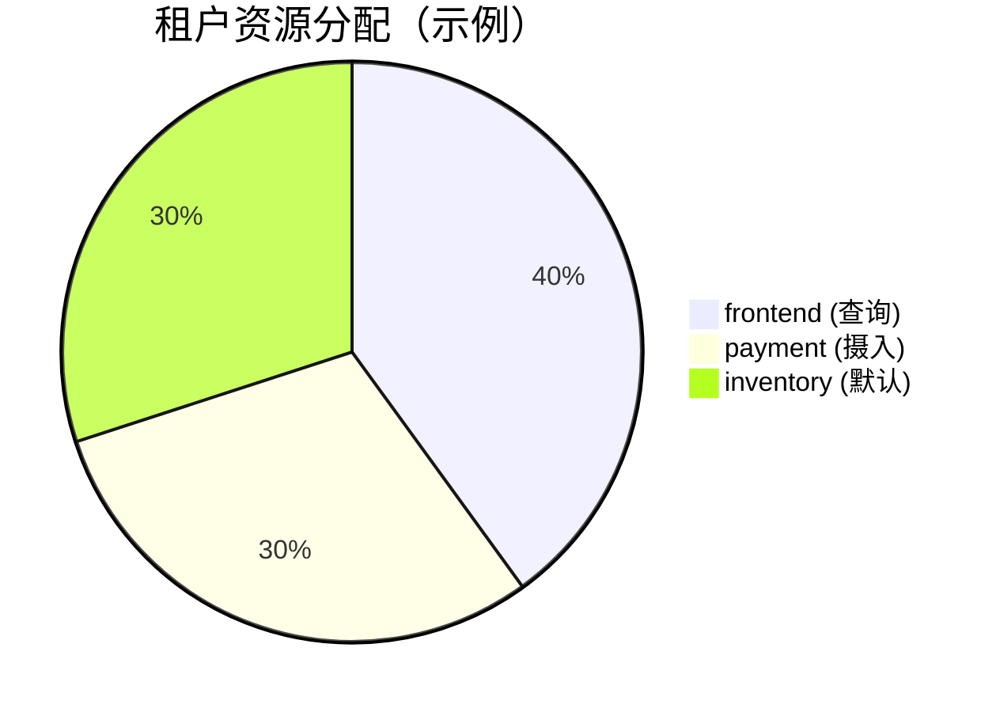

# 租户资源限制

## 介绍

在多租户的Grafana Loki环境中，租户资源限制是一个关键功能，它允许管理员为不同的租户分配特定的资源配额（如日志摄入速率、查询吞吐量或存储空间）。这确保了系统资源的公平分配，防止单个租户过度消耗资源而影响其他租户的性能。

:::note
**租户**是Loki中的一个逻辑隔离单元，每个租户的数据和配置相互独立。资源限制通常通过Loki的`limits_config`配置实现。
:::

## 核心概念

### 1. 资源限制的类型
Loki支持以下主要资源限制：
- **日志摄入速率限制**：控制每个租户每秒可推送的日志量（例如`ingestion_rate_mb`）。
- **日志流数量限制**：限制每个租户可同时活跃的日志流数量（例如`max_streams_per_user`）。
- **查询限制**：限制查询的并发数或返回的数据量（例如`max_query_parallelism`）。

### 2. 配置方式
资源限制可以通过以下方式配置：
- **全局默认值**：在`limits_config`中设置所有租户的默认限制。
- **租户覆盖**：通过`runtime_config`文件或API为特定租户覆盖默认值。

## 配置示例

### 全局默认配置
在Loki的配置文件（`loki.yaml`）中定义默认限制：

```yaml
limits_config:
  ingestion_rate_mb: 10      # 每个租户默认10MB/s的日志摄入速率
  ingestion_burst_size_mb: 15
  max_streams_per_user: 10000
  max_query_parallelism: 32
```

### 租户级覆盖
通过`runtime_config.yaml`为租户`team-a`设置更高的限制：

```yaml
overrides:
  team-a:
    ingestion_rate_mb: 50
    max_streams_per_user: 20000
```

## 实际案例

### 场景：电商平台的多租户日志管理
假设一个电商平台使用Loki收集以下租户的日志：
- `frontend`（前端服务）
- `payment`（支付服务）
- `inventory`（库存服务）

**需求**：支付服务需要更高的日志摄入配额，而前端服务的查询负载较高。

**解决方案**：
```yaml
overrides:
  payment:
    ingestion_rate_mb: 30
  frontend:
    max_query_parallelism: 64
```

## 验证限制

通过Loki的`/loki/api/v1/status/limits`端点检查租户的实际限制：

```bash
curl -H "X-Scope-OrgID: frontend" http://loki:3100/loki/api/v1/status/limits
```

输出示例：
```json
{
  "ingestion_rate_mb": 10,
  "max_query_parallelism": 64,
  "max_streams_per_user": 10000
}
```

## 可视化资源分配



## 总结

- 租户资源限制是Loki多租户功能的核心，确保资源公平性和系统稳定性。
- 通过`limits_config`设置全局默认值，并通过`overrides`为关键租户调整配额。
- 实际配置需结合业务需求，例如高吞吐量服务可能需要更高的`ingestion_rate_mb`。

## 附加资源

1. **官方文档**：[Loki多租户配置](https://grafana.com/docs/loki/latest/configuration/#limits_config)
2. **练习**：
   - 在本地Loki实例中为两个租户设置不同的`max_streams_per_user`。
   - 使用`/api/v1/push`测试日志摄入限制。