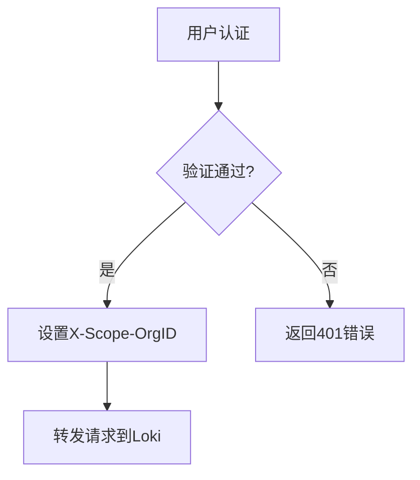

# 租户认证配置

## 介绍

多租户是Grafana Loki的核心功能之一，它允许不同团队或项目共享同一个Loki实例，同时保持数据的逻辑隔离。租户认证配置是实现这一功能的关键，它确保每个租户只能访问自己的日志数据。本文将详细介绍如何在Loki中配置租户认证，包括基本概念、配置方法和实际案例。

## 基本概念

在Loki中，租户通过唯一的租户ID（通常是一个字符串）标识。所有日志查询和写入操作都必须包含租户ID，Loki会根据这个ID对数据进行隔离。租户认证通常通过以下两种方式实现：

1. **HTTP头认证**：在请求头中添加`X-Scope-OrgID`字段
2. **代理认证**：通过认证代理（如Nginx）注入租户信息

:::note
Loki本身不提供用户身份验证功能，需要依赖外部系统（如Grafana、OAuth2代理等）来处理实际的身份验证。
:::

## 配置步骤

### 1. 启用多租户模式

首先，需要在Loki配置文件中启用多租户模式：

```yaml
auth_enabled: true
```

### 2. 配置认证方式

#### 方案A：直接使用HTTP头

客户端可以直接在请求头中指定租户ID：

```bash
curl -H "X-Scope-OrgID: tenant1" http://loki:3100/loki/api/v1/query
```

#### 方案B：通过代理认证

更安全的做法是通过反向代理注入租户信息。以下是Nginx配置示例：

```nginx
server {
    listen 3100;
    
    location / {
        set $tenant_id "tenant1"; # 根据实际认证逻辑设置
        proxy_set_header X-Scope-OrgID $tenant_id;
        proxy_pass http://loki:3100;
    }
}
```

### 3. 存储配置

确保为每个租户配置适当的存储隔离。以下是使用S3存储的示例：

```yaml
storage_config:
  aws:
    s3: s3://logs-bucket
    s3forcepathstyle: true
  boltdb_shipper:
    shared_store: s3
    active_index_directory: /var/loki/index
    cache_location: /var/loki/cache
```

## 实际案例

### 场景：多团队共享Loki实例

假设有三个开发团队需要共享一个Loki集群：

1. **团队A**（tenant-a）：处理Web应用日志
2. **团队B**（tenant-b）：处理数据库日志
3. **团队C**（tenant-c）：处理基础设施日志

配置流程：



每个团队的Grafana数据源配置示例：

```yaml
datasources:
  - name: Loki-Web
    type: loki
    url: http://loki:3100
    jsonData:
      httpHeaderName1: "X-Scope-OrgID"
      httpHeaderValue1: "tenant-a"
```

## 安全注意事项

:::warning
1. 永远不要在生产环境中允许未经认证的租户ID注入
2. 确保反向代理正确处理认证和租户映射
3. 定期审计租户访问权限
:::

## 总结

租户认证配置是Loki多租户功能的基础，通过合理配置可以：
- 实现日志数据的逻辑隔离
- 共享集群资源降低成本
- 灵活管理不同团队或项目的访问权限

## 延伸学习

1. 尝试为你的Loki实例配置至少两个租户
2. 使用Grafana为不同租户创建隔离的仪表盘
3. 探索Loki的租户配额限制功能

:::tip
在生产环境中，建议结合OpenID Connect或LDAP等标准协议来实现更完善的认证流程。
:::