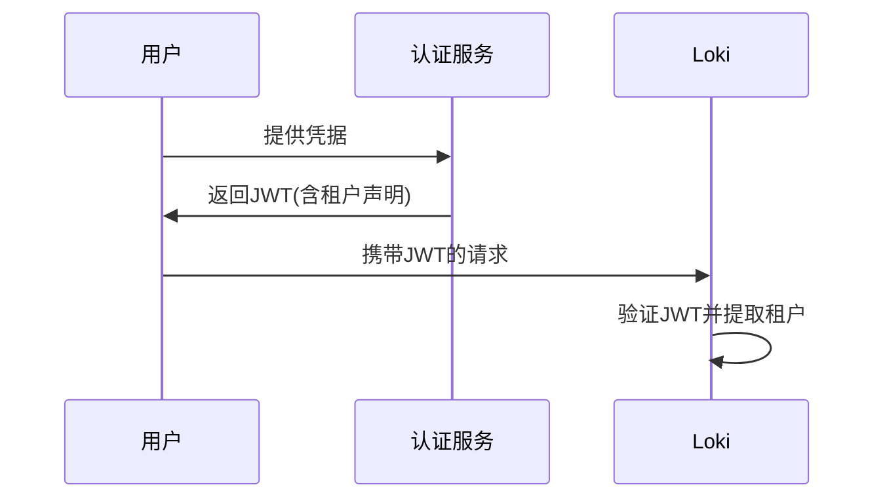

# 租户鉴权方案

## 介绍

在多租户的Grafana Loki环境中，租户鉴权(Tenant Authentication)是确保不同租户数据隔离和安全访问的核心机制。本文将介绍Loki支持的鉴权方案，帮助您理解如何为不同团队或客户配置安全的访问控制。

:::note 什么是租户？
租户是Loki中的逻辑隔离单元，每个租户拥有独立的日志存储和查询空间。典型的租户可以是企业内不同部门、不同客户或不同环境（如生产/测试）。
:::

## 基础鉴权方案

### 1. HTTP头部鉴权 (X-Scope-OrgID)

最简单的鉴权方式是通过HTTP头部传递租户标识：

```bash
# 查询示例
curl -H "X-Scope-OrgID: tenant1" http://loki:3100/loki/api/v1/query?query={...}
```

:::caution 安全提示
单纯使用X-Scope-OrgID时，必须配合反向代理进行前置认证，否则可能被恶意用户伪造
:::

### 2. 基础认证(Basic Auth) + 租户映射

结合Nginx等反向代理实现：

```nginx
# Nginx配置示例
location /loki/ {
  proxy_pass http://loki:3100/;
  proxy_set_header X-Scope-OrgID $remote_user;
  auth_basic "Loki Access";
  auth_basic_user_file /etc/nginx/.htpasswd;
}
```

## 高级鉴权方案

### 3. JWT鉴权

使用JSON Web Tokens实现更细粒度的控制：



配置示例：
```yaml
# Loki 配置片段
auth_enabled: true
auth:
  enabled: true
  tenants:
    - name: tenant1
      issuer: https://auth.example.com
      audiences:
        - loki-prod
```

### 4. OAuth2/OIDC集成

适用于企业级SSO集成：

```go
// 伪代码示例：中间件验证
func authMiddleware(next http.Handler) http.Handler {
    return http.HandlerFunc(func(w http.ResponseWriter, r *http.Request) {
        claims := verifyOIDCToken(r)
        if claims.Tenant == "" {
            http.Error(w, "Unauthorized", 401)
            return
        }
        r.Header.Set("X-Scope-OrgID", claims.Tenant)
        next.ServeHTTP(w, r)
    })
}
```

## 实际应用案例

**场景：SaaS日志平台**
- 每个客户作为独立租户
- 使用JWT鉴权，令牌由中央认证服务签发
- 租户信息嵌入JWT的`tenant`声明
- Loki配置为只接受特定发行者(Issuer)的令牌

```json
// 示例JWT payload
{
  "sub": "user123",
  "tenant": "acme-corp",
  "iss": "https://auth.your-saas.com",
  "exp": 1735689600
}
```

## 最佳实践

1. **最小权限原则**：每个租户只应访问必要的数据
2. **审计日志**：记录所有租户访问行为
3. **定期轮换**：对JWT密钥或OAuth2凭证实施轮换策略
4. **配额管理**：结合Loki的租户配额限制功能

## 总结

Grafana Loki提供了灵活的租户鉴权方案，从简单的HTTP头部到企业级的OIDC集成。选择方案时应考虑：

- 安全需求级别
- 现有认证基础设施
- 运维复杂度

:::tip 练习建议
1. 使用Docker Compose搭建测试环境，尝试不同鉴权方案
2. 编写一个简单的中间件，将JWT声明转换为X-Scope-OrgID
3. 模拟多租户场景，验证数据隔离效果
:::

## 延伸阅读

- [Loki官方多租户文档](https://grafana.com/docs/loki/latest/operations/multi-tenancy/)
- [OpenID Connect规范](https://openid.net/connect/)
- [Nginx auth_request模块](https://nginx.org/en/docs/http/ngx_http_auth_request_module.html)