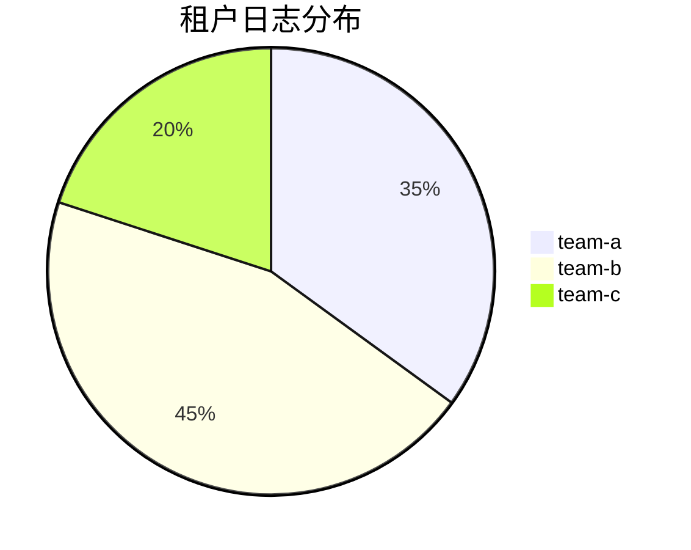

# 跨租户查询

## 介绍

在Grafana Loki的多租户架构中，每个租户（tenant）的数据默认是隔离的。但某些场景下（如审计或全局分析），需要同时查询多个租户的日志数据。**跨租户查询**（Cross-tenant Query）允许你在一次请求中检索多个租户的日志，而无需分别查询每个租户。

:::note 核心概念
- **租户隔离**：Loki默认通过`X-Scope-OrgID`头区分租户数据<br />
- **跨租户查询**：通过特殊语法`|~`或`| regex`实现多租户数据联合
:::

## 启用跨租户查询

### 前提条件
1. Loki需以多租户模式运行（`-auth.enabled=true`）<br />
2. 执行查询的用户需具有**所有目标租户的读取权限**

### 配置示例
在Loki配置文件中启用查询引擎的跨租户支持：
```yaml
query_frontend:
  multi_tenant_queries_enabled: true
```

## 查询语法

### 基础语法
使用正则表达式匹配租户ID：
```logql
{job="nginx"} |~ "error"
```
附加租户过滤（假设租户ID为`team-a`和`team-b`）：
```logql
{job="nginx"} |~ "error" --tenant="team-a|team-b"
```

### 实际案例
假设有三个租户的Nginx日志需要联合查询：


查询所有租户中`/api`路径的5xx错误：
```logql
{job="nginx", status=~"5.."} 
|~ "/api" 
--tenant="team-a|team-b|team-c"
```

## 权限控制

:::warning 重要
跨租户查询需要显式授权。以下两种方式可选：
1. **请求头授权**：`X-Scope-OrgID: team-a,team-b`（逗号分隔）<br />
2. **查询参数授权**：`--tenant="team-a|team-b"`（LogQL扩展语法）
:::

## 性能优化

1. **限制时间范围**：跨租户查询会扫描更多数据，建议缩小`time range`<br />
2. **并行查询**：Loki会自动并行处理各租户查询
3. **使用标签过滤**：先通过`label selector`减少数据量

```logql
{cluster="prod", env="us-east"} 
| json 
| latency > 500ms 
--tenant="frontend|backend"
```

## 应用场景

### 案例：全局错误追踪
当多个微服务（不同租户）需要联合排查错误时：
```logql
{service=~"payment|order|inventory"} 
|~ "NullPointerException" 
--tenant="team-payment|team-order|team-inventory" 
| rate() by (service)
```

### 输出示例
```
{service="payment"} 15
{service="order"}   8
{service="inventory"} 3
```

## 总结

关键要点：
- 跨租户查询是多租户环境下的高级功能<br />
- 需显式授权且对性能有显著影响<br />
- 适合审计、全局监控等特定场景

:::tip 练习建议
1. 在测试环境创建两个租户，分别写入不同日志<br />
2. 尝试用`--tenant`参数执行联合查询<br />
3. 对比单租户与多租户查询的响应时间差异
:::

## 延伸阅读
- [Loki官方多租户文档](https://grafana.com/docs/loki/latest/operations/multi-tenancy/)
- 《LogQL实战》第6章 - 多租户查询优化