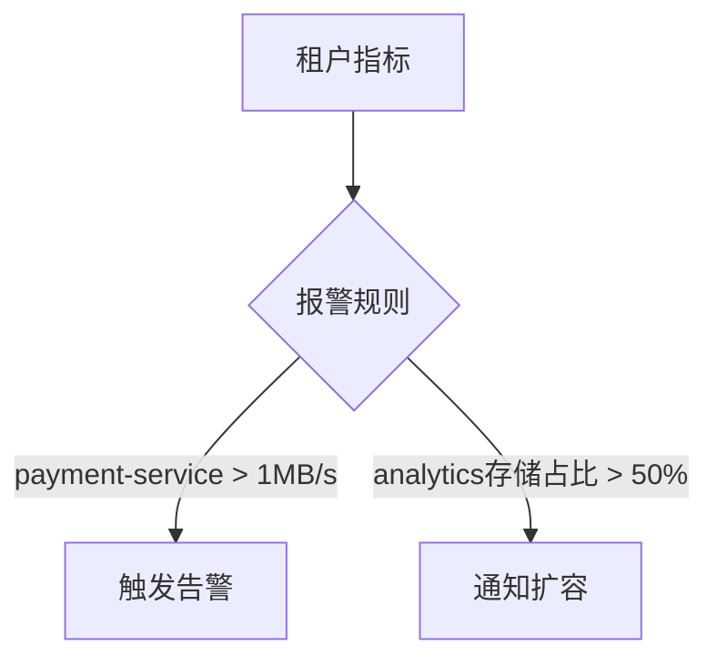

# 租户指标监控

## 介绍

在多租户环境中，**租户指标监控**是确保每个租户的资源使用情况和性能可独立观测的关键功能。Grafana Loki 通过多租户支持，允许管理员为不同租户隔离和监控日志数据及相关指标。本章将介绍如何配置和查询租户指标，并通过实际案例展示其应用场景。

---

## 租户指标的核心概念

### 1. 什么是租户指标？
租户指标是反映特定租户在Loki中活动的数据，例如：
- 日志摄入速率（`ingestion_rate`）
- 存储使用量（`chunk_storage_bytes`）
- 查询延迟（`query_latency_seconds`）

这些指标通过租户ID（`tenant_id`）标签区分，例如：
```promql
loki_ingester_ingestion_rate_bytes{tenant_id="team-a"}
```

### 2. 为什么需要监控租户指标？
- **资源隔离**：防止单一租户耗尽集群资源。
- **计费依据**：按实际使用量向租户收费。
- **故障排查**：快速定位特定租户的性能问题。

---

## 配置租户指标

### 步骤1：启用多租户模式
在Loki配置文件中启用多租户（需使用`auth_enabled: true`）：
```yaml
auth_enabled: true
multitenancy_enabled: true
```

### 步骤2：为租户生成指标
Loki自动为每个租户生成指标，例如：
- `loki_distributor_bytes_received_total`
- `loki_ingester_memory_chunks`

:::tip
使用`-tenant-id`标头区分租户请求：
```bash
curl -H "X-Scope-OrgID: team-b" http://loki:3100/metrics
```
:::

---

## 查询租户指标

### 方法1：通过Prometheus查询
直接查询带`tenant_id`标签的指标：
```promql
# 查询租户"team-a"的日志摄入速率
rate(loki_distributor_bytes_received_total{tenant_id="team-a"}[5m])
```

### 方法2：通过Grafana仪表盘
创建租户专属仪表盘，过滤条件为`$tenant_id`变量：
```json
{
  "targets": [{
    "expr": "sum by(tenant_id)(rate(loki_ingester_ingestion_rate_bytes[1m]))",
    "legendFormat": "{{tenant_id}}"
  }]
}
```

---

## 实际案例：电商平台监控

### 场景描述
一个电商平台使用Loki监控三个租户：
- `web-frontend`（前端应用日志）
- `payment-service`（支付服务日志）
- `analytics`（用户行为分析日志）

### 监控需求
1. 检测`payment-service`的日志量突增
2. 比较各租户的存储使用量

### 解决方案


对应的PromQL报警规则：
```yaml
groups:
- name: tenant-alerts
  rules:
  - alert: HighPaymentLogRate
    expr: rate(loki_distributor_bytes_received_total{tenant_id="payment-service"}[1m]) > 1e6
    labels:
      severity: critical
```

---

## 总结与练习

### 关键点总结
- 租户指标通过`tenant_id`标签实现隔离
- 需在Loki配置中显式启用多租户
- Prometheus和Grafana是主要监控工具

### 练习建议
1. 在测试环境中部署多租户Loki，发送不同租户的日志
2. 编写PromQL查询计算各租户的日志存储占比
3. 创建Grafana仪表盘展示租户资源使用TOP 3

### 扩展阅读
- [Loki官方多租户文档](https://grafana.com/docs/loki/latest/operations/multi-tenancy/)
- 《Prometheus监控实战》第7章（指标标签策略）