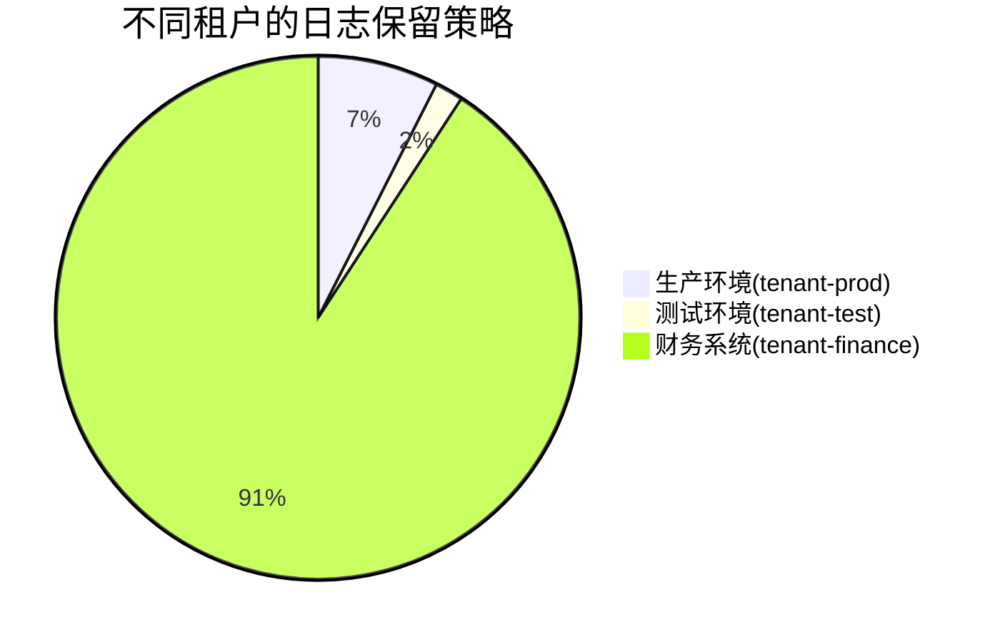

# 租户日志保留

## 介绍

在Grafana Loki的多租户架构中，**租户日志保留**是指为每个租户单独配置日志存储的保留期限。通过此功能，您可以：
- 根据业务需求为不同租户设置不同的日志保留周期
- 优化存储成本（如开发环境保留7天，生产环境保留30天）
- 满足合规性要求（如金融行业需保留日志1年以上）

## 核心概念

### 1. 保留策略生效位置
Loki的日志保留策略在以下两个层面生效：
1. **存储层**：通过`compactor`服务删除过期数据
2. **查询层**：过滤掉已过期日志的查询结果

### 2. 配置参数
关键配置参数包括：
- `retention_period`: 全局默认保留期限（如`744h`表示31天）
- `retention_stream`: 细粒度流选择器配置

## 配置示例

### 全局默认配置（loki.yaml）
```yaml
limits_config:
  retention_period: 744h  # 全局默认31天
  retention_stream:
    - selector: '{namespace="default"}'
      priority: 1
      period: 168h  # 该流仅保留7天
```

### 租户覆盖配置（CLI方式）
```bash
# 为tenant1设置60天保留期
loki -config.file=loki.yaml \
  -limits.config="retention_period=1440h" \
  -target=compactor \
  -auth.enabled=true \
  -auth.enforce-tenant=true
```

:::tip 优先级规则
租户特定配置 > 流选择器配置 > 全局默认配置
:::

## 实际案例

### 电商平台场景


配置实现：
```yaml
limits_config:
  retention_stream:
    - selector: '{tenant="tenant-prod"}'
      period: 720h
    - selector: '{tenant="tenant-test"}'
      period: 168h
    - selector: '{tenant="tenant-finance"}'
      period: 8760h
```

## 验证配置

1. 检查当前生效策略：
```bash
curl -H "X-Scope-OrgID: tenant-prod" \
  http://loki:3100/loki/api/v1/status/config
```

2. 手动触发保留操作：
```bash
loki -config.file=loki.yaml \
  -target=compactor \
  -compactor.retention-enabled=true \
  -compactor.run-once=true
```

## 常见问题

:::caution 注意
- 需要`compactor`服务正常运行才能执行保留策略
- 修改保留策略后需等待下一个压缩周期生效（默认24小时）
:::

## 总结

通过租户日志保留功能，您可以：
- 实现成本敏感的日志存储管理
- 满足不同业务部门的差异化需求
- 符合行业监管合规要求

## 扩展学习

- 官方文档：[Loki Retention](https://grafana.com/docs/loki/latest/operations/storage/retention/)
- 实践练习：尝试为开发/测试/生产环境设置不同的保留策略
- 进阶话题：研究如何与S3生命周期策略配合使用