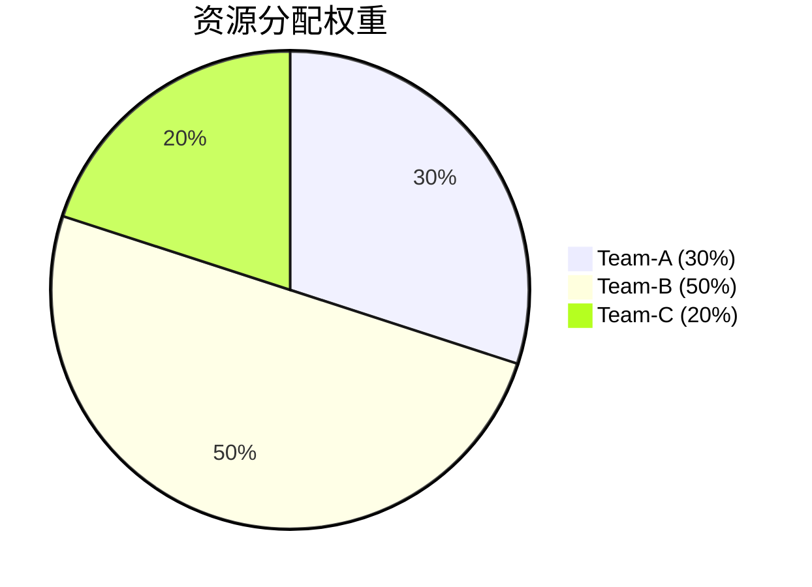

# 租户成本分析

## 介绍

在多租户的Grafana Loki环境中，**租户成本分析**是管理资源分配和优化成本的关键环节。通过分析每个租户的资源使用情况（如日志存储量、查询频率等），管理员可以：

1. 实现公平的资源分配
2. 识别资源消耗异常
3. 为不同租户制定合理的计费策略
4. 优化集群整体性能

:::note 基本概念
Loki通过`X-Scope-OrgID`请求头实现多租户隔离，每个租户的资源使用会被单独统计。
:::

## 核心指标分析

### 1. 存储用量分析

使用以下LogQL查询获取各租户的日志存储量：

```logql
sum by (organization) (
  avg_over_time(
    loki_log_store_bytes_bucket{cluster="prod"}[1d]
  )
)
```

示例输出：
```
{organization="team-a"}  1.5e+09
{organization="team-b"}  7.2e+08
```

### 2. 查询负载分析

分析各租户的查询请求量：

```logql
sum by (organization) (
  rate(loki_request_duration_seconds_count{job="loki", route=~"query.*"}[1d])
)
```

:::tip 实践建议
建议为高频查询租户配置单独的查询调度器，避免影响其他租户。
:::

## 成本分配模型

### 基于权重的分配方案



计算公式：
```
租户成本 = (总成本 × 租户资源占比) / 总资源使用量
```

## 实际案例：电商平台多团队环境

**场景**：某电商平台有三个团队使用同一个Loki集群：

1. **订单团队**：高频写入，低查询
2. **风控团队**：低写入，复杂查询
3. **客服团队**：中等写入和查询

**解决方案**：

1. 通过成本分析发现风控团队占用了70%的查询资源
2. 调整配额配置：
```yaml
limits_config:
  query_limits:
    max_query_parallelism:
      team-orders: 10
      team-risk: 30
      team-support: 15
```

## 总结与最佳实践

### 关键总结
- 定期(建议每周)运行成本分析报告
- 为关键业务租户预留资源缓冲
- 实现自动化告警机制监控异常消耗

### 扩展练习
1. 使用`loki_ingester_memory_chunks`指标分析各租户的内存使用情况
2. 尝试为不同租户配置差异化的保留策略

### 附加资源
- [官方文档：Loki多租户配置](https://grafana.com/docs/loki/latest/operations/multi-tenancy/)
- 《云原生日志系统设计》第5章-成本优化