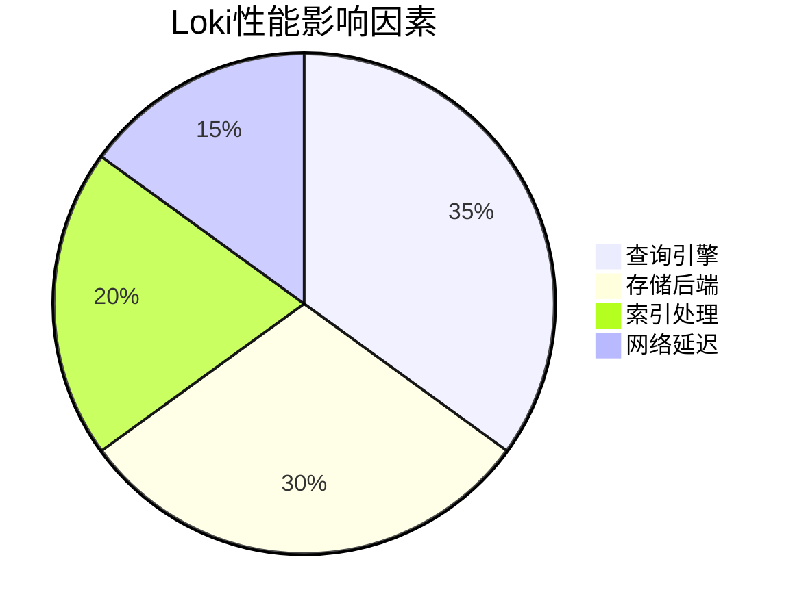

# Loki 性能概述

Grafana Loki是一个为日志聚合而设计的高效系统，其性能表现直接影响日志查询速度和资源消耗。本章将介绍Loki的核心性能特性、关键指标及基础优化思路。

## 1. Loki性能的核心组成

Loki的性能主要由以下组件决定：



### 1.1 查询性能
- **LogQL执行效率**：Loki使用LogQL查询语言，复杂查询会消耗更多资源
- **并行处理能力**：查询分解为多个分片并行执行

### 1.2 写入性能
- 受限于：
  - 日志接收速率（`/loki/api/v1/push`）
  - 存储后端写入速度
  - 索引构建开销

:::tip 实际案例
当每秒接收100MB日志时，Loki需要：
1. 压缩日志（通常5-10x压缩比）
2. 生成索引条目（约1条索引/日志块）
3. 写入对象存储（如S3）
:::

## 2. 关键性能指标

监控这些指标可快速定位瓶颈：

| 指标名称                      | 正常范围         | 监控方法       |
|---------------------------|--------------|------------|
| `ingester_bytes_received` | `<50MB/s/节点` | Prometheus |
| `query_frontend_queries`  | `<50并发/节点`   | Grafana仪表盘 |
| `chunk_store_lookups`     | `<100ms/次`   | 日志查询响应时间   |

## 3. 性能调优基础

### 3.1 配置示例：限制资源使用

```yaml
# loki-config.yaml 片段
limits_config:
  ingestion_rate_mb: 10      # 每用户写入限制
  max_concurrent_tail: 5    # 每用户实时尾随限制
query_scheduler:
  max_outstanding_requests_per_tenant: 100
```

### 3.2 查询优化技巧

避免全扫描（低效）：
```logql
{job="nginx"} |= "error"
```

使用标签过滤（高效）：
```logql
{job="nginx", level="error"}
```

:::warning 注意
未使用标签过滤的查询会导致扫描全部日志数据，在PB级存储中可能耗时数分钟！
:::

## 4. 真实场景分析

**电商大促期间的性能问题**：
1. 现象：查询超时增加300%
2. 根本原因：
   - 突发日志量增长5倍
   - 未配置速率限制
3. 解决方案：
   - 增加`ingester`节点
   - 设置`ingestion_rate_mb=15`
   - 添加查询缓存

## 5. 总结与练习

### 关键要点
- Loki性能受查询复杂度、存储后端和资源配置共同影响
- 优先使用标签过滤减少查询数据量
- 监控`ingester`和`querier`组件的资源使用

### 动手练习
1. 部署Loki时尝试不同`chunk_target_size`值（1MB vs 5MB），观察查询延迟变化
2. 对比有无标签过滤的查询响应时间差异
3. 使用`logcli`工具模拟高并发查询：
   ```bash
   logcli query '{job="myapp"}' --limit=1000 --parallel=10
   ```

### 扩展阅读
- [Loki架构设计文档](https://grafana.com/docs/loki/latest/architecture/)
- 《高性能LogQL查询模式》技术白皮书