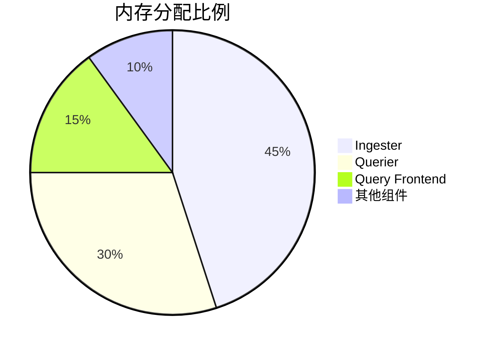

## 简介

资源需求评估是Loki性能调优的关键步骤，它帮助您合理规划集群规模，避免资源浪费或性能瓶颈。对于初学者而言，理解Loki各组件的资源消耗模式，能够为部署和生产环境扩容提供科学依据。

## 核心概念

Loki的资源需求主要取决于以下因素：

1. **日志吞吐量**：每秒摄入的日志量（MB/s）
2. **查询负载**：并发查询数量和复杂度
3. **保留策略**：日志存储时长和压缩率
4. **副本因子**：数据冗余级别

:::tip 黄金法则
生产环境应始终预留20-30%的资源余量以应对流量峰值
:::

## 评估方法

### 1. CPU需求计算

Loki的CPU消耗主要来自：
- 日志接收时的压缩处理
- 查询执行时的数据解压和过滤

基准测试公式：
```
所需vCPU数量 = (日志吞吐量 × 压缩系数) + (QPS × 查询复杂度系数)
```

示例场景：
```text
假设：
- 日志吞吐量 = 10MB/s
- 压缩系数 = 0.5 vCPU per MB/s
- 查询负载 = 50 QPS
- 查询复杂度系数 = 0.02 vCPU per query

计算：
(10 × 0.5) + (50 × 0.02) = 5 + 1 = 6 vCPU
```

### 2. 内存需求评估

Loki组件内存占用分布：



内存计算公式：
```
总内存(GB) = Ingester内存 + Querier内存 + 缓存大小
```

配置示例：
```yaml
limits_config:
  ingestion_rate_mb: 10
  ingestion_burst_size_mb: 20
  max_concurrent_tail_requests: 100
```

### 3. 存储容量规划

考虑因素：
- 原始日志大小
- 压缩率（通常3-4x）
- 副本数
- 保留期限

计算公式：
```
总存储 = 每日日志量 × 保留天数 × 副本数 / 压缩率
```

:::caution 重要提示
始终监控实际压缩率，不同日志格式的压缩效率差异可能达到30%
:::

## 实战案例

### 电商平台日志系统

**需求参数**：
- 日均日志量：500GB
- 查询QPS峰值：200
- 保留周期：30天
- 副本因子：3

**资源评估**：

1. **计算存储**：
   ```
   500GB × 30 × 3 / 3.5 ≈ 12.8TB
   ```

2. **内存配置**：
   ```yaml
   ingester:
     memory: 16GB  # 处理约20MB/s的吞吐
   querier:
     memory: 12GB  # 支持200并发查询
   ```

3. **CPU配置**：
   ```
   (20 × 0.5) + (200 × 0.02) = 10 + 4 = 14 vCPU
   ```

## 监控与调整

关键监控指标：
- `loki_ingester_memory_series`：当前内存中的日志流数量
- `loki_ingester_flush_queue_length`：等待持久化的队列长度
- `process_cpu_seconds_total`：CPU使用率

调整策略示例：
```go
// 当内存使用超过阈值时自动扩容
if memoryUsage > 0.7 {
    scaleIngesters(1.5)
}
```

## 总结

资源需求评估需要结合实际业务场景，通过本文您已经学习到：
- 计算CPU/内存/存储的基本方法
- 关键配置参数的优化方向
- 生产环境的容量规划流程

## 延伸学习

推荐练习：
1. 使用`loki-canary`工具生成测试负载
2. 通过Grafana监控资源使用曲线
3. 模拟突发流量测试自动扩展能力

参考资源：
- Loki官方文档"Scaling Guide"
- 《云原生日志系统设计》第5章
- Prometheus监控指标说明