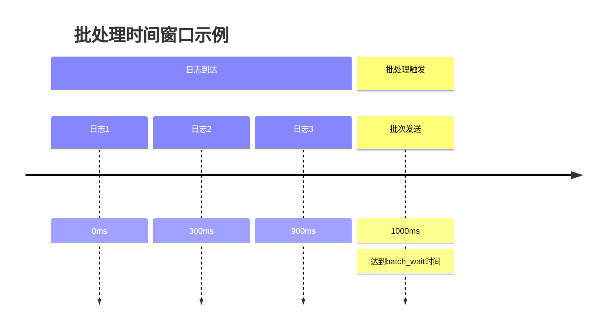

# 批处理参数调整

## 介绍

在Grafana Loki中，**批处理（Batching）**是将多个日志条目合并为单个请求发送到存储后端的过程。合理调整批处理参数可以显著提升吞吐量并降低网络开销，尤其在高负载场景下。本章将深入解析关键参数及其调优方法。

:::tip 为什么需要批处理？
- 减少网络请求次数
- 提高压缩效率
- 降低存储后端压力
:::

## 核心参数解析

### 1. `chunk_size`
控制单个日志块（chunk）的最大体积，单位为字节。Loki会将日志累积到该大小后刷新。

```yaml
# loki-config.yaml
limits_config:
  max_chunk_size: 1572864  # 1.5MB (默认值)
```

**调优建议**：
- 增大该值可提高压缩率，但会增加内存使用
- 通常设置为1-2MB，超过5MB可能影响查询性能

### 2. `batch_wait`
日志在内存中缓冲的最大等待时间（即使未达到`chunk_size`）。

```yaml
# promtail-config.yaml
clients:
  - batchwait: 1s  # 默认1秒
```

**实际案例**：


### 3. `max_batch_size`
单次批处理包含的最大日志条目数（适用于Promtail）。

```yaml
# promtail-config.yaml
clients:
  - batchsize: 102400  # 默认10万条
```

## 参数联动效应

这些参数需要协同调整：

| 参数 | 调高影响 | 调低影响 |
|------|---------|---------|
| `chunk_size` | 内存占用↑，吞吐量↑ | 网络请求↑，压缩率↓ |
| `batch_wait` | 延迟↑，批次效率↑ | 实时性↑，吞吐量↓ |
| `max_batch_size` | 内存压力↑，吞吐量↑ | 处理频率↑，开销↑ |

:::caution 警告
过大的批次可能导致：
- 内存溢出（OOM）
- 日志丢失风险（进程崩溃时）
:::

## 实战调优示例

**场景**：处理每分钟约100万条日志的K8s集群

1. 初始配置问题：
   - 频繁出现`too many outstanding requests`错误
   - 存储延迟高达5秒

2. 优化后配置：
```yaml
# promtail调优
clients:
  - batchwait: 2s      # 从1s调整为2s
    batchsize: 204800   # 从102400加倍
    timeout: 10s        # 默认5s

# loki调优
limits_config:
  max_chunk_size: 3145728  # 3MB
  max_streams_per_user: 10000
```

3. 效果对比：
   - 请求量减少62%
   - 存储延迟降至800ms

## 总结

关键调优原则：
1. 先监控再调优（观察`loki_request_duration_seconds`等指标）
2. 逐步调整单个参数
3. 在高负载时段验证配置

**推荐练习**：
1. 使用`logcli`查询当前chunk大小分布：
   ```bash
   logcli series --analyze-labels='{job="my-service"}'
   ```
2. 对比不同`batch_wait`值下的内存使用情况

## 延伸阅读
- [Loki官方性能调优指南](https://grafana.com/docs/loki/latest/operations/performance/)
- 《大规模日志系统设计》第4章
``` 

注意：实际使用时请移除最外层的