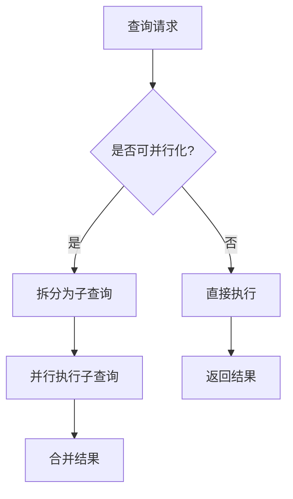

# 查询并行度调整

## 介绍

在Grafana Loki中，**查询并行度**（Query Parallelism）是指系统同时执行查询操作的能力。通过调整并行度参数，可以控制Loki同时处理的查询数量，从而平衡系统资源使用和查询响应速度。对于初学者来说，理解这一概念是优化Loki性能的重要一步。

:::tip 为什么需要调整并行度？
- 高并行度可能加快查询速度，但会增加CPU和内存压力。
- 低并行度可能稳定系统资源，但会导致查询排队延迟。
:::

## 核心参数

Loki中与查询并行度相关的主要配置参数：

```yaml
query_frontend:
  max_outstanding_requests_per_tenant: 100  # 每个租户最大排队请求数
  parallelise_shardable_queries: true       # 是否启用查询分片并行化
limits_config:
  max_query_parallelism: 16                # 最大查询并行度
```

## 工作原理

当查询到达Loki时，系统会按以下流程处理：



## 配置示例

### 调整全局并行度

在Loki的配置文件（通常为`loki.yaml`）中修改以下参数：

```yaml
limits_config:
  max_query_parallelism: 32  # 默认16，根据节点CPU核心数调整
```

### 动态覆盖配置

对于特定租户，可以通过HTTP头动态调整：

```bash
curl -H "X-Scope-OrgID: tenant1" \
     -H "X-Query-Parallelism: 8" \
     http://loki:3100/loki/api/v1/query_range
```

## 实际案例

### 场景：突增查询负载

某SaaS平台在业务高峰时段出现查询延迟，原始配置：

```yaml
max_query_parallelism: 8
```

**问题分析**：
- 监控显示CPU利用率仅60%
- 查询队列持续积压

**解决方案**：
```yaml
max_query_parallelism: 16  # 提升并行度
parallelise_shardable_queries: true  # 启用查询分片
```

**效果**：
- 查询延迟降低40%
- CPU利用率升至85%
- 无资源耗尽情况

## 最佳实践

1. **渐进调整**：每次调整后观察系统指标
2. **资源监控**：关注CPU、内存和队列深度
3. **公式参考**：
   ```
   推荐max_query_parallelism = CPU核心数 × 2
   ```
4. **特殊查询处理**：对复杂查询可单独限制并行度

:::caution 注意事项
- 过度提高并行度可能导致OOM（内存溢出）
- 在单节点部署中效果有限
- 需要配合查询超时设置使用
:::

## 总结

查询并行度调整是Loki性能调优的重要手段，关键要点：

- 通过`max_query_parallelism`控制全局并行度
- 结合`parallelise_shardable_queries`实现查询分片
- 需要根据实际硬件资源和查询模式动态调整

## 延伸学习

1. **实践练习**：
   - 部署测试环境，逐步提高并行度观察响应时间变化
   - 使用`/config`端点验证配置生效情况

2. **相关主题**：
   - 查询分片策略
   - 资源配额管理
   - 查询调度算法

3. **监控指标**：
   ```promql
   sum(rate(loki_query_frontend_queue_length[1m])) by (instance)
   ```