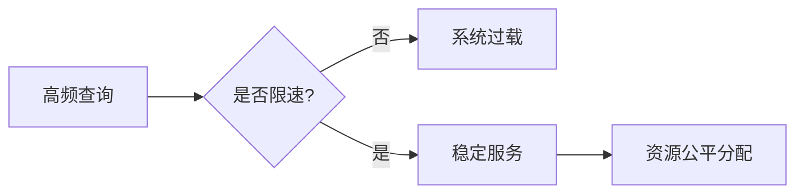

# 查询限速配置

## 介绍

在Grafana Loki中，查询限速（Query Rate Limiting）是一种保护机制，用于限制用户或客户端发送的查询请求频率。通过合理配置查询限速，可以防止系统因突发的高频查询而过载，确保服务的稳定性和公平性。本指南将详细介绍如何配置查询限速，并通过实际案例展示其应用场景。

## 为什么需要查询限速？

Loki作为一个日志聚合系统，可能会面临大量查询请求。如果没有限速机制：
- 单个用户的高频查询可能耗尽系统资源，影响其他用户。
- 突发流量可能导致服务响应变慢甚至崩溃。
- 难以保证资源的公平分配。

## 基本配置

Loki通过`limits_config`配置块实现查询限速。以下是关键参数：

```yaml
limits_config:
  max_query_parallelism: 128      # 最大并行查询数
  query_timeout: "5m"            # 查询超时时间
  max_entries_limit_per_query: 5000  # 单次查询返回的最大日志条目数
  split_queries_by_interval: "1h"    # 查询按时间分片的最小间隔
```

## 租户级限速

Loki支持多租户模式，可以为不同租户设置独立的限速规则：

```yaml
overrides:
  "tenant1":
    max_query_parallelism: 64
    max_query_rate: 10
  "tenant2":
    max_query_parallelism: 32
    max_query_rate: 5
```

## 实际案例

### 场景：防止异常查询
某团队发现夜间总出现Loki响应变慢，经排查是某个定时任务频繁查询全部日志。通过添加租户级限速：

```yaml
overrides:
  "batch-job-tenant":
    max_query_rate: 1  # 每秒最多1次查询
    max_query_parallelism: 2
```

问题解决后，系统负载回归正常。

## 验证配置

通过`/loki/api/v1/status/config`端点可以验证生效的限速规则：

```bash
curl http://localhost:3100/loki/api/v1/status/config
```

## 性能影响评估



:::tip 最佳实践
1. 生产环境务必启用查询限速
2. 根据业务需求逐步调整阈值
3. 为不同优先级的租户设置不同限制
:::

## 总结

查询限速是Loki性能调优的重要组成部分。通过本文您已经学习到：
- 限速的基本原理和配置方法
- 租户级限速的实现
- 实际问题的解决案例

## 延伸学习

1. 官方文档：[Loki Rate Limiting](https://grafana.com/docs/loki/latest/configuration/#limits_config)
2. 练习：在测试环境模拟高负载查询，观察限速效果
3. 进阶：结合Prometheus监控查询速率指标