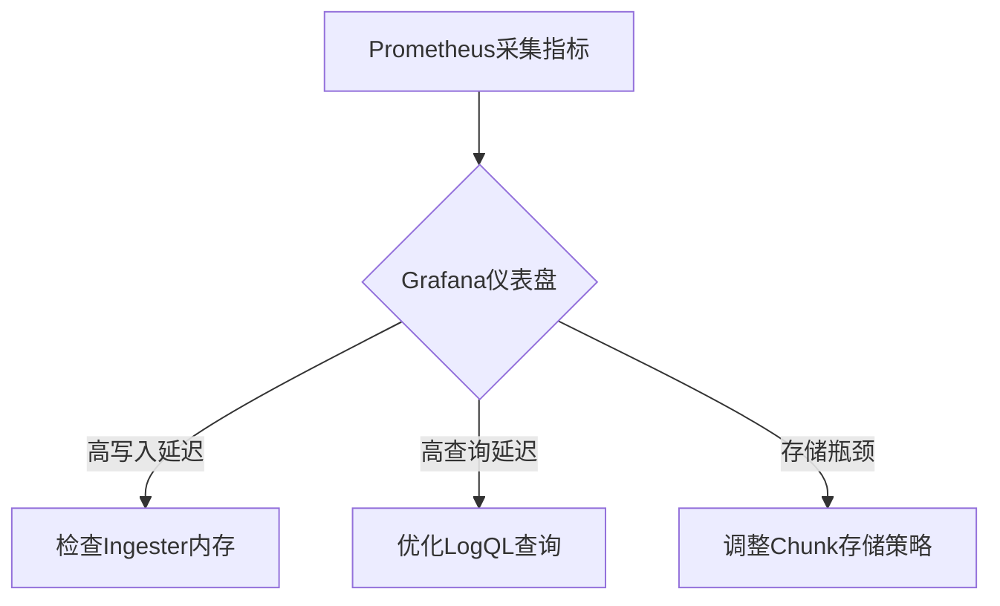

# 性能监控指标

## 简介

性能监控是Grafana Loki运维中的核心环节。通过监控关键指标，您可以快速发现瓶颈、优化资源分配并提升查询效率。本文将介绍Loki的核心性能指标、监控方法及实际调优案例。

---

## 核心监控指标分类

### 1. 写入性能指标
- **ingester_appended_lines_total**  
  每秒写入的日志行数，反映数据摄入吞吐量。
- **ingester_memory_chunks**  
  Ingester内存中的Chunk数量，过高可能导致OOM。
- **distributor_bytes_received_total**  
  接收的原始日志字节数，用于评估网络负载。

### 2. 查询性能指标
- **querier_load_bytes_total**  
  查询时加载的数据量，直接影响查询延迟。
- **query_range_duration_seconds**  
  范围查询耗时，超过1秒需警惕。
- **logs_queried_bytes_total**  
  实际扫描的日志数据量，与查询效率强相关。

### 3. 存储层指标
- **chunk_store_chunks_fetched_total**  
  从存储后端获取的Chunk数量。
- **chunk_store_chunks_downloaded_bytes_total**  
  从对象存储下载的数据量，影响查询成本。

---

## 指标采集实战

### 通过Prometheus采集Loki指标
```yaml
# prometheus.yml 配置示例
scrape_configs:
  - job_name: 'loki'
    static_configs:
      - targets: ['loki:3100']  # Loki 服务地址
```

### 关键查询示例
```promql
# 计算每秒日志摄入速率
sum(rate(ingester_appended_lines_total[1m]))

# 检测高延迟查询（>2秒）
histogram_quantile(0.99, sum(rate(query_range_duration_seconds_bucket[5m])) by (le))
```

---

## 实际案例：查询优化

**场景**：用户报告日志查询延迟高达8秒。

**诊断步骤**：
1. 发现 `query_range_duration_seconds` P99值为7.8秒
2. 关联指标显示 `logs_queried_bytes_total` 达500MB/查询
3. 确认查询未使用有效标签过滤：
   ```logql
   {job="nginx"} |~ "error"  # 未使用时间范围限定
   ```

**优化方案**：
```logql
{job="nginx"} |= "error" | __range__=15m  # 添加时间范围+精确匹配
```
优化后查询延迟降至400ms。

---

## 可视化监控



---

## 总结与练习

### 关键总结
- 监控写入/查询/存储三类指标
- 使用PromQL建立基线性能基准
- 结合LogQL优化减少数据扫描量

### 练习建议
1. 部署Loki时启用 `--metrics.enabled=true`
2. 创建一个Grafana仪表盘包含：
   - 摄入速率面板
   - 查询延迟热力图
   - 存储层吞吐量统计

### 扩展阅读
- [Loki官方监控文档](https://grafana.com/docs/loki/latest/operations/monitoring/)
- 《Prometheus监控实战》第七章
``` 

注意：实际使用时请移除代码块外的