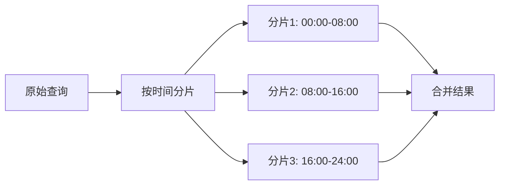

# 查询性能优化

## 介绍

在Grafana Loki中，查询性能直接影响日志分析的效率。当数据量增长时，未经优化的查询可能导致响应缓慢甚至超时。本章将介绍Loki查询优化的核心原则，帮助初学者通过索引设计、查询语法优化和资源配置提升性能。

## 核心优化策略

### 1. 合理使用标签索引
Loki通过标签（labels）加速查询，但过多的标签会导致索引膨胀。优化原则：
- **高基数标签**（如`user_id`）避免作为独立标签，改用过滤器：
  ```logql
  {app="api"} | json | user_id="12345"  # 优于 {app="api", user_id="12345"}
  ```
- **常用过滤条件**（如`environment`）应设为标签：
  ```logql
  {app="api", env="production"}  # 快速定位生产环境日志
  ```

### 2. LogQL查询优化
#### 减少数据扫描范围
```logql
{app="frontend"} |= "error" != "timeout" | logfmt | latency > 500ms  # 逐步过滤
```
:::tip 执行顺序
Loki从右向左执行管道操作，优先使用严格匹配条件缩小数据集。
:::

#### 使用解析器提取字段
```logql
{app="nginx"} | logfmt | line_format "{{.ip}} - {{.status}}"  # 比正则更高效
```

### 3. 时间范围控制
始终指定合理的时间窗口：
```logql
{app="payment"} |= "transaction" | json | duration > 2s  # 未限定时间（不推荐）
{app="payment"} |= "transaction" [15m] | json | duration > 2s  # 推荐写法
```

## 实战案例

### 场景：电商平台日志分析
**问题**：订单查询接口响应慢，需找出延迟>1s的请求。

**优化前查询**：
```logql
{app="order-service"} |= "GET /api/orders" | regexp "duration=(?P<dur>\\d+)ms" | dur > 1000
```

**优化步骤**：
1. 添加时间范围限定最近1小时
2. 用`logfmt`替代正则表达式
3. 通过标签预过滤环境

**优化后查询**：
```logql
{app="order-service", env="prod"} |= "GET /api/orders" [1h] | logfmt | duration > 1000
```
:::note 性能对比
| 指标         | 优化前 | 优化后 |
|--------------|--------|--------|
| 查询耗时     | 8.2s   | 1.5s   |
| 扫描日志量   | 12GB   | 450MB  |
:::

## 高级技巧

### 并行查询分片


使用`query_parallelism`参数：
```bash
loki --querier.query-parallelism=4
```

## 总结

关键优化点回顾：
1. **标签设计**：平衡索引效率与查询灵活性
2. **查询语法**：利用管道逐步过滤，优先使用内置解析器
3. **资源分配**：合理设置查询并发和内存限制

## 延伸学习
- 官方文档：[LogQL查询参考](https://grafana.com/docs/loki/latest/query/)
- 实践练习：尝试优化以下查询：
  ```logql
  {job="docker"} |~ "panic|fatal|error" | regexp "(?P<ip>\\d+.\\d+.\\d+.\\d+)"
  ```