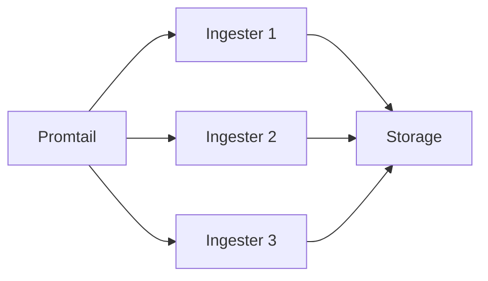

# 写入性能优化

## 介绍

Grafana Loki是一个高效的日志聚合系统，但在高负载场景下，写入性能可能成为瓶颈。本章将介绍如何通过配置调整、批处理策略和存储优化等技术提升Loki的写入吞吐量，同时保持系统的稳定性。

:::note
性能调优通常需要在资源使用率和响应速度之间找到平衡点。建议在测试环境中验证所有更改。
:::

## 核心优化策略

### 1. 批处理与压缩

Loki通过批处理日志条目减少写入操作次数。关键配置参数：

```yaml
limits_config:
  ingestion_rate_mb: 16  # 每用户每秒最大摄入量(MB)
  ingestion_burst_size_mb: 32  # 突发流量允许的最大值
ingester:
  chunk_idle_period: 30m  # 块空闲时间后刷新
  max_chunk_age: 1h       # 块最大存活时间
```

:::tip
适当增加 `ingestion_burst_size_mb` 可以吸收流量高峰，但需确保有足够内存。
:::

### 2. 并行写入优化

通过增加ingester实例实现水平扩展：



配置示例：
```yaml
ingester:
  lifecycler:
    num_tokens: 512  # 每个ingester的哈希环token数
    replication_factor: 3
```

### 3. 存储层优化

#### 使用高性能存储后端
```yaml
storage_config:
  boltdb_shipper:
    active_index_directory: /loki/index
    cache_location: /loki/cache
  filesystem:
    directory: /loki/chunks
```

#### 调整块大小
```yaml
schema_config:
  configs:
    - from: 2020-10-24
      store: boltdb-shipper
      object_store: filesystem
      schema: v11
      index:
        prefix: index_
        period: 24h  # 索引文件周期
```

## 实战案例

### 场景：处理突发日志流量

**问题**：应用部署期间日志量激增10倍，导致Loki写入延迟高。

**解决方案**：
1. 临时提高批处理缓冲区：
   ```yaml
   ingester:
     chunk_block_size: 262144  # 256KB → 1MB
     chunk_target_size: 1048576
   ```
2. 增加Promtail发送批次：
   ```yaml
   clients:
     - url: http://loki:3100/loki/api/v1/push
       batchwait: 1s → 5s  # 增加批次等待时间
       batchsize: 1024 → 4096  # 增加批次大小
   ```

## 监控与调优

关键监控指标：
- `loki_ingester_memory_chunks` (内存中的块数量)
- `loki_ingester_chunk_utilization` (块填充率)
- `loki_request_duration_seconds` (写入延迟)

使用以下Record Rule检测问题：
```yaml
groups:
  - name: loki-writing-alerts
    rules:
      - record: job:loki_high_rejection_rate
        expr: rate(loki_ingester_samples_rejected_total[1m]) > 0
```

## 总结

优化Loki写入性能的关键点：
1. 合理配置批处理参数平衡延迟与吞吐
2. 通过水平扩展ingester处理高负载
3. 选择匹配业务特点的存储配置
4. 建立完善的监控体系

## 扩展学习

推荐练习：
1. 使用`logcli`工具压力测试：
   ```bash
   logcli bench --url=http://loki:3100 --size=100KB --count=1000
   ```
2. 比较不同`chunk_target_size`下的内存使用情况

官方资源：
- [Loki性能调优文档](https://grafana.com/docs/loki/latest/operations/performance/)
- [生产环境部署指南](https://grafana.com/docs/loki/latest/installation/production/)