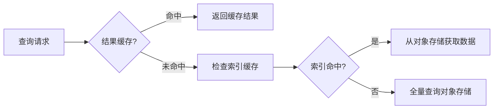

# 缓存策略配置

## 介绍

缓存是提升Grafana Loki查询性能的核心机制之一。通过缓存索引和查询结果，Loki可以显著减少对后端存储的访问压力，降低查询延迟。本文将介绍Loki支持的缓存类型、配置方法以及实际应用场景。

:::note 缓存类型
Loki主要支持两种缓存：
1. **索引缓存**：加速日志元数据查询
2. **查询结果缓存**：存储重复查询的结果
:::

## 基础配置

### 1. 索引缓存配置

在Loki的配置文件(`loki.yaml`)中添加以下片段启用索引缓存：

```yaml
schema_config:
  configs:
    - from: 2020-10-24
      store: boltdb-shipper
      object_store: s3
      schema: v11
      index:
        prefix: loki_index_
        period: 24h

storage_config:
  boltdb_shipper:
    active_index_directory: /loki/index
    cache_location: /loki/cache/boltdb-cache
    shared_store: s3
```

关键参数说明：
- `cache_location`：指定本地缓存存储路径
- `cache_ttl`：缓存有效期（默认24h）

### 2. 查询结果缓存

启用Memcached作为查询结果缓存：

```yaml
query_range:
  results_cache:
    cache:
      memcached:
        batch_size: 100
        parallelism: 100
      memcached_client:
        host: memcached.loki.svc.cluster.local
        service: memcached
        timeout: 500ms
```

## 缓存策略详解

### 缓存失效策略

Loki采用**TTL（Time-To-Live）**机制管理缓存有效期。当配置如下时：

```yaml
storage_config:
  index_cache_validity: 12h
  chunk_cache_validity: 6h
```

:::tip 最佳实践
- 高频查询场景：设置较长TTL（如24h）
- 数据更新频繁：缩短TTL（如1h）
:::

### 多级缓存示例



## 实战案例

### 场景：电商日志分析

**需求**：黑色星期五期间快速查询支付错误日志

**解决方案**：
1. 预热关键查询：
```bash
# 预先执行高频查询
logcli query '{app="payment", level="error"}' --limit=5000 --since=1h
```

2. 调整缓存配置：
```yaml
query_range:
  max_retries: 3
  cache_results: true
  parallelise_shardable_queries: true
```

3. 监控缓存命中率：
```promql
sum(rate(loki_cache_request_duration_seconds_count{status="hit"}[1m])) 
/ 
sum(rate(loki_cache_request_duration_seconds_count[1m]))
```

## 常见问题

:::caution 缓存不一致
当修改索引配置后，需要手动清除缓存：
```bash
rm -rf /loki/cache/boltdb-cache/*
```
:::

## 总结

关键要点：
- 索引缓存适合元数据频繁查询场景
- 查询缓存对重复查询效果显著
- 合理设置TTL平衡实时性和性能

## 延伸学习

推荐练习：
1. 对比启用缓存前后的查询延迟变化
2. 使用`logcli`工具测试缓存命中情况
3. 通过Prometheus监控`loki_cache_*`指标

官方资源：
- [Loki缓存官方文档](https://grafana.com/docs/loki/latest/configuration/#cache_config)
- [缓存性能调优指南](https://grafana.com/docs/loki/latest/operations/storage/)