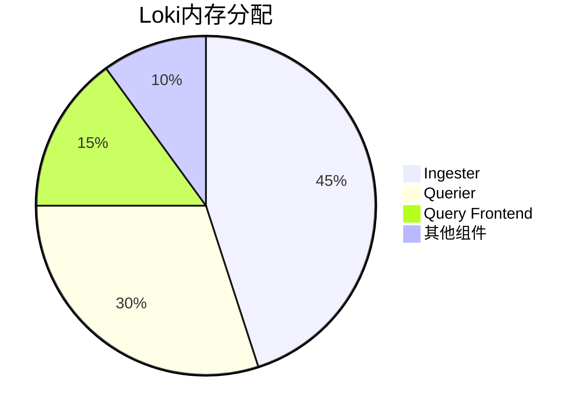

# 内存使用优化

## 介绍

Grafana Loki是一个高效的日志聚合系统，但在处理大规模日志时，内存使用可能成为性能瓶颈。本章将介绍如何通过配置调整和最佳实践来优化Loki的内存使用，适合初学者理解并实践。

内存优化主要涉及以下几个方面：
- 合理配置Loki组件的内存限制
- 优化查询性能以减少内存占用
- 调整日志摄取(ingestion)参数
- 监控内存使用情况

## Loki 内存组成

Loki的内存使用主要来自以下几个组件：



## 关键优化策略

### 1. Ingester内存优化

Ingester是Loki中内存消耗最大的组件，负责接收和存储日志数据。

#### 优化配置示例：

```yaml
ingester:
  lifecycler:
    ring:
      replication_factor: 3
  chunk_idle_period: 30m
  max_transfer_retries: 0
  chunk_target_size: 1572864  # 1.5MB
```

:::tip
降低 `replication_factor` 可以减少内存使用，但会影响数据冗余性。根据业务需求平衡。
:::

### 2. 查询内存限制

为查询设置内存限制可以防止单个查询耗尽系统资源：

```yaml
limits_config:
  max_query_parallelism: 128
  query_timeout: 30s
  max_entries_limit_per_query: 5000
```

### 3. 日志流(chunk)配置优化

调整日志流(chunk)的大小和保留时间可以显著影响内存使用：

```yaml
schema_config:
  configs:
    - from: 2020-10-24
      store: boltdb-shipper
      object_store: s3
      schema: v11
      index:
        prefix: index_
        period: 24h
```

:::caution
过小的 `chunk_target_size` 会导致更多的内存开销，而过大会增加查询延迟。
:::

## 实际案例

### 案例1：高流量日志处理

某电商网站在大促期间日志量激增，Loki内存使用达到上限。通过以下调整解决了问题：

1. 将 `chunk_idle_period` 从默认的1h降低到30分钟
2. 增加 `ingester.max_chunk_age` 到2h
3. 为查询添加了 `max_query_length` 限制

调整后内存使用降低了35%，同时保持了查询性能。

### 案例2：长期日志分析

一个需要分析30天日志的团队遇到了查询超时问题。解决方案：

```yaml
limits_config:
  max_query_length: 720h  # 30天
  query_timeout: 10m
  split_queries_by_interval: 24h
```

## 监控与调优

使用Grafana监控Loki内存使用情况，重点关注以下指标：

- `process_resident_memory_bytes`: 进程实际内存使用
- `go_memstats_alloc_bytes`: 当前内存分配量
- `loki_ingester_memory_chunks`: Ingester中的chunk数量

## 总结

优化Loki内存使用的关键点：
1. 合理配置Ingester参数
2. 为查询操作设置适当限制
3. 根据业务需求调整chunk大小和保留策略
4. 持续监控内存使用情况

## 附加资源

1. [Loki官方文档 - 性能调优](https://grafana.com/docs/loki/latest/operations/tuning/)
2. 练习：使用不同 `chunk_target_size` 配置测试内存使用变化
3. 使用 `logcli` 工具分析查询内存消耗