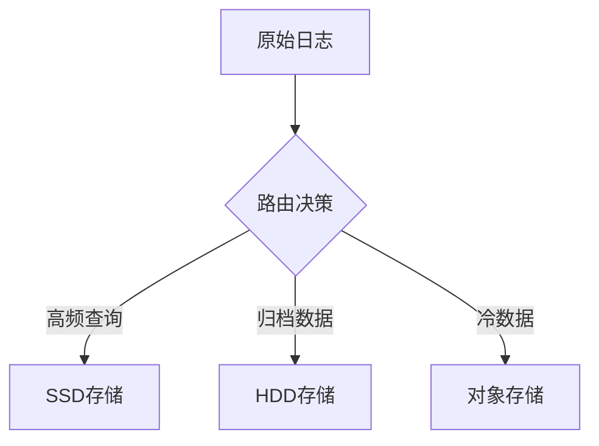

# 磁盘IO优化

## 介绍

磁盘IO（输入/输出）是影响Grafana Loki性能的关键因素之一。当Loki处理大量日志数据时，频繁的磁盘读写可能导致性能瓶颈。本章将介绍如何通过优化磁盘IO来提升Loki的查询和写入效率，涵盖配置调整、存储策略以及实际案例。

:::note
磁盘IO优化不仅适用于Loki，也是其他数据库和存储系统的通用优化手段。
:::

## 为什么需要优化磁盘IO？

Loki的核心功能是高效存储和查询日志数据。如果磁盘IO成为瓶颈，可能会出现以下问题：
- 写入速度变慢，导致日志堆积
- 查询响应时间延长
- 系统资源利用率不均衡
- 整体性能下降

## 优化策略

### 1. 选择合适的存储后端

Loki支持多种存储后端，每种后端的IO特性不同：

| 存储类型 | IO特点 | 适用场景 |
|---------|--------|----------|
| 本地SSD | 低延迟，高IOPS | 小规模部署，测试环境 |
| 云存储(如S3/GCS) | 高吞吐，较低IOPS | 大规模生产环境 |
| NVMe | 极低延迟，超高IOPS | 高性能需求场景 |

### 2. 调整Loki配置

修改Loki的配置文件可以显著影响磁盘IO性能：

```yaml
storage_config:
  boltdb_shipper:
    active_index_directory: /data/loki/index
    cache_location: /data/loki/boltdb-cache
    shared_store: s3
  filesystem:
    directory: /data/loki/chunks
```

关键参数说明：
- `active_index_directory`: 将活跃索引放在高性能存储上
- `cache_location`: 使用本地缓存减少远程存储访问
- `shared_store`: 使用对象存储减轻本地磁盘压力

### 3. 分区策略优化



通过数据分层存储，将热点数据放在高性能存储上：

```yaml
compactor:
  working_directory: /data/loki/compactor
  shared_store: s3
  retention_enabled: true
  retention_delete_delay: 2h
```

### 4. 文件系统优化

选择合适的文件系统并调整挂载参数：

```bash
# 使用XFS文件系统并启用写屏障
mkfs.xfs /dev/sdb
mount -o defaults,noatime,nodiratime,barrier=0 /dev/sdb /data/loki
```

:::tip
XFS通常比EXT4更适合Loki的写入模式，特别是大量小文件场景。
:::

## 实际案例

### 案例1：电商平台日志系统

**问题**：
- 每天产生TB级日志
- 查询响应时间超过5秒
- 磁盘IO等待时间占比超过60%

**解决方案**：
1. 将索引存储在本地NVMe SSD上
2. 日志块存储在S3兼容存储
3. 启用压缩和保留策略

**结果**：
- 查询时间降至1秒内
- 磁盘IO等待降至15%
- 存储成本降低40%

### 案例2：SaaS监控系统

**问题**：
- 高峰期写入延迟显著增加
- 日志丢失率上升

**解决方案**：
1. 实现写入批处理和缓冲
2. 增加本地SSD缓存层
3. 调整文件系统预读参数

```yaml
ingester:
  chunk_idle_period: 30m
  chunk_block_size: 262144
  max_transfer_retries: 3
```

## 性能监控

使用以下命令监控磁盘IO性能：

```bash
# 查看实时IO状态
iostat -x 1

# 检查磁盘队列长度
cat /proc/diskstats

# Loki 特定指标
logcli query_range --query='rate(loki_disk_io_seconds_total[5m])'
```

## 总结

磁盘IO优化是提升Loki性能的重要手段，关键点包括：
- 根据工作负载选择合适的存储类型
- 合理配置Loki的分层存储策略
- 优化文件系统和操作系统参数
- 持续监控和调整

## 延伸学习

1. 阅读Loki官方文档中关于存储配置的部分
2. 实验不同文件系统对性能的影响
3. 尝试在测试环境模拟高负载场景并优化配置
4. 学习Linux系统级的IO调度器调优

:::warning
在进行生产环境变更前，务必在测试环境验证配置变更的效果。
:::