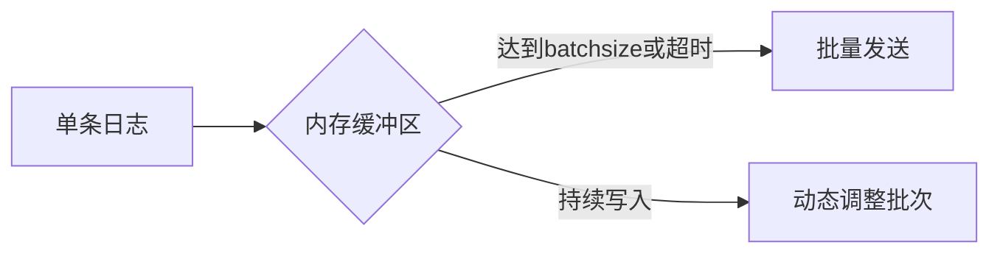

# 网络传输优化

## 介绍

在分布式日志系统Grafana Loki中，网络传输是影响整体性能的关键因素之一。高效的网络传输能显著降低延迟、减少带宽消耗，并提升系统吞吐量。本文将介绍Loki网络传输优化的核心方法，包括数据压缩、批处理、协议选择等，帮助初学者构建高性能的日志管道。

---

## 核心优化技术

### 1. 数据压缩

Loki支持在传输前对日志数据进行压缩，减少网络带宽占用。默认使用gzip压缩，可通过客户端配置调整：

```yaml
# promtail-config.yaml
clients:
  - url: http://loki:3100/loki/api/v1/push
    batchwait: 1s
    batchsize: 1048576  # 1MB
    compression: gzip   # 可选 snappy/zstd
```

:::tip
压缩算法选择建议：
- `gzip`：平衡压缩率与CPU消耗
- `snappy`：低延迟场景首选
- `zstd`：高压缩比需求场景
:::

### 2. 批处理策略

合理的批处理能减少网络请求次数：



关键参数示例：
```yaml
# 优化批处理配置
batchwait: 2s              # 等待时间窗口
batchsize: 2097152         # 2MB批次大小
maxretries: 5              # 网络重试次数
minbackoff: 100ms          # 最小重试间隔
```

### 3. 协议优化

#### HTTP/2优势
- 多路复用减少连接开销
- 头部压缩降低传输量
- 二进制帧提升解析效率

启用方法（客户端示例）：
```go
// Loki客户端配置
config := loki.Config{
    URL:       "https://loki.example.com",
    Transport: &http2.Transport{},
}
```

---

## 实战案例

### 场景：电商日志采集优化
**问题**：黑色星期五期间日志量激增，出现网络拥堵和推送延迟。

**解决方案**：
1. 将压缩算法从gzip切换到zstd，压缩率提升30%
2. 调整批处理参数：
   ```yaml
   batchwait: 500ms        # 缩短等待时间
   batchsize: 4194304      # 增大到4MB
   ```
3. 启用HTTP/2并配置连接池：
   ```yaml
   client:
     backoff_config:
       max_period: 5s
     timeout: 10s
   ```

**效果**：
- 网络带宽消耗降低45%
- 日志延迟从15s降至3s以内

---

## 总结

关键优化要点：
1. 根据场景选择合适的压缩算法
2. 动态调整批处理参数平衡实时性与吞吐量
3. 利用现代协议特性减少传输开销

:::warning 注意事项
- 压缩级别越高，CPU消耗越大
- 批次过大可能导致内存压力
- 生产环境建议进行压力测试
:::

## 扩展学习

推荐练习：
1. 使用`wrk`工具测试不同压缩算法的吞吐量差异
2. 通过Grafana监控`loki_distributor_bytes_received_total`指标观察优化效果

进一步阅读：
- [Loki官方文档：客户端配置](https://grafana.com/docs/loki/latest/clients/)
- 《HTTP/2 in Action》网络协议优化指南