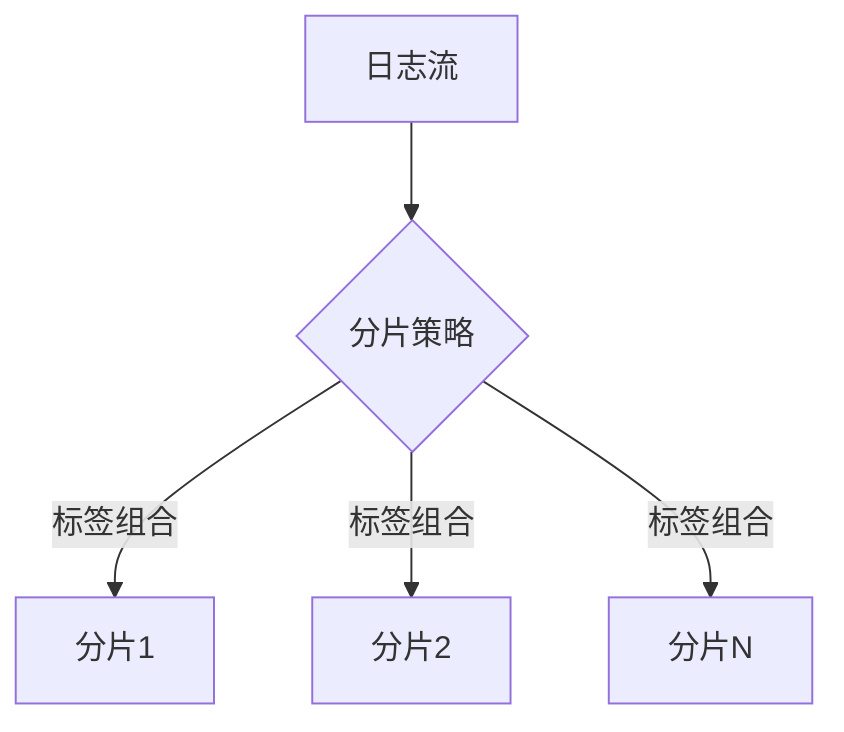

# 分片策略优化

## 介绍

分片（Sharding）是Grafana Loki中提升日志并行处理能力的关键机制。通过将日志流拆分为多个分片，Loki可以将负载分散到不同的处理节点上，从而显著提高查询和写入性能。本指南将详细介绍分片策略的原理、配置方法以及优化技巧。

:::note 什么是分片？
分片是将数据水平分割为多个独立部分的过程，每个部分（分片）可以独立存储和处理。在Loki中，分片通常基于日志流的标签（labels）进行。
:::

## 分片基础原理

Loki的分片策略主要通过以下两个配置参数控制：

1. **`-distributor.shard-by-all-labels`**  
   如果设置为`true`，分片会考虑所有标签的组合；若为`false`则仅使用`__name__`标签。

2. **`-ingester.ring.replication-factor`**  
   决定每个分片的副本数，影响数据冗余和可用性。



## 配置示例

### 基础配置
在Loki的配置文件（`loki-config.yaml`）中调整分片参数：

```yaml
distributor:
  shard_by_all_labels: true  # 使用所有标签分片
ingester:
  ring:
    replication_factor: 3     # 每个分片3个副本
```

### 动态分片
通过LogQL的`_stream`过滤器实现查询时分片：

```sql
{cluster="prod"} |= "error" !~ "timeout" | _stream="shard-1"  # 查询特定分片
```

## 优化策略

### 1. 标签基数控制
高基数标签（如`user_id`）会导致分片数量爆炸，应避免：

:::caution 错误示范
```yaml
labels:
  - "user_id"  # 可能导致数百万分片！
```
:::

### 2. 分片大小均衡
通过`-ingester.max-chunk-age`调整分片时间窗口，避免大小不均：

```yaml
ingester:
  max_chunk_age: 1h  # 1小时后强制分片
```

### 3. 查询并行化
在Grafana面板中启用分片查询加速：

```sql
sum by (shard) (rate({job="nginx"} [5m]))  # 自动并行查询
```

## 实战案例

**场景**：某电商平台在促销期间日志量增长10倍，原有单分片架构出现查询超时。

**解决方案**：
1. 按`region`和`app`标签分片
2. 设置`replication_factor=2`保证可用性
3. 通过LogQL分片查询：

```sql
{app="checkout", region="us-east-1"} |= "high_latency"  # 定向查询特定分片
```

**效果**：
- 查询延迟从15s降至2s
- 写入吞吐量提升8倍

## 总结

关键优化点：
- 选择低基数标签作为分片依据
- 监控分片均衡性（使用`loki_shard_utilization`指标）
- 结合业务场景调整副本数

## 延伸学习

1. 官方文档：[Loki Sharding](https://grafana.com/docs/loki/latest/operations/storage/sharding/)
2. 练习：在测试集群中比较`shard_by_all_labels=true/false`的查询性能差异
3. 工具：使用`logcli`分析分片分布：  
   ```bash
   logcli series --analyze-labels '{job="nginx"}'
   ```