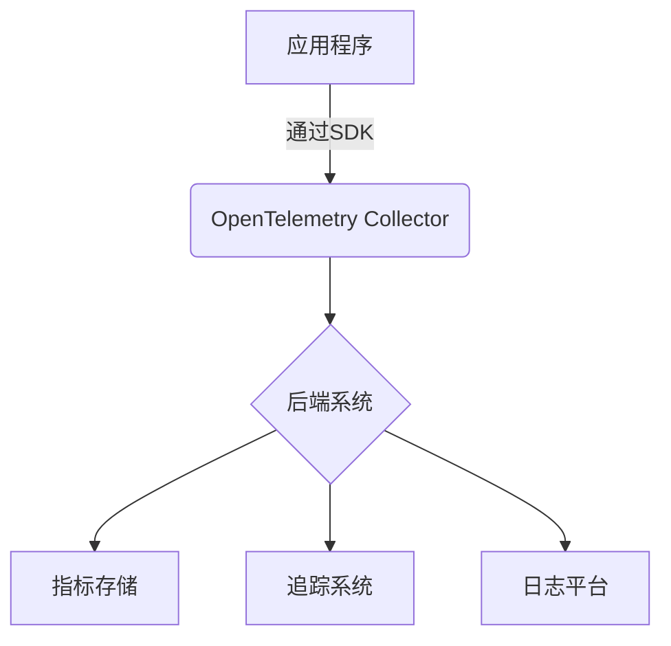
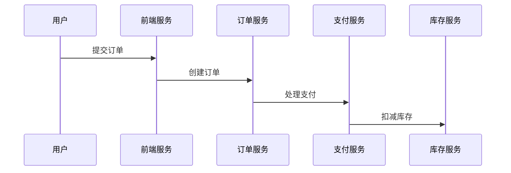

# OpenTelemetry 简介

## 什么是OpenTelemetry？

OpenTelemetry（简称OTel）是一个**开源的可观测性框架**，用于生成、收集和管理**遥测数据**（Telemetry Data），包括指标（Metrics）、日志（Logs）和追踪（Traces）。它是CNCF（云原生计算基金会）的毕业项目，由OpenTracing和OpenCensus合并而来，现已成为**云原生可观测性的行业标准**。

:::note 关键特性
- **跨语言支持**：提供Java、Python、Go等10+语言的SDK
- **厂商中立**：数据可导出到任何兼容的后端（如Prometheus、Jaeger）
- **统一API**：标准化了指标、日志和追踪的数据模型
:::

## 核心组件



1. **API层**：定义数据采集的接口规范
2. **SDK**：语言特定的实现，处理数据生成和导出
3. **Collector**：接收、处理并转发遥测数据

## 基础代码示例

以下是一个Python的简单追踪示例：

```python
from opentelemetry import trace
from opentelemetry.sdk.trace import TracerProvider
from opentelemetry.sdk.trace.export import ConsoleSpanExporter, SimpleSpanProcessor

# 1. 设置TracerProvider
trace.set_tracer_provider(TracerProvider())

# 2. 创建控制台导出器
exporter = ConsoleSpanExporter()
span_processor = SimpleSpanProcessor(exporter)
trace.get_tracer_provider().add_span_processor(span_processor)

# 3. 创建追踪器
tracer = trace.get_tracer(__name__)

# 4. 创建span
with tracer.start_as_current_span("hello_world"):
    print("Hello, OpenTelemetry!")
```

**输出示例**：
```
{
    "name": "hello_world",
    "context": {"trace_id": "7bba9f33312b3dbb8b2c2c62bb7ade2a",...},
    "start_time": "2023-07-01T12:00:00Z",
    "end_time": "2023-07-01T12:00:00.000100Z"
}
```

## 实际应用场景

### 微服务追踪
在电商系统中追踪用户请求的完整路径：


### 性能监控
通过指标识别API延迟问题：
```python
from opentelemetry import metrics

meter = metrics.get_meter(__name__)
request_counter = meter.create_counter(
    "api.requests.count",
    description="Total API requests"
)

# 在请求处理中
request_counter.add(1, {"endpoint": "/checkout", "status": 200})
```

## 为什么选择OpenTelemetry？

1. **避免供应商锁定**：数据格式与后端解耦
2. **降低维护成本**：统一替换多种监控工具
3. **完整的可观测性**：覆盖指标/日志/追踪三大支柱

:::tip 最佳实践
- 生产环境建议使用OTel Collector作为中介
- 优先使用自动 instrumentation 减少代码侵入
- 合理设置采样率避免数据过载
:::

## 总结

OpenTelemetry通过提供标准化的数据采集方式，解决了多云环境下可观测数据的碎片化问题。其核心价值在于：

- 统一了原先分散的监控数据标准
- 降低了跨团队协作的复杂度
- 提供了灵活的扩展架构

## 延伸学习

1. [官方文档](https://opentelemetry.io/docs/)
2. 动手实验：尝试将OTel数据导出到Jaeger
3. 进阶话题：Context Propagation（上下文传播）机制