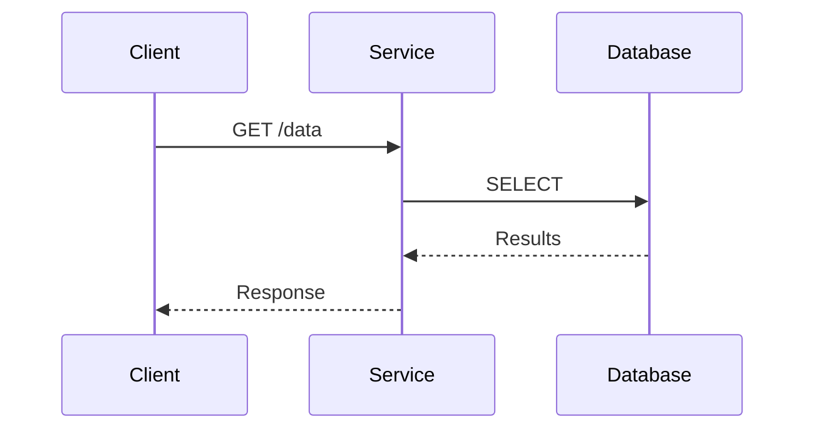

# OpenTelemetry 架构

## 介绍

OpenTelemetry（简称OTel）是一个**开源的可观测性框架**，用于生成、收集和导出遥测数据（指标、日志、跟踪）。它的架构设计允许开发者以统一的方式监控分布式系统的行为。本文将逐步拆解其核心组件，并通过实际案例帮助你理解其工作原理。

## 核心组件

OpenTelemetry架构主要由以下模块组成：

```mermaid
graph TD
    A[应用程序] -->|生成数据| B[OpenTelemetry SDK]
    B -->|导出数据| C[OpenTelemetry Collector]
    C -->|传输数据| D[后端系统<br/>(如Prometheus, Jaeger)]
```

### 1. API层
- 提供与语言无关的接口规范（如`TracerProvider`、`Meter`）
- 示例（Python API）：
  ```python
  from opentelemetry import trace
  tracer = trace.get_tracer("my.tracer")
  ```

### 2. SDK层
- 实现API的具体功能，包含：
  - 采样策略（Sampling）
  - 处理器（Processors）
  - 导出器（Exporters）
- 配置示例：
  ```go
  exporter := otlptracehttp.NewExporter()
  tp := trace.NewTracerProvider(trace.WithBatcher(exporter))
  ```

### 3. Collector（收集器）
作为独立进程运行的核心数据处理枢纽：

:::note 关键功能
- **接收**：支持多种协议（OTLP/gRPC/HTTP）
- **处理**：过滤、转换、丰富数据
- **导出**：转发到监控后端
:::

## 数据流示例

假设一个HTTP服务调用数据库：



对应的跟踪数据会包含：
1. 父Span（HTTP请求）
2. 子Span（数据库查询）

## 实际案例：电商应用监控

场景：跟踪用户下单流程

```python
# 创建跟踪
with tracer.start_as_current_span("checkout"):
    # 记录支付步骤
    with tracer.start_as_current_span("process_payment"):
        payment_result = process_payment()
    
    # 记录库存更新
    with tracer.start_as_current_span("update_inventory"):
        update_inventory()
```

导出的跟踪数据可能包含：
- 总耗时
- 各子步骤状态
- 错误信息（如有）

## 总结

OpenTelemetry架构通过分层设计实现了：
1. **标准化**：统一各类遥测数据
2. **灵活性**：支持多种语言和后端
3. **扩展性**：Collector可插件化扩展

:::tip 练习建议
1. 使用`opentelemetry-auto-instrumentation`自动检测一个Python Flask应用
2. 配置Collector将数据导出到Jaeger
3. 尝试添加自定义属性到Span中
:::

## 延伸阅读
- [官方架构文档](https://opentelemetry.io/docs/concepts/architecture/)
- 《Distributed Tracing in Practice》书籍
- OpenTelemetry Collector的`transform`处理器用法