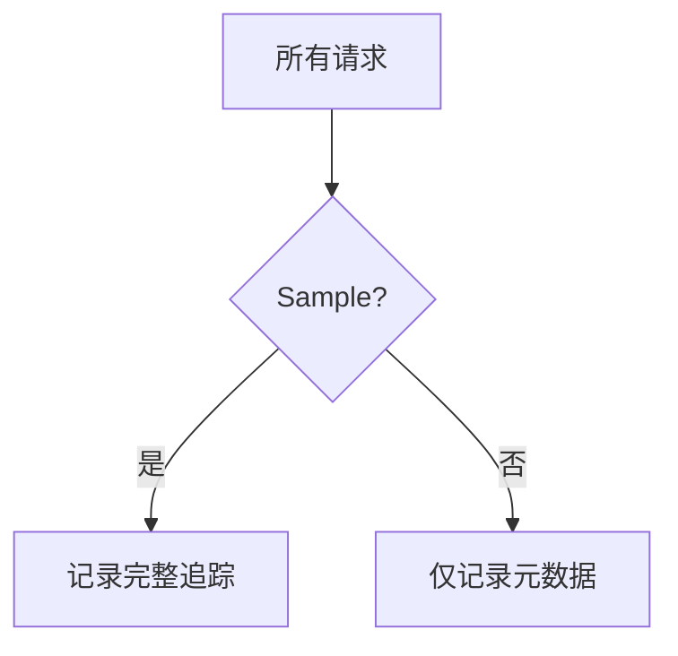

## 介绍

OpenTelemetry是一套用于生成、收集和导出遥测数据（指标、日志、追踪）的工具和API。配置是使用OpenTelemetry的核心步骤，它决定了数据如何被采集、处理并发送到后端系统。本文将带你逐步完成典型配置场景。

:::note 关键概念
- **SDK配置**：设置采样率、处理器、导出器等核心组件
- **自动/手动埋点**：决定是否自动捕获框架数据或手动编码
- **上下文传播**：配置跨服务边界的追踪信息传递方式
:::

## 基础配置步骤

### 1. 安装依赖

首先安装必要的npm包：

```bash
npm install @opentelemetry/api @opentelemetry/sdk-node \
           @opentelemetry/auto-instrumentations-node \
           @opentelemetry/exporter-trace-otlp-http
```

### 2. 初始化SDK

创建`tracing.js`配置文件：

```javascript
const { NodeSDK } = require('@opentelemetry/sdk-node');
const { getNodeAutoInstrumentations } = require('@opentelemetry/auto-instrumentations-node');
const { OTLPTraceExporter } = require('@opentelemetry/exporter-trace-otlp-http');

const sdk = new NodeSDK({
  traceExporter: new OTLPTraceExporter({
    url: 'http://collector:4318/v1/traces'
  }),
  instrumentations: [getNodeAutoInstrumentations()],
  resource: new Resource({
    'service.name': 'my-service',
    'version': '1.0.0'
  })
});

sdk.start();
```

### 3. 环境变量配置

OpenTelemetry支持通过环境变量覆盖配置：

```bash
export OTEL_SERVICE_NAME=my-service
export OTEL_EXPORTER_OTLP_ENDPOINT=http://collector:4318
export OTEL_TRACES_SAMPLER=parentbased_traceidratio
export OTEL_TRACES_SAMPLER_ARG=0.5
```

## 核心配置选项

### 采样策略



常用采样器配置示例：

```javascript
const { TraceIdRatioBasedSampler } = require('@opentelemetry/core');

const sampler = new TraceIdRatioBasedSampler(0.5); // 50%采样率
```

### 处理器与导出器

典型处理管道：

```javascript
const { BatchSpanProcessor } = require('@opentelemetry/sdk-trace-base');

const processor = new BatchSpanProcessor(
  new OTLPTraceExporter(),
  { maxQueueSize: 1000, scheduledDelayMillis: 5000 }
);
```

:::tip 性能建议
批量处理器(BatchSpanProcessor)比简单处理器(SimpleSpanProcessor)更适合生产环境，能减少网络请求次数
:::

## 实际案例：电商应用配置

假设我们需要监控一个Node.js电商服务：

```javascript
const { diag, DiagConsoleLogger, DiagLogLevel } = require('@opentelemetry/api');
const { PrometheusExporter } = require('@opentelemetry/exporter-prometheus');

// 启用调试日志
diag.setLogger(new DiagConsoleLogger(), DiagLogLevel.DEBUG);

// 添加指标导出
const metricExporter = new PrometheusExporter({ port: 9464 });

const sdk = new NodeSDK({
  traceExporter,
  metricExporter,
  instrumentations: [
    getNodeAutoInstrumentations({
      '@opentelemetry/instrumentation-http': {
        ignoreIncomingPaths: ['/healthz']
      }
    })
  ]
});
```

## 常见问题解决

:::caution 配置陷阱
1. **采样率过高**：在生产环境设置100%采样可能导致性能问题
2. **缺少资源属性**：未设置service.name会导致数据难以识别
3. **网络超时**：导出器未配置超时可能导致线程阻塞
:::

## 总结与扩展

通过合理配置OpenTelemetry，你可以：
- 控制数据采集范围和频率
- 优化监控系统性能影响
- 定制数据导出目的地

**延伸学习**：
- 尝试将数据导出到Jaeger或Zipkin
- 实验不同的采样策略对系统性能的影响
- 研究如何自定义资源属性