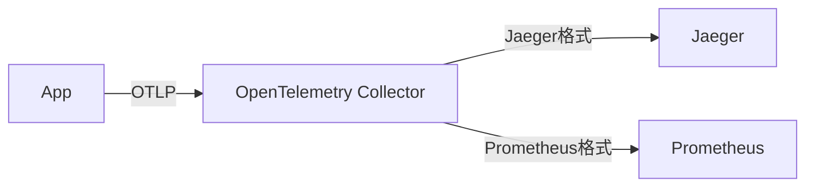

## 介绍

在现代分布式系统中，可观测性（Observability）是确保系统稳定性和性能的关键。OpenTelemetry作为新一代的可观测性框架，与其他工具（如Prometheus、Jaeger等）有何不同？本文将对比它们的核心特性、适用场景和优缺点，帮助初学者做出合理的技术选型。

---

## 什么是可观测性工具？

可观测性工具通过**指标（Metrics）、日志（Logs）和追踪（Traces）**三类数据帮助开发者监控系统状态。常见的工具包括：

- **OpenTelemetry**：统一的标准化框架，支持多语言和多后端导出。
- **Prometheus**：专注于指标收集和告警的时间序列数据库。
- **Jaeger/Zipkin**：分布式追踪系统，用于分析请求链路。
- **ELK Stack**：基于日志的分析工具链（Elasticsearch、Logstash、Kibana）。

---

## 核心对比

### 1. OpenTelemetry vs Prometheus

| 特性                | OpenTelemetry                          | Prometheus                          |
|---------------------|---------------------------------------|-------------------------------------|
| **数据类型**        | 指标、日志、追踪                      | 仅指标                              |
| **数据采集**        | 支持自动/手动埋点，多语言SDK          | 依赖Pull模型（通过HTTP端点抓取）    |
| **存储与可视化**    | 需配合后端（如Prometheus、Jaeger）    | 内置TSDB和简单UI                   |
| **适用场景**        | 全链路观测、多云环境                  | 单集群监控、Kubernetes生态          |

:::tip
若需**全栈观测**（如追踪+指标），可将OpenTelemetry数据导出到Prometheus：
```go
// OpenTelemetry导出Prometheus示例
exporter, err := prometheus.NewExporter(prometheus.Config{})
provider := metric.NewMeterProvider(metric.WithReader(exporter))
```
:::

---

### 2. OpenTelemetry vs Jaeger/Zipkin

| 特性                | OpenTelemetry                  | Jaeger                          |
|---------------------|--------------------------------|---------------------------------|
| **追踪功能**        | 标准化API，支持多后端导出      | 专用追踪系统，UI功能更丰富      |
| **语言支持**        | 10+语言SDK                    | 主要支持Java/Go/Python         |
| **部署复杂度**      | 需搭配Collector和存储后端      | 独立服务，一键部署             |



:::note
OpenTelemetry可作为**数据采集层**，将追踪数据转发到Jaeger进行可视化。
:::

---

### 3. OpenTelemetry vs ELK Stack

| 特性                | OpenTelemetry          | ELK Stack               |
|---------------------|------------------------|-------------------------|
| **日志处理**        | 结构化日志导出          | 全文搜索+聚合分析       |
| **资源开销**        | 低（轻量级SDK）        | 高（需Elasticsearch集群）|
| **扩展性**          | 通过插件支持多种输出    | 依赖Logstash管道        |

---

## 实际案例

### 场景：电商微服务监控
1. **需求**：监控订单服务的延迟和错误率，并追踪用户请求链路。
2. **方案**：
   - 使用OpenTelemetry收集**指标**（如请求耗时）和**追踪**（如订单创建链路）。
   - 指标导出到Prometheus告警，追踪数据发送到Jaeger分析。
3. **代码片段**：
```python
# Python示例：创建追踪和指标
from opentelemetry import trace, metrics
tracer = trace.get_tracer("order.service")
meter = metrics.get_meter("order.metrics")

with tracer.start_as_current_span("process_order"):
    meter.create_counter("orders.count").add(1)
```

---

## 总结

| 工具                | 优势                                      | 局限性                     |
|---------------------|------------------------------------------|---------------------------|
| **OpenTelemetry**   | 统一标准、多语言支持、扩展性强            | 依赖后端存储和可视化工具  |
| **Prometheus**      | 简单易用、适合K8s监控                    | 不支持追踪和日志          |
| **Jaeger**          | 强大的追踪可视化                          | 功能单一                  |

:::caution
选择工具时需考虑：
1. 是否需要**全栈观测**（指标+日志+追踪）？
2. 团队是否有能力维护复杂后端？
:::

---

## 延伸资源
1. [OpenTelemetry官方文档](https://opentelemetry.io/docs/)
2. 练习：尝试将OpenTelemetry的指标导出到Prometheus，并配置Grafana面板。