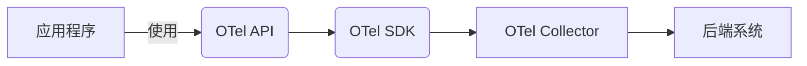
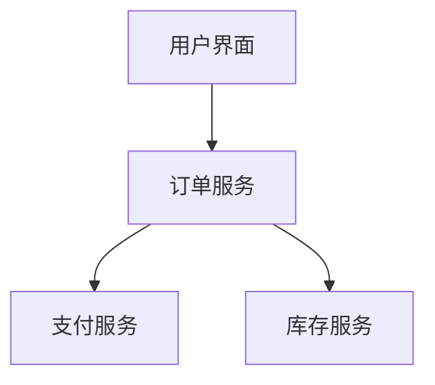

# OpenTelemetry 常见问题解答

## 介绍

OpenTelemetry（简称OTel）是一个开源的**可观测性框架**，用于生成、收集和管理**遥测数据**（指标、日志和追踪）。它已经成为云原生领域的行业标准，本指南将解答初学者最常遇到的问题。

:::tip 为什么需要OpenTelemetry？
传统监控工具往往存在供应商锁定问题，而OTel提供了与供应商无关的标准化数据收集方式。
:::

## 基础概念问答

### 1. OpenTelemetry由哪些核心组件组成？

OpenTelemetry主要包含以下组件：

- **API层**：定义如何生成遥测数据
- **SDK**：实现API并处理数据采样、处理和导出
- **收集器**（Collector）：接收、处理和导出遥测数据
- **导出器**（Exporters）：将数据发送到后端系统



### 2. 如何开始使用OpenTelemetry？

以下是一个Python的简单示例，展示如何初始化跟踪器：

```python
from opentelemetry import trace
from opentelemetry.sdk.trace import TracerProvider
from opentelemetry.sdk.trace.export import ConsoleSpanExporter, SimpleSpanProcessor

# 设置跟踪提供者
trace.set_tracer_provider(TracerProvider())

# 创建控制台导出器
exporter = ConsoleSpanExporter()
span_processor = SimpleSpanProcessor(exporter)
trace.get_tracer_provider().add_span_processor(span_processor)

# 获取跟踪器
tracer = trace.get_tracer(__name__)

# 创建span
with tracer.start_as_current_span("example-span"):
    print("Hello, OpenTelemetry!")
```

输出示例：
```
{
    "name": "example-span",
    "context": {...},
    "start_time": "2023-01-01T00:00:00Z",
    "end_time": "2023-01-01T00:00:00.123456Z"
}
```

### 3. OpenTelemetry与Prometheus有什么区别？

| 特性          | OpenTelemetry          | Prometheus            |
|---------------|------------------------|-----------------------|
| **数据模型**  | 支持多种类型遥测数据   | 主要专注于指标        |
| **采集方式**  | 推和拉模式都支持       | 主要使用拉模式        |
| **灵活性**    | 供应商中立，高度可扩展 | 主要针对PromQL生态系统|

## 实际应用场景

### 4. 如何在微服务中使用OpenTelemetry？

假设我们有一个订单处理系统：



配置分布式追踪的要点：

1. 在所有服务中初始化OTel
2. 确保传播上下文（通常通过HTTP头）
3. 使用相同的收集器端点

:::caution 注意
跨服务边界时，必须正确传播`traceparent`头，否则会创建不相关的追踪。
:::

### 5. OpenTelemetry如何处理采样？

采样策略示例（Java）：

```java
Sampler alwaysOn = Sampler.alwaysOn();
Sampler alwaysOff = Sampler.alwaysOff();
Sampler traceIdRatio = Sampler.traceIdRatioBased(0.5); // 采样50%的请求
```

常见采样策略：
- **总是采样**：开发环境适用
- **概率采样**：生产环境推荐
- **基于规则的采样**：如仅采样错误请求

## 高级问题

### 6. 如何自定义指标？

以下是一个自定义指标的Go示例：

```go
meter := global.Meter("myapp")
requestCounter := meter.NewInt64Counter(
    "requests.count",
    metric.WithDescription("Total number of requests"),
)

// 在请求处理中
requestCounter.Add(ctx, 1, []attribute.KeyValue{
    attribute.String("method", "GET"),
    attribute.Int("status", 200),
}...)
```

### 7. OpenTelemetry Collector的典型配置

`otel-collector-config.yaml`示例：

```yaml
receivers:
  otlp:
    protocols:
      grpc:
      http:

processors:
  batch:
    timeout: 10s
    send_batch_size: 1000

exporters:
  logging:
    logLevel: debug
  prometheus:
    endpoint: "0.0.0.0:8889"

service:
  pipelines:
    traces:
      receivers: [otlp]
      processors: [batch]
      exporters: [logging]
    metrics:
      receivers: [otlp]
      processors: [batch]
      exporters: [prometheus]
```

## 总结与资源

### 关键要点

- OpenTelemetry提供**标准化**的遥测数据收集
- 支持**多种语言**和**多种后端系统**
- 核心价值在于**避免供应商锁定**

### 推荐练习

1. 在本地运行一个OTel Collector
2. 为简单HTTP服务添加自动和手动检测
3. 将数据导出到Jaeger或Prometheus

### 延伸阅读

- [OpenTelemetry官方文档](https://opentelemetry.io/docs/)
- [OpenTelemetry Collector GitHub仓库](https://github.com/open-telemetry/opentelemetry-collector)
- [CNCF可观测性白皮书](https://github.com/cncf/tag-observability)

:::note 遇到问题？
欢迎在我们的社区论坛提问，初学者问题同样受欢迎！
:::