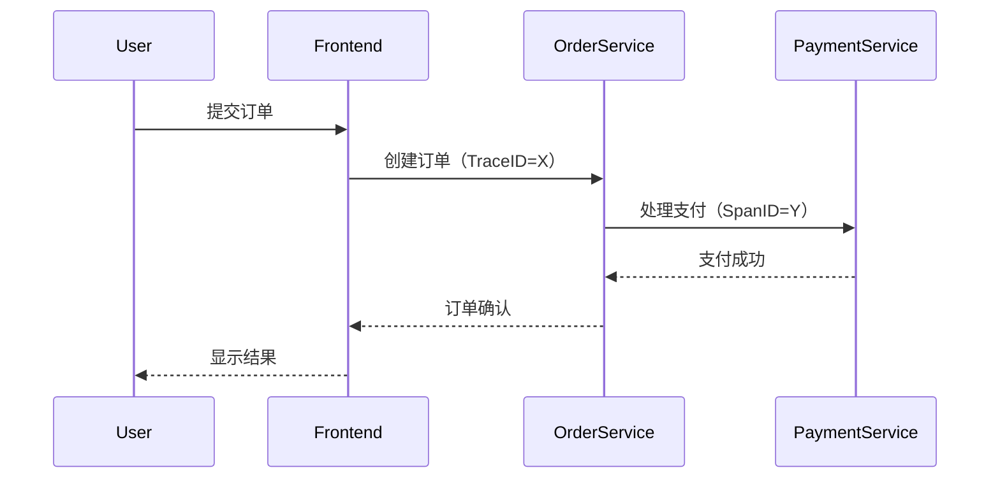

# OpenTelemetry 社区资源

OpenTelemetry（简称OTel）是一个开源的观测性框架，用于生成、收集和管理遥测数据（如追踪、指标和日志）。其活跃的社区为开发者提供了丰富的学习资源和支持渠道。本文将介绍如何利用这些资源加速你的OpenTelemetry学习之旅。

## 官方资源

### 1. 核心文档
- **官网**: [opentelemetry.io](https://opentelemetry.io/)  
  提供入门指南、概念解释和API参考，适合系统学习。
- **规范仓库**: [GitHub/specs](https://github.com/open-telemetry/opentelemetry-specification)  
  包含OpenTelemetry的技术规范，适合深入理解设计原理。

:::tip
使用官网的[交互式示例](https://opentelemetry.io/docs/demo/)快速体验OpenTelemetry的全套功能。
:::

### 2. 代码库与SDK
- **主仓库**: [GitHub/opentelemetry](https://github.com/open-telemetry)  
  包含各语言SDK（如Python、Java、Go）的实现代码。
  
示例：安装Python SDK  
```bash
pip install opentelemetry-api opentelemetry-sdk
```

### 3. 社区支持
- **Slack频道**: `#opentelemetry`（通过[CNCF Slack](https://slack.cncf.io/)加入）  
  实时提问和讨论。
- **每周会议**: [会议日历](https://github.com/open-telemetry/community#calendar)  
  参与社区决策与路线图讨论。

## 第三方资源

### 1. 教程与博客
- **OpenTelemetry官方博客**: 发布最新功能解读和案例研究。
- **第三方教程**: 如[《Distributed Tracing in Practice》](https://www.oreilly.com/library/view/distributed-tracing-in/9781492056621/)书籍。

### 2. 工具集成
- **导出器（Exporters）**: 将数据发送到Jaeger、Prometheus等后端。  
  示例：配置Jaeger导出器（Python）：
  ```python
  from opentelemetry import trace
  from opentelemetry.exporter.jaeger.thrift import JaegerExporter
  from opentelemetry.sdk.trace import TracerProvider

  trace.set_tracer_provider(TracerProvider())
  tracer = trace.get_tracer(__name__)
  jaeger_exporter = JaegerExporter(
      agent_host_name="localhost",
      agent_port=6831,
  )
  ```

### 3. 在线课程
- **Udemy/Kubernetes Academy**: 提供从入门到实战的系列课程。

## 实际案例

**场景**: 电商平台使用OpenTelemetry追踪订单流程  

通过Jaeger可视化追踪数据，可快速定位支付服务的延迟问题。

## 总结与练习

### 总结
- 官方资源适合系统学习，社区论坛解决实际问题。
- 结合第三方工具（如Jaeger）构建完整观测体系。

### 练习
1. 在本地运行OpenTelemetry Demo应用，并导出数据到Jaeger。
2. 在Slack中提出一个关于指标收集的具体问题。

### 附加资源
- [Awesome-OpenTelemetry](https://github.com/robertkrimen/awesome-opentelemetry)  
- CNCF的[OpenTelemetry专项课程](https://training.linuxfoundation.org/)