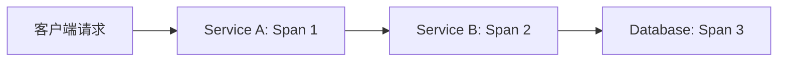
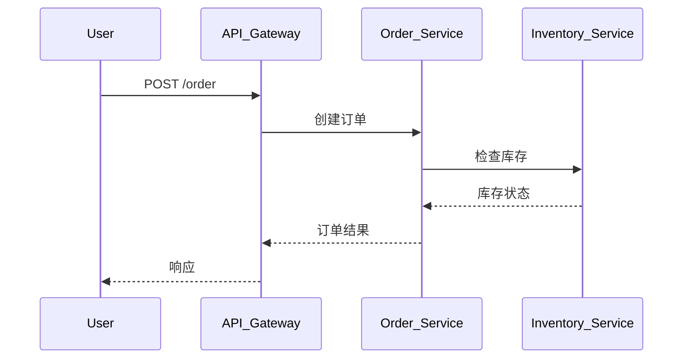

# OpenTelemetry 核心概念

## 介绍

OpenTelemetry（简称OTel）是一个**开源的可观测性框架**，用于生成、收集和管理**分布式系统**的遥测数据（如追踪、指标和日志）。它由Cloud Native Computing Foundation（CNCF）维护，是业界标准的工具集，帮助开发者监控和调试复杂的微服务架构。

:::note 为什么需要OpenTelemetry？
在分布式系统中，一个用户请求可能跨越多个服务。传统监控工具难以追踪完整的请求路径，而OpenTelemetry提供了统一的API和SDK来解决这一问题。
:::

---

## 核心组件

### 1. Tracing（追踪）
**追踪**记录了请求在系统中的完整路径（即"调用链"）。每个操作称为一个**Span**，多个Span组成一个**Trace**。



**代码示例（Python）**：
```python
from opentelemetry import trace
tracer = trace.get_tracer("my.tracer")

with tracer.start_as_current_span("parent-span") as parent:
    # 业务逻辑
    with tracer.start_as_current_span("child-span") as child:
        child.add_event("Processing started")
```

### 2. Metrics（指标）
**指标**是系统状态的定量测量（如CPU使用率、请求延迟）。OpenTelemetry支持：
- **Counter**（累加值）：如请求次数
- **Gauge**（瞬时值）：如内存使用量
- **Histogram**（分布统计）：如响应时间分布

**示例（Go）**：
```go
meter := global.Meter("my.meter")
requestCounter, _ := meter.Int64Counter("requests.total")

// 在请求处理中增加计数
requestCounter.Add(ctx, 1)
```

### 3. Logging（日志）
日志是与特定时间点相关的事件记录。OpenTelemetry将日志与Trace关联，提供上下文。

:::tip 最佳实践
使用结构化日志（如JSON格式），并包含`trace_id`以便关联追踪数据。
:::

---

## 关键概念

### 1. Context Propagation（上下文传播）
跨服务传递追踪上下文（通常通过HTTP头实现）：

```
traceparent: 00-0af7651916cd43dd8448eb211c80319c-b7ad6b7169203331-01
```

### 2. Exporters（导出器）
将数据发送到后端分析工具（如Jaeger、Prometheus）：

```yaml
# 配置Jaeger导出器（Python）
opentelemetry-exporter-jaeger \
    --service-name my-service \
    --endpoint http://jaeger:14268/api/traces
```

### 3. Resource（资源）
描述数据来源的元数据：
```python
Resource.create({
    "service.name": "payment-service",
    "service.version": "1.0.0"
})
```

---

## 实际案例：电商系统

假设用户下单时，请求经过以下服务：
1. **API网关** → 2. **订单服务** → 3. **库存服务**

OpenTelemetry会：
1. 记录每个服务的处理时间（Metrics）
2. 追踪完整调用链（Trace）
3. 关联错误日志（如库存不足）



---

## 总结

| 概念          | 作用                          | 典型应用场景         |
|---------------|-----------------------------|-------------------|
| Tracing       | 分析请求路径和延迟              | 诊断慢请求          |
| Metrics       | 监控系统健康状态                | 自动扩缩容          |
| Logging       | 记录离散事件                   | 错误分析           |

:::caution 常见误区
- 不要在生产环境使用`ConsoleExporter`（会导致性能问题）
- 避免过度采样（高流量系统需配置采样策略）
:::

---

## 扩展资源

1. [官方文档](https://opentelemetry.io/docs/)
2. 练习：部署Jaeger，导出一个包含3个Span的Trace
3. 进阶：尝试将Metrics数据导入Prometheus