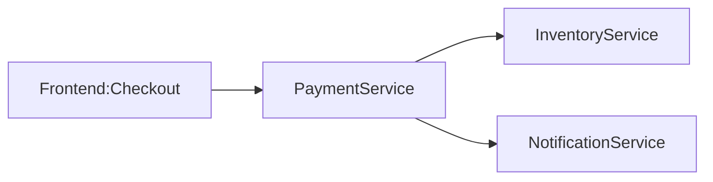
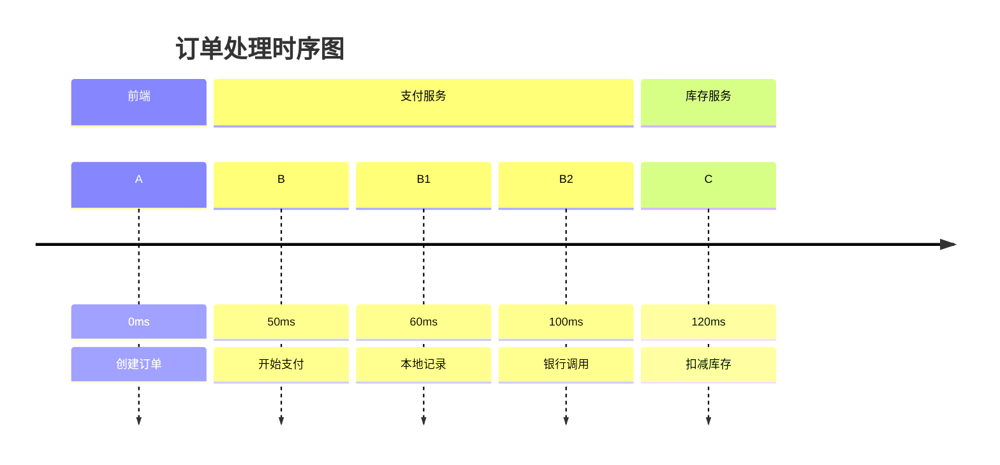

## 介绍

OpenTelemetry作为云原生可观测性标准，其术语体系是理解分布式追踪和指标监控的基础。本术语表将系统性地解释20+个核心概念，帮助初学者快速构建知识框架。

## 核心术语解析

### 1. Span（跨度）
表示分布式系统中单个操作的元数据单元，包含：
- 操作名称
- 开始/结束时间戳
- 键值对形式的属性
- 状态码（OK/Error/Unset）

```python
from opentelemetry import trace

tracer = trace.get_tracer("shop.service")
with tracer.start_as_current_span("checkout") as span:
    span.set_attribute("payment.method", "credit_card")
    # 业务逻辑...
```

:::tip 实际场景
电商订单处理流程中，一个Span可能代表：
- 支付验证
- 库存扣减
- 物流创建
:::

### 2. Trace（追踪）
由关联Span组成的有向无环图(DAG)，展示请求在系统中的完整路径：



### 3. Context Propagation（上下文传播）
跨服务传递追踪信息的机制，主要包含：
- `TraceId`：全局唯一追踪标识
- `SpanId`：当前操作标识
- `TraceFlags`：采样决策等标志

```go
// 从HTTP头中提取上下文
ctx := propagation.Extract(
    r.Context(),
    propagation.HeaderCarrier(r.Header),
)
```

### 4. Exporter（导出器）
将遥测数据发送到后端的组件，常见类型：
- `ConsoleExporter`（调试用）
- `OTLPExporter`（OpenTelemetry协议）
- `JaegerExporter`

```javascript
const { ConsoleSpanExporter } = require('@opentelemetry/sdk-trace-base');

const exporter = new ConsoleSpanExporter();
// 输出示例：
// {
//   "traceId": "4bf92f3577b34da6a3ce929d0e0e4736",
//   "name": "checkout",
//   "attributes": { "payment.method": "credit_card" }
// }
```

### 5. Resource（资源）
描述数据来源实体的不可变属性，例如：
- 服务名称
- 云提供商区域
- 进程ID

```yaml
attributes:
  service.name: "payment-service"
  cloud.region: "us-west-2"
  process.pid: 12345
```

## 进阶概念

### 6. Baggage（行李）
跨进程传递的键值对数据（与追踪解耦）：

```java
Baggage baggage = Baggage.current()
    .toBuilder()
    .put("user.tier", "premium")
    .build();

// 下游服务可读取：
String tier = Baggage.current().getEntryValue("user.tier");
```

:::caution 注意
Baggage会随请求传播，需谨慎控制数据量和敏感性
:::

### 7. Meter（计量器）
创建指标(Metrics)的入口点：

```python
from opentelemetry import metrics

meter = metrics.get_meter("shop.meter")
request_counter = meter.create_counter(
    "api.requests.count",
    unit="1",
    description="Total API requests"
)

# 使用示例
request_counter.add(1, {"endpoint": "/checkout"})
```

### 8. Semantic Conventions（语义约定）
标准化的属性命名规范，例如：
- `http.method`: GET/POST等
- `db.system`: mysql/postgresql
- `exception.message`

## 实战案例

**电商系统追踪示例：**
1. 用户发起订单（Span A）
2. 支付服务处理（Span B）
   - 创建支付记录（Span B1）
   - 调用银行接口（Span B2）
3. 库存服务更新（Span C）



## 总结与扩展

### 关键术语对比表
| 术语 | 作用域 | 典型生命周期 |
|------|--------|--------------|
| Span | 单个操作 | 毫秒~秒级 |
| Trace | 完整请求 | 秒~分钟级 |
| Metric | 系统状态 | 持续更新 |

### 推荐练习
1. 使用`ConsoleExporter`实现本地Span可视化
2. 为REST API添加HTTP语义属性
3. 通过Baggage实现跨服务用户标签传递

### 延伸阅读
- OpenTelemetry官方文档（specification目录）
- W3C Trace Context规范
- 分布式追踪模式（Dapper论文）
