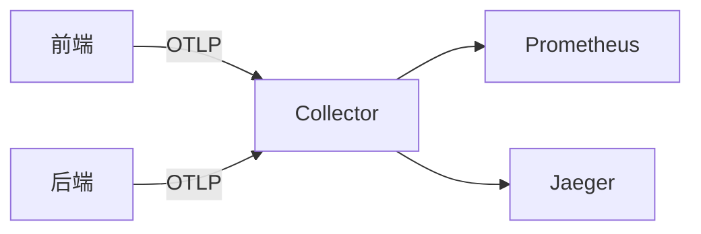

## 介绍

OpenTelemetry 是一个开源的观测性框架，用于生成、收集和管理遥测数据（如指标、日志和追踪）。它由多个核心组件组成，这些组件协同工作，帮助开发者实现端到端的观测性。本文将详细介绍这些组件及其交互方式。

:::note 关键概念
OpenTelemetry 的组件设计遵循了 **模块化** 和 **可扩展性** 原则，允许用户根据需要灵活组合。
:::

---

## 核心组件

### 1. OpenTelemetry API
API 层定义了遥测数据的抽象接口，包括：
- **Tracing API**：用于创建和管理分布式追踪的 span。
- **Metrics API**：用于记录和聚合指标。
- **Logging API**（实验性）：用于结构化日志记录。

#### 代码示例（创建Span）
```python
from opentelemetry import trace

tracer = trace.get_tracer("example.tracer")
with tracer.start_as_current_span("hello-world"):
    print("Hello, OpenTelemetry!")
```
**输出**：生成一个名为 `hello-world` 的 span，并记录其执行时间。

---

### 2. OpenTelemetry SDK
SDK 是 API 的具体实现，提供以下功能：
- **数据采集**：通过采样器（Sampler）决定是否记录数据。
- **数据处理**：通过处理器（Processor）批量或即时处理数据。
- **数据导出**：通过导出器（Exporter）将数据发送到后端（如Jaeger、Prometheus）。

#### 配置示例（Python SDK）
```python
from opentelemetry.sdk.trace import TracerProvider
from opentelemetry.sdk.trace.export import BatchSpanProcessor
from opentelemetry.exporter.otlp.proto.grpc.trace_exporter import OTLPSpanExporter

provider = TracerProvider()
processor = BatchSpanProcessor(OTLPSpanExporter())
provider.add_span_processor(processor)
trace.set_tracer_provider(provider)
```

---

### 3. OpenTelemetry Collector
Collector 是一个独立服务，负责接收、处理和导出遥测数据。其核心子组件包括：
- **Receiver**：接收数据（如OTLP、Jaeger、Zipkin格式）。
- **Processor**：过滤或转换数据（如添加属性）。
- **Exporter**：将数据转发到存储或分析系统。

#### 配置示例（Collector配置文件）
```yaml
receivers:
  otlp:
    protocols:
      grpc:
exporters:
  logging:
    logLevel: debug
service:
  pipelines:
    traces:
      receivers: [otlp]
      exporters: [logging]
```

---

### 4. 自动与手动埋点
- **自动埋点**：通过库（如 `opentelemetry-instrumentation`）自动捕获框架（如Flask、Django）的数据。
- **手动埋点**：开发者主动调用 API 记录关键操作。

:::tip 选择建议
自动埋点适合快速接入，手动埋点则提供更精细的控制。
:::

---

## 实际案例

### 场景：电商应用观测
1. **前端**：使用自动埋点记录页面加载时间（Metrics）。
2. **后端**：手动记录订单处理的 Span（Tracing）。
3. **Collector**：聚合数据并导出到 Prometheus 和 Jaeger。



---

## 总结

OpenTelemetry 的组件协同工作，提供了从数据生成到分析的完整链路：
1. **API** 定义规范，**SDK** 实现功能。
2. **Collector** 解耦应用与观测后端。
3. 通过自动/手动埋点平衡效率与控制力。

---

## 扩展资源
1. [OpenTelemetry官方文档](https://opentelemetry.io/docs/)
2. 练习：尝试在本地运行 Collector 并导出数据到控制台。
3. 进阶：探索如何自定义 Processor 来过滤敏感数据。