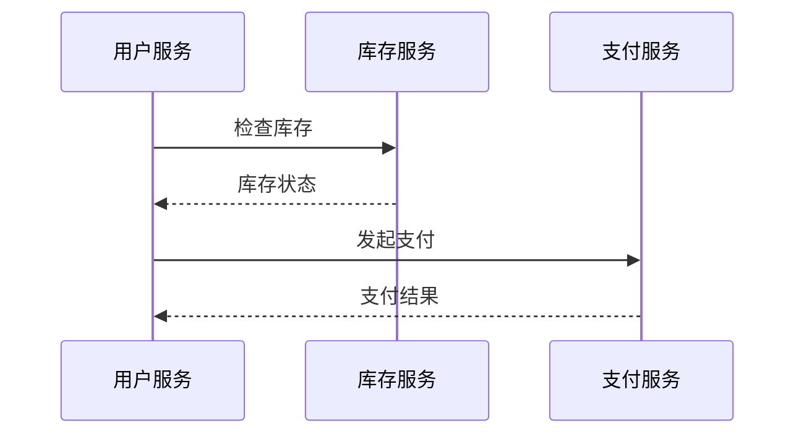

# OpenTelemetry 与可观测性

## 介绍

在当今复杂的分布式系统中，**可观测性（Observability）**是理解系统行为的关键。OpenTelemetry（简称OTel）是一个开源的观测性框架，它通过标准化**指标（Metrics）、日志（Logs）和追踪（Traces）**的收集与传输，帮助开发者监控和调试应用程序。

:::note 可观测性三支柱
1. **指标（Metrics）**：量化系统性能（如请求速率、错误率）。
2. **日志（Logs）**：记录离散事件（如错误消息）。
3. **追踪（Traces）**：跟踪请求在分布式系统中的流转路径。
:::

---

## OpenTelemetry 的核心组件

### 1. 数据采集（Instrumentation）
OpenTelemetry通过**自动或手动插桩（Instrumentation）**收集数据。例如，在Python中手动插桩一个HTTP请求：

```python
from opentelemetry import trace
from opentelemetry.sdk.trace import TracerProvider

# 初始化Tracer
trace.set_tracer_provider(TracerProvider())
tracer = trace.get_tracer(__name__)

# 创建一个Span（追踪的基本单元）
with tracer.start_as_current_span("http_request"):
    print("Sending HTTP request...")  # 模拟业务逻辑
```

**输出**：  
生成的Span会被导出到配置的后端（如Jaeger），显示请求的耗时和上下文。

### 2. 数据导出（Exporters）
OpenTelemetry支持将数据导出到多种后端，例如Prometheus（指标）或Zipkin（追踪）。配置一个控制台导出器：

```python
from opentelemetry.sdk.trace.export import ConsoleSpanExporter, SimpleSpanProcessor

# 将Span输出到控制台
exporter = ConsoleSpanExporter()
span_processor = SimpleSpanProcessor(exporter)
trace.get_tracer_provider().add_span_processor(span_processor)
```

---

## 实际应用场景

### 案例：电商系统的订单流程
假设一个电商系统的订单流程涉及多个服务（用户服务、库存服务、支付服务），OpenTelemetry可以追踪整个请求链路：



通过OpenTelemetry的分布式追踪，可以快速定位延迟或错误的根源（例如支付服务超时）。

---

## 总结

OpenTelemetry通过统一的数据模型和工具链，简化了可观测性数据的收集与分析。关键要点：
- **标准化**：避免厂商锁定，支持多语言和多后端。
- **灵活性**：支持自动插桩和自定义插桩。
- **全栈观测**：覆盖指标、日志、追踪三大支柱。

:::tip 下一步学习
1. 尝试在本地运行一个OpenTelemetry Collector。
2. 将追踪数据导出到Jaeger或Prometheus可视化。
3. 阅读[OpenTelemetry官方文档](https://opentelemetry.io/docs/)。
:::