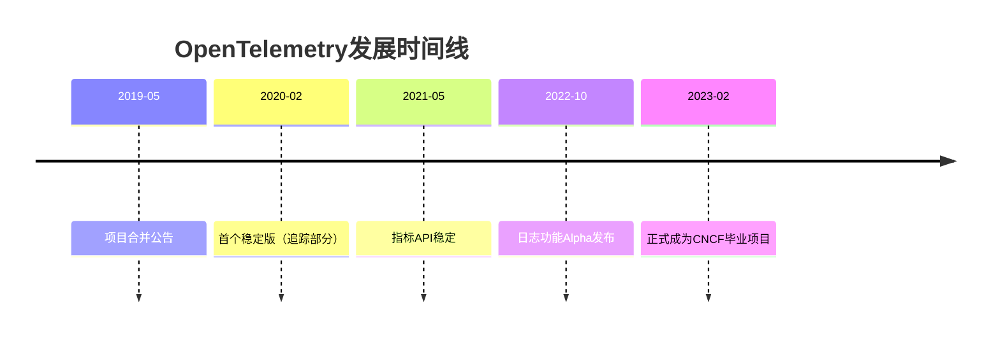

# OpenTelemetry 历史与发展

## 介绍

OpenTelemetry（简称OTel）是当今可观测性领域的**开源标准**，用于生成、收集和管理**遥测数据**（如指标、日志和链路追踪）。它的诞生解决了传统监控工具碎片化的问题，统一了数据采集的规范。本文将带你了解它的发展历程、核心设计理念以及实际应用场景。

---

## 1. 起源背景

在OpenTelemetry出现之前，开发者面临两大主流但互不兼容的遥测库：
- **OpenTracing**：专注于分布式链路追踪的API标准（2016年发布）。
- **OpenCensus**：提供指标和追踪的完整实现（2018年由Google发布）。

两者的竞争导致生态碎片化。2019年5月，CNCF（云原生计算基金会）宣布合并这两个项目，形成**OpenTelemetry**。

:::note 为什么需要统一？
想象你同时使用`OpenTracing`和`OpenCensus`，代码中需要维护两套SDK，数据格式也无法互通。OpenTelemetry解决了这一问题。
:::

---

## 2. 关键里程碑



---

## 3. 核心设计理念

OpenTelemetry的三大支柱：
1. **跨语言一致性**：提供Java、Go、Python等语言的SDK。
2. **可扩展性**：支持自定义导出器（Exporters）和处理管道。
3. **厂商中立**：数据可发送到任何后端（如Prometheus、Jaeger）。

### 代码示例：基础追踪
```python
from opentelemetry import trace
from opentelemetry.sdk.trace import TracerProvider

# 初始化
trace.set_tracer_provider(TracerProvider())
tracer = trace.get_tracer("my.service")

# 创建Span（追踪的基本单元）
with tracer.start_as_current_span("parent-span"):
    with tracer.start_as_current_span("child-span"):
        print("正在执行操作...")
```
**输出**：在Jaeger等工具中会看到父子关系的Span结构。

---

## 4. 实际应用案例

### 案例：电商微服务链路追踪
假设一个订单流程涉及`用户服务`、`库存服务`和`支付服务`：
1. 每个服务通过OpenTelemetry生成Span。
2. 所有Span共享同一个`Trace ID`，形成完整调用链。
3. 开发人员可以快速定位延迟高的服务。

:::tip 实际价值
某公司使用OpenTelemetry后，将故障平均解决时间（MTTR）从2小时缩短到15分钟。
:::

---

## 5. 未来发展方向
- **日志标准化**：统一日志与指标/追踪的关联。
- **更轻量级SDK**：适应边缘计算场景。
- **AI集成**：自动异常检测。

---

## 总结

OpenTelemetry通过合并历史项目、建立开放标准，已成为可观测性领域的基石。它的发展体现了开源社区的协作力量。

### 附加资源
- [官方文档](https://opentelemetry.io/docs/)
- 练习：在本地运行一个Python服务，导出追踪数据到Jaeger。
```python
# 安装必要库
pip install opentelemetry-api opentelemetry-sdk opentelemetry-exporter-jaeger
```

:::caution 注意
生产环境中需配置采样策略，避免数据爆炸！
:::