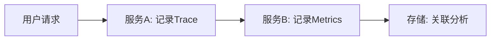

## 介绍

OpenTelemetry（简称OTel）是一个开源的**可观测性框架**，用于生成、收集和管理遥测数据（如指标、日志和链路追踪）。它解决了传统监控工具分散、语言绑定和厂商锁定的问题。以下是其核心优势的详细解析。

## 1. 跨平台与语言标准化

OpenTelemetry提供了**统一的API和SDK**，支持多种编程语言（如Java、Python、Go等），并兼容主流后端分析工具（如Prometheus、Jaeger）。  
以下是一个Python的简单示例：

```python
from opentelemetry import trace
from opentelemetry.sdk.trace import TracerProvider

# 初始化Tracer
trace.set_tracer_provider(TracerProvider())
tracer = trace.get_tracer(__name__)

# 创建Span（追踪的基本单元）
with tracer.start_as_current_span("example_span"):
    print("Hello, OpenTelemetry!")
```

**输出**：  
在兼容的后端（如Jaeger）中会看到名为`example_span`的追踪记录。

## 2. 统一的可观测性支柱

OpenTelemetry将**指标（Metrics）、日志（Logs）和追踪（Traces）**整合到单一框架中，避免了工具碎片化。  
例如，通过OTel收集的链路追踪数据可以直接关联到特定服务的CPU指标：



## 3. 避免厂商锁定

传统工具（如Datadog或New Relic）的SDK通常绑定特定厂商。OpenTelemetry通过**标准化协议**（如OTLP）实现数据导出解耦：

```go
// Go语言示例：导出到OTLP协议
provider := sdktrace.NewTracerProvider(
    sdktrace.WithBatcher(otlptracegrpc.NewExporter()))
```

## 4. 活跃的社区支持

由CNCF（云原生计算基金会）托管，OpenTelemetry拥有快速迭代的生态。例如：
- 支持新兴技术（如eBPF）。
- 定期更新SDK适配器（如AWS Lambda扩展）。

## 实际案例：电商系统监控

假设一个电商平台使用OpenTelemetry实现全链路追踪：
1. **前端**：记录用户点击事件的Span。
2. **订单服务**：追踪订单创建耗时。
3. **支付服务**：关联支付延迟指标与错误日志。

:::tip 结果
通过统一的Trace ID，运维团队可以快速定位支付超时的根本原因（如数据库瓶颈）。
:::

## 总结

| 优势                | 说明                              |
|---------------------|----------------------------------|
| 标准化              | 跨语言、跨平台一致性              |
| 三支柱统一          | 指标、日志、追踪一站式集成        |
| 厂商中立            | 数据可导出到任意兼容后端          |
| 社区强大            | 持续更新，适配云原生场景          |

## 下一步

- **练习**：尝试用OpenTelemetry SDK记录一个简单的HTTP请求链路。
- **资源**：  
  - [官方文档](https://opentelemetry.io/docs/)  
  - 《Distributed Tracing in Practice》书籍（第4章）