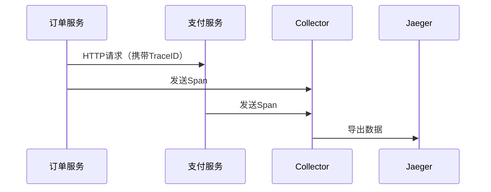

# OpenTelemetry 生态系统

## 介绍

OpenTelemetry（简称OTel）是一个**跨语言、可扩展**的开源可观测性框架，用于生成、收集和管理**遥测数据**（指标、日志、跟踪）。其生态系统由多个相互协作的组件构成，包括**SDK、API、收集器（Collector）**和**第三方集成**。本指南将带你逐步理解这些组件如何协同工作，并展示实际应用场景。

---

## 核心组件

### 1. OpenTelemetry API
- **作用**：提供统一的编程接口，用于生成遥测数据（如创建Span、记录指标）。
- **特点**：与语言无关的规范，各语言有具体实现（如Java、Python、Go）。

```python
# Python示例：创建一个Span
from opentelemetry import trace
tracer = trace.get_tracer("my.tracer")
with tracer.start_as_current_span("my_span") as span:
    span.set_attribute("key", "value")
```

### 2. OpenTelemetry SDK
- **作用**：实现API功能，处理数据导出（如发送到Jaeger或Prometheus）。
- **关键模块**：
  - **采样器（Sampler）**：决定是否记录某条跟踪。
  - **导出器（Exporter）**：将数据发送到后端（如`OTLPExporter`）。

```go
// Go示例：配置OTLP导出器
import "go.opentelemetry.io/otel/exporters/otlp/otlptrace/otlptracegrpc"
exporter, err := otlptracegrpc.New(ctx, otlptracegrpc.WithEndpoint("collector:4317"))
```

### 3. OpenTelemetry Collector
- **作用**：接收、处理、转发遥测数据。
- **架构**：
  ```mermaid
  graph LR
    A[Receivers] --> B[Processors]
    B --> C[Exporters]
  ```
- **常用组件**：
  - **Receivers**：接收数据（如`otlp`、`jaeger`）。
  - **Processors**：过滤或增强数据（如`batch`处理器）。
  - **Exporters**：输出到后端（如`logging`、`prometheus`）。

:::tip
Collector的**管道式设计**使其可以灵活适配不同数据流，例如将数据同时发送到日志系统和监控平台。
:::

---

## 实际应用场景

### 案例：微服务跟踪
假设有一个电商系统，包含`订单服务`和`支付服务`：
1. **生成跟踪数据**：各服务通过OTel SDK创建Span。
2. **收集数据**：Collector统一接收所有服务的OTLP数据。
3. **分析数据**：导出到Jaeger后可视化调用链。



:::note
TraceID的**跨服务传递**是分布式跟踪的关键，OpenTelemetry自动处理了这部分逻辑。
:::

---

## 总结

OpenTelemetry生态系统通过标准化API、多语言SDK和可扩展的Collector，为开发者提供了**端到端的可观测性解决方案**。它的优势在于：
- **统一性**：避免不同供应商的锁定。
- **灵活性**：支持自定义处理器和导出器。
- **社区支持**：与主流工具（如Prometheus、Jaeger）深度集成。

### 下一步学习
- 实践：部署一个Collector并导出数据到本地Jaeger实例。
- 探索：了解如何通过`Auto-Instrumentation`无侵入式接入现有应用。