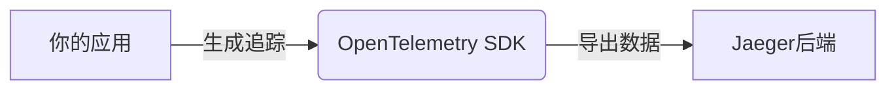

# OpenTelemetry 安装

OpenTelemetry（简称OTel）是一个开源的观测性框架，用于生成、收集和管理遥测数据（如指标、日志和追踪）。它是CNCF（云原生计算基金会）的项目，旨在标准化观测数据的采集方式。本文将指导你完成OpenTelemetry的安装过程。

## 先决条件

在开始之前，请确保：
- 已安装目标语言的运行时环境（如Node.js、Python、Java等）。
- 具备基本的命令行操作知识。
- 了解你的应用程序架构（例如是否使用微服务）。

---

## 安装OpenTelemetry SDK

OpenTelemetry提供多种语言的SDK。以下是常见语言的安装方法：

### 1. Node.js 安装

```bash
npm install @opentelemetry/api @opentelemetry/sdk-node
```

### 2. Python 安装

```bash
pip install opentelemetry-api opentelemetry-sdk
```

### 3. Java 安装

在Maven项目的`pom.xml`中添加依赖：
```xml
<dependency>
  <groupId>io.opentelemetry</groupId>
  <artifactId>opentelemetry-api</artifactId>
  <version>1.30.0</version>
</dependency>
```

:::tip
运行安装命令后，建议验证SDK版本是否与文档示例兼容。可通过命令如 `npm list @opentelemetry/api` 检查。
:::

---

## 配置基础追踪

以下是一个Node.js的示例，展示如何初始化追踪并导出数据到控制台：

```javascript
const { NodeTracerProvider } = require('@opentelemetry/sdk-trace-node');
const { ConsoleSpanExporter } = require('@opentelemetry/sdk-trace-base');

const provider = new NodeTracerProvider();
provider.addSpanProcessor(new SimpleSpanProcessor(new ConsoleSpanExporter()));
provider.register();

console.log('Tracing initialized');
```

**输出示例**：
```
{
  "traceId": "7b9d546113a1cd5b9a9d71e59a5b3e2d",
  "name": "HTTP GET /api",
  "kind": "SERVER",
  "duration": 42
}
```

:::note
此配置仅用于开发环境。生产环境中需替换`ConsoleSpanExporter`为Jaeger或Zipkin等后端。
:::

---

## 实际案例：监控HTTP服务

假设你有一个Express.js服务，以下是添加OpenTelemetry的完整流程：

1. **安装必要包**：
   ```bash
   npm install @opentelemetry/instrumentation-http @opentelemetry/instrumentation-express
   ```

2. **初始化代码**：
   ```javascript
   const express = require('express');
   const { HttpInstrumentation } = require('@opentelemetry/instrumentation-http');
   const { ExpressInstrumentation } = require('@opentelemetry/instrumentation-express');

   const provider = new NodeTracerProvider();
   provider.register();
   new HttpInstrumentation().start();
   new ExpressInstrumentation().start();

   const app = express();
   app.get('/', (req, res) => res.send('Hello with tracing!'));
   app.listen(3000);
   ```

此时所有HTTP请求和Express路由将自动生成追踪数据。

---

## 数据导出到后端

配置将数据发送到Jaeger的示例（以Node.js为例）：

```javascript
const { JaegerExporter } = require('@opentelemetry/exporter-jaeger');
const exporter = new JaegerExporter({
  endpoint: 'http://jaeger:14268/api/traces',
});
provider.addSpanProcessor(new SimpleSpanProcessor(exporter));
```



---

## 常见问题

1. **依赖冲突**：确保所有OpenTelemetry包版本一致。
2. **无数据输出**：检查后端服务是否运行，以及端口是否开放。
3. **性能影响**：在生产环境中采样率建议设置为1%（通过`Sampler`配置）。

---

## 总结

通过本文，你学会了：
- 安装OpenTelemetry SDK的多种语言方法。
- 配置基础追踪并导出到控制台。
- 在实际HTTP服务中集成自动检测。
- 将数据导出到Jaeger等后端系统。

**下一步建议**：
- 尝试在本地运行Jaeger并查看追踪数据。
- 探索OpenTelemetry的指标（Metrics）和日志（Logs）功能。
- 阅读[官方文档](https://opentelemetry.io/docs/)的"Getting Started"部分。