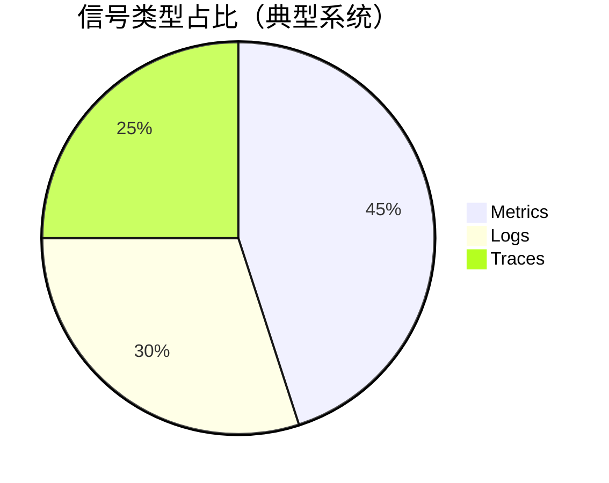
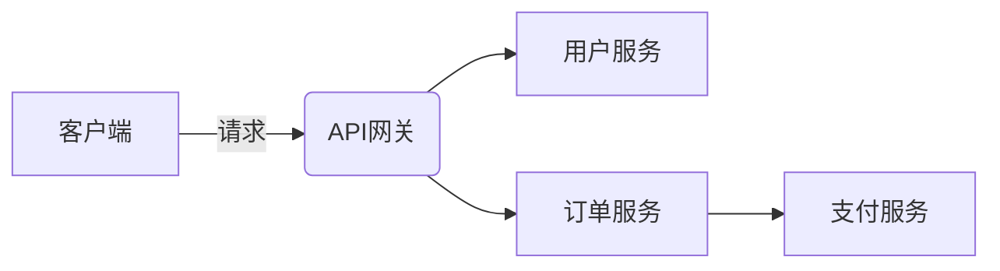
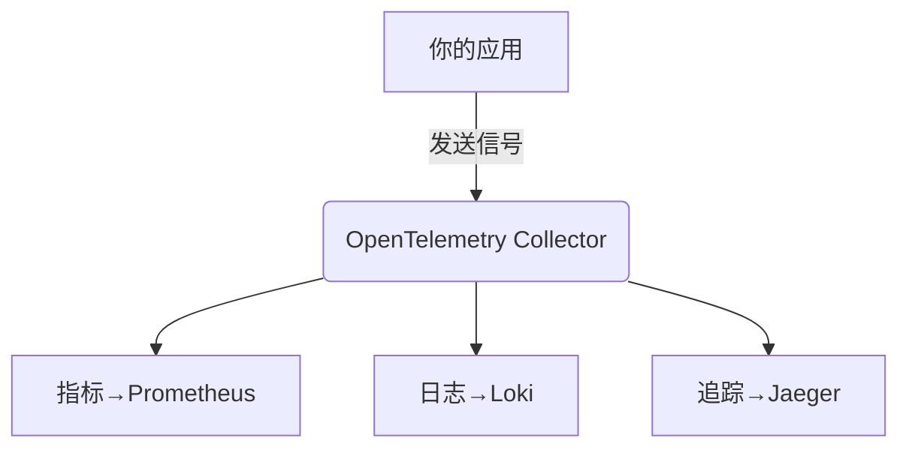

# OpenTelemetry 信号概述

OpenTelemetry是现代可观测性(Observability)的标准工具集，它通过**三大信号类型**帮助开发者理解系统的运行状态。本文将带你认识这些信号的核心概念、相互关系以及实际应用。

## 什么是可观测性信号？

可观测性信号是系统向外部暴露的状态数据，就像汽车的仪表盘：
- **指标(Metrics)**：量化数据（如CPU使用率）
- **日志(Logs)**：离散事件记录（如错误消息）
- **追踪(Traces)**：请求的生命周期（如API调用链）



## 1. 指标(Metrics)

### 核心概念
指标是**随时间变化的数值测量**，例如：
- 服务器内存使用量
- HTTP请求成功率
- 数据库查询延迟

:::tip 指标的特点
- 低开销
- 适合监控和告警
- 通常以固定间隔采集
:::

### 代码示例
```python
from opentelemetry import metrics

meter = metrics.get_meter("shopping.cart")
requests_counter = meter.create_counter(
    "http.requests",
    description="Total HTTP requests"
)

# 记录指标
requests_counter.add(1, {"method": "GET", "status": "200"})
```

## 2. 日志(Logs)

### 核心概念
日志是**带时间戳的事件记录**，包含：
- 错误堆栈
- 系统状态变更
- 关键业务事件

:::caution 注意
避免过度日志记录，这可能导致：
- 存储成本激增
- 关键信息被淹没
:::

### 结构化日志示例
```json
{
  "timestamp": "2023-08-20T14:32:01Z",
  "severity": "ERROR",
  "message": "Payment failed",
  "attributes": {
    "user_id": "u123",
    "transaction_id": "tx-456",
    "error_code": "INSUFFICIENT_FUNDS"
  }
}
```

## 3. 追踪(Traces)

### 核心概念
追踪展示**请求在分布式系统中的流转**：
- 跨服务调用关系
- 每个操作的耗时
- 错误传播路径



### 追踪上下文传播
```go
// 创建span（操作单元）
ctx, span := tracer.Start(ctx, "checkout.process")
defer span.End()

// 添加属性
span.SetAttributes(
    attribute.String("payment.method", "credit_card"),
    attribute.Int("items.count", 3),
)
```

## 信号协同工作示例

电商系统故障排查场景：
1. **指标**发现支付成功率下降
2. **追踪**定位到卡在库存服务
3. **日志**显示数据库连接超时

:::note 黄金信号组合
Google SRE推荐的四大黄金信号：
- 延迟
- 流量
- 错误率
- 饱和度
:::

## 总结与扩展

### 关键对比表
| 特性        | 指标               | 日志                | 追踪               |
|------------|--------------------|---------------------|--------------------|
| 数据类型    | 数值               | 文本/结构化         | 调用图             |
| 最佳用途    | 趋势监控           | 事件调查            | 性能分析           |
| 存储成本    | 低                 | 高                  | 中                 |

### 学习建议
1. 从指标监控开始实践
2. 为关键业务流添加追踪
3. 采用结构化日志规范

### 延伸阅读
- [OpenTelemetry官方文档](https://opentelemetry.io/docs/)
- 《Distributed Systems Observability》
- 实践练习：使用`docker-compose`部署Jaeger+Prometheus+Grafana监控demo



记住：**优秀的可观测性=适当的信号组合+上下文关联**！