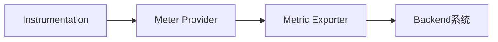

# OpenTelemetry 指标(Metrics)

## 介绍

OpenTelemetry指标（Metrics）是分布式系统中用于**量化系统状态**的数值数据，例如请求速率、错误计数或资源利用率。与日志（Logs）和追踪（Traces）不同，指标通过定期采样提供系统行为的**趋势分析**，帮助开发者监控性能、定位瓶颈和触发告警。

:::note 关键特性
- **时间序列数据**：按时间戳记录的数值序列。
- **多维标签**：通过键值对（如 `method="GET"`）细化数据维度。
- **聚合能力**：支持求和、平均值等统计操作。
:::

---

## 核心概念

### 1. 指标类型
OpenTelemetry定义了四种基础指标类型：

| 类型          | 描述                          | 示例                  |
|---------------|-----------------------------|-----------------------|
| **Counter**   | 单调递增的累计值（如请求总数）     | `http.requests.total` |
| **Gauge**     | 瞬时可变值（如CPU使用率）         | `memory.usage.bytes`  |
| **Histogram** | 数值分布统计（如响应时间分桶）     | `http.duration.ms`    |
| **Summary**   | 客户端计算的百分位数（如P99延迟）  | `db.query.latency`    |

### 2. 指标管道


1. **Instrumentation**：在代码中埋点收集数据。
2. **Meter Provider**：管理指标生成和聚合。
3. **Exporter**：将数据发送到Prometheus等后端。

---

## 代码示例

### 使用Python SDK记录指标
以下示例展示如何记录HTTP请求计数和响应时间：

```python
from opentelemetry import metrics
from opentelemetry.sdk.metrics import MeterProvider

# 初始化Meter
provider = MeterProvider()
metrics.set_meter_provider(provider)
meter = metrics.get_meter("my.service")

# 创建Counter和Histogram
request_counter = meter.create_counter(
    name="http.requests.total",
    description="Total HTTP requests"
)
duration_histogram = meter.create_histogram(
    name="http.duration.ms",
    unit="milliseconds"
)

# 记录指标
request_counter.add(1, {"method": "GET", "status": 200})
duration_histogram.record(150, {"endpoint": "/api/users"})
```

**输出到控制台**：
```
http.requests.total{method="GET",status="200"} 1
http.duration.ms{endpoint="/api/users"} 150
```

---

## 实际应用场景

### 场景：监控Web服务
假设有一个电商网站，需要监控：
1. **请求量**：使用`Counter`统计每秒订单创建数。
2. **延迟**：使用`Histogram`分析支付接口的P99延迟。
3. **资源**：使用`Gauge`跟踪服务器内存使用峰值。

:::tip 最佳实践
- 为指标添加有意义的标签（如 `region="us-east"`）。
- 避免高基数标签（如用户ID），防止存储压力。
:::

---

## 总结

OpenTelemetry指标提供了：
- 系统健康度的**实时快照**
- 性能问题的**早期预警**
- 资源优化的**数据依据**

### 下一步学习
- 官方文档：[OpenTelemetry Metrics Specification](https://opentelemetry.io/docs/concepts/signals/metrics/)
- 实践练习：将指标导出到[Prometheus](https://prometheus.io/)并配置Grafana看板。