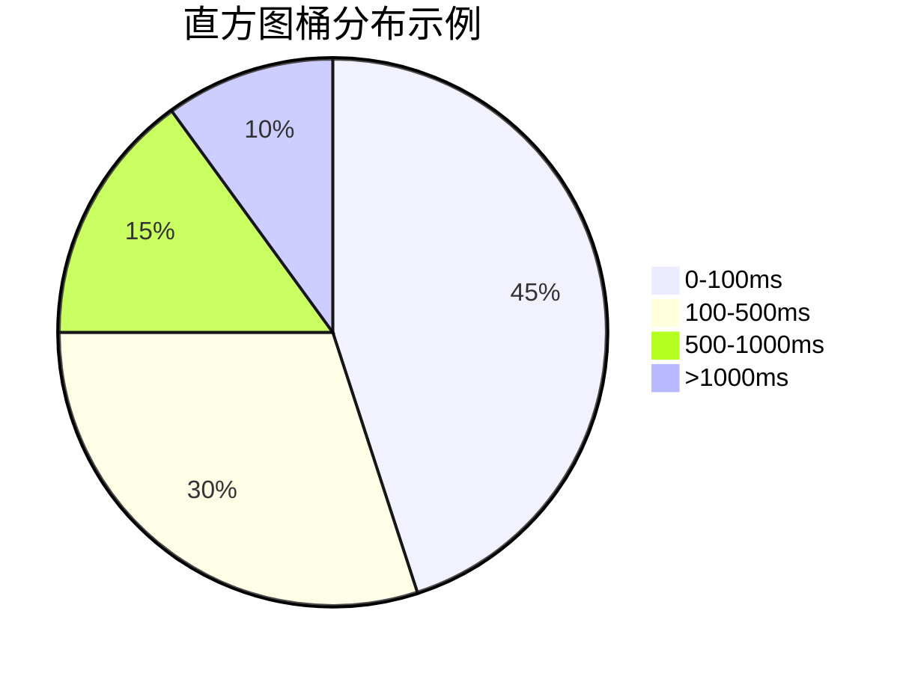

# OpenTelemetry 指标类型

## 介绍

在可观测性领域，**指标（Metrics）**是系统运行状态的量化表示。OpenTelemetry定义了四种核心指标类型，帮助开发者监控应用程序性能、资源使用情况和业务趋势。这些指标类型是构建有效监控系统的基石。

## 指标类型详解

### 1. 计数器（Counter）
**计数器**是最简单的指标类型，表示单调递增的数值（只增不减），常用于统计请求次数、错误发生次数等场景。

```python
from opentelemetry import metrics

meter = metrics.get_meter("my.meter")
request_counter = meter.create_counter(
    "http.requests.count",
    description="Total number of HTTP requests"
)

# 记录指标
request_counter.add(1, {"method": "GET", "status": "200"})
```

:::tip 典型用例
- API调用次数统计
- 任务队列处理数量
- 系统错误累计计数
:::

### 2. 上下计数器（UpDownCounter）
**上下计数器**允许数值增减，适用于需要跟踪当前状态的场景，如内存使用量、活跃连接数等。

```javascript
const { metrics } = require('@opentelemetry/api');
const meter = metrics.getMeter('app.metrics');

const activeConnections = meter.createUpDownCounter(
  'db.connections.active',
  { description: 'Current active database connections' }
);

// 连接建立时增加
activeConnections.add(1);
// 连接关闭时减少
activeConnections.add(-1);
```

### 3. 直方图（Histogram）
**直方图**记录值的分布情况，自动计算最小值、最大值、平均值和百分位数，特别适合测量延迟等指标。

```go
import "go.opentelemetry.io/otel/metric"

meter := metric.NewMeter("service.metrics")
requestLatency := meter.NewFloat64Histogram(
    "http.request.duration",
    metric.WithDescription("Request latency in seconds"),
)

// 记录请求耗时
requestLatency.Record(ctx, 2.5)
```



### 4. 测量值（Gauge）
**测量值**表示某个时间点的瞬时值，通常由回调函数提供，适用于CPU温度、内存使用率等场景。

```java
Meter meter = OpenTelemetry.getGlobalMeter("jvm.metrics");
meter.gaugeBuilder("jvm.memory.used")
    .setDescription("Current memory usage")
    .setUnit("bytes")
    .buildWithCallback(result -> {
        result.record(Runtime.getRuntime().totalMemory() - 
                     Runtime.getRuntime().freeMemory());
    });
```

## 实际应用案例

**电商平台监控场景**：
1. 使用**Counter**统计下单请求量
2. 用**UpDownCounter**跟踪库存变化
3. 通过**Histogram**分析支付接口延迟
4. 利用**Gauge**监控服务器CPU温度

:::note 指标选择原则
- 需要累加统计 → Counter
- 需要跟踪当前状态 → UpDownCounter/Gauge
- 需要分析分布情况 → Histogram
:::

## 总结

OpenTelemetry的四种指标类型各有侧重：
- **Counter**：只增不减的累计值
- **UpDownCounter**：可增减的累计值  
- **Histogram**：值的分布统计
- **Gauge**：瞬时值测量

## 延伸学习

1. 实践练习：为你的Web服务添加四种指标监控
2. 推荐工具：Grafana + Prometheus + OpenTelemetry指标可视化
3. 进阶阅读：OpenTelemetry指标聚合与采样策略