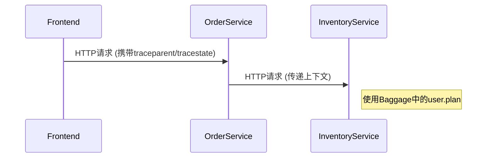

# OpenTelemetry W3C标准对齐

## 介绍

OpenTelemetry（简称OTel）是一个开源的观测性框架，用于生成、收集和管理遥测数据（指标、日志和追踪）。为了确保不同系统间的互操作性，OpenTelemetry与[W3C标准](https://www.w3.org/)（如Trace Context和Baggage）对齐。这种对齐使得分布式系统中的追踪上下文能够无缝传递，即使系统使用不同的技术栈。

:::note 关键概念
- **Trace Context**: W3C定义的HTTP头部格式，用于传播追踪上下文（如trace ID和span ID）。
- **Baggage**: 用户定义的键值对，随追踪上下文一起传播，用于跨服务传递业务上下文。
:::

## W3C Trace Context

### 标准格式
OpenTelemetry使用以下W3C定义的HTTP头部传播追踪上下文：
- `traceparent`: 携带trace ID、span ID和采样标志。
- `tracestate`: 提供供应商特定的追踪状态（如采样率、自定义标记）。

#### 示例头部
```plaintext
traceparent: 00-0af7651916cd43dd8448eb211c80319c-b7ad6b7169203331-01
tracestate: vendor1=value1,vendor2=value2
```

### 代码示例
以下是一个Python示例，展示如何注入和提取W3C头部：

```python
from opentelemetry import trace
from opentelemetry.propagate import inject, extract
from opentelemetry.trace.propagation.tracecontext import TraceContextTextMapPropagator

# 创建追踪上下文
tracer = trace.get_tracer("example.tracer")
with tracer.start_as_current_span("parent-span") as span:
    # 注入到HTTP头部
    headers = {}
    inject(headers)
    print("注入的头部:", headers)  # 输出: {'traceparent': '00-...-01'}

    # 从头部提取上下文
    ctx = extract(headers)
    with tracer.start_span("child-span", context=ctx):
        print("子Span创建成功")
```

## W3C Baggage

### 用途
Baggage允许在服务间传递附加信息（如用户ID、请求优先级），这些信息不会影响追踪逻辑但可用于业务决策。

#### 示例
```python
from opentelemetry.baggage import set_baggage, get_baggage

# 设置Baggage
set_baggage("user.id", "12345")

# 读取Baggage
user_id = get_baggage("user.id")
print("User ID:", user_id)  # 输出: User ID: 12345
```

## 实际案例

### 跨服务调用场景
假设一个电商系统：
1. **前端服务**生成初始追踪上下文并添加Baggage（如 `user.plan=premium`）。
2. **订单服务**和**库存服务**通过HTTP头部接收上下文，实现关联的追踪和业务逻辑（如优先处理高级用户）。



## 总结

OpenTelemetry通过W3C标准对齐实现了：
1. **互操作性**: 不同系统间追踪上下文的统一传播。
2. **扩展性**: 通过Baggage传递业务上下文。
3. **标准化**: 减少厂商锁定风险。

## 附加资源

- [W3C Trace Context规范](https://www.w3.org/TR/trace-context/)
- [OpenTelemetry官方文档](https://opentelemetry.io/docs/)
- 练习：尝试在本地启动两个服务，通过HTTP调用验证上下文传播。