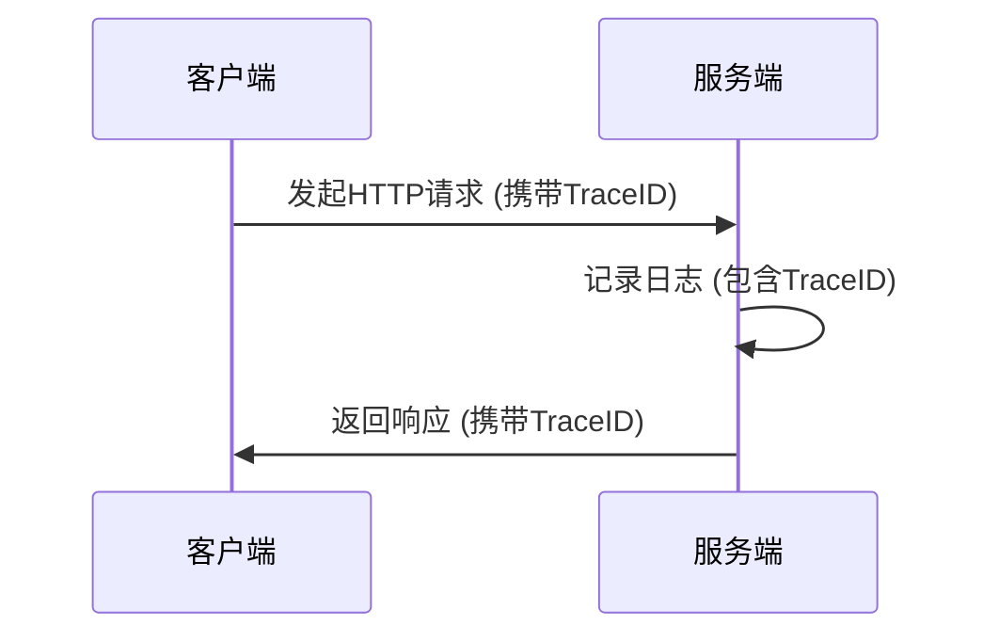

## 介绍

OpenTelemetry的**信号互操作性**（Signal Interoperability）是指其三大核心信号类型——**指标（Metrics）、日志（Logs）和追踪（Traces）**之间的数据关联与协同能力。这种能力使得开发者能够通过统一的上下文（如TraceID）将不同信号关联起来，形成完整的应用行为画像。

:::tip 为什么需要信号互操作性？
当你的应用出现性能问题时，单独查看慢请求（追踪）或高CPU指标可能无法定位根因。通过关联信号，你可以快速发现"某个服务的延迟激增（指标）是由数据库查询日志中的错误引起的"。
:::

## 核心机制：上下文传播

OpenTelemetry使用**上下文（Context）**作为信号互操作的基础。以下是一个典型的关联流程：



## 代码示例：关联追踪与日志

以下示例展示如何在Node.js中实现追踪与日志的关联：

```javascript
const { trace, logs } = require('@opentelemetry/api');

// 1. 创建日志记录器
const logger = logs.getLogger('app-logger');

function processOrder(orderId) {
  // 2. 获取当前活跃的Span上下文
  const activeSpan = trace.getActiveSpan();
  const spanContext = activeSpan?.spanContext();

  // 3. 记录带有TraceID的日志
  logger.emit({
    severityNumber: logs.SeverityNumber.INFO,
    severityText: 'INFO',
    body: `Processing order ${orderId}`,
    traceId: spanContext?.traceId,
    spanId: spanContext?.spanId,
  });

  // ...业务逻辑...
}
```

**输出结果示例**：
```json
{
  "timestamp": "2023-05-15T08:23:45.000Z",
  "severityText": "INFO",
  "body": "Processing order 12345",
  "traceId": "7b9d546113e06e5f3e1a5567a1c2a678",
  "spanId": "3e1a5567a1c2a678"
}
```

## 实际应用场景

### 场景1：错误诊断
1. 用户报告支付失败
2. 通过TraceID找到对应的追踪数据
3. 发现该追踪关联的日志中包含"库存不足"错误
4. 检查该时刻的库存指标确认问题

### 场景2：性能优化
1. 监控显示API延迟升高（指标）
2. 找到慢速Trace样本
3. 关联日志发现"正在执行全表扫描"
4. 优化数据库查询

## 高级互操作模式

### 1. 指标导出为追踪
将关键指标（如请求率）作为Span属性附加：

```javascript
const meter = metrics.getMeter('app-meter');
const requestCounter = meter.createCounter('requests');

function handleRequest() {
  requestCounter.add(1, { 
    'trace_id': trace.getActiveSpan()?.spanContext().traceId 
  });
}
```

### 2. 日志转换为追踪事件
将错误日志自动转换为Span事件：

```python
from opentelemetry import trace

def log_error(message):
    current_span = trace.get_current_span()
    if current_span:
        current_span.add_event("error", {"message": message})
    else:
        print(f"Error: {message}")
```

## 总结

OpenTelemetry的信号互操作性通过以下方式提升可观测性：
- **统一上下文**：TraceID贯穿所有信号类型
- **关联分析**：在单一界面中查看相关数据
- **根因定位**：快速跨越信号类型边界发现问题

## 延伸学习

1. 实践练习：在本地环境中配置日志与追踪的关联
2. 官方文档：[OpenTelemetry Logs Bridge](https://opentelemetry.io/docs/concepts/signals/logs/)
3. 工具推荐：使用Grafana或Jaeger查看关联数据

:::caution 注意
不同语言的SDK实现可能有细微差异，请始终参考对应语言的官方文档。
:::