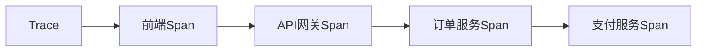
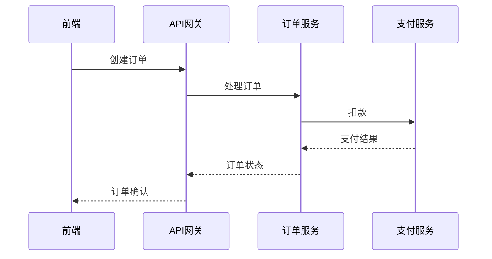

# OpenTelemetry 跟踪(Traces)

## 什么是跟踪(Traces)?

在分布式系统中，一个用户请求可能会经过多个服务的处理。**跟踪(Traces)** 就是记录这些请求在系统中流转的完整路径，帮助你理解请求的生命周期、性能瓶颈和错误来源。

一个跟踪由多个**跨度(Span)**组成，每个跨度代表请求在某个服务中的操作。例如：



## 核心概念

### 1. 跨度(Span)
跨度是跟踪的基本单元，包含：
- 操作名称（如 `GET /orders`）
- 开始和结束时间戳
- 状态（成功/失败）
- 属性（键值对元数据）
- 事件（特定时间点发生的事）

### 2. 跟踪上下文(Trace Context)
用于跨服务传递跟踪信息，包含：
- `trace_id`：唯一标识一个跟踪
- `span_id`：标识当前跨度
- 其他字段（如采样标志）

## 代码示例

### 创建简单跨度（Python）

```python
from opentelemetry import trace
from opentelemetry.sdk.trace import TracerProvider

# 设置跟踪提供者
trace.set_tracer_provider(TracerProvider())
tracer = trace.get_tracer("my.tracer")

# 创建跨度
with tracer.start_as_current_span("main-operation") as span:
    span.set_attribute("http.method", "GET")
    span.add_event("Processing started")
    # 你的业务逻辑...
    span.add_event("Processing completed")
```

### 输出结果
生成的跟踪数据可能类似：
```json
{
  "name": "main-operation",
  "context": {
    "trace_id": "7b9d546113f9455c85c79a8e4e3e7b3a",
    "span_id": "2a3b1c8d9e0f4d5c"
  },
  "attributes": {
    "http.method": "GET"
  },
  "events": [
    {"name": "Processing started", "timestamp": "2023-01-01T00:00:00Z"},
    {"name": "Processing completed", "timestamp": "2023-01-01T00:00:02Z"}
  ]
}
```

## 实际应用场景

### 电商订单流程
当用户下单时，跟踪可以展示请求如何流经：
1. 前端 → 2. API网关 → 3. 订单服务 → 4. 支付服务 → 5. 库存服务



:::tip 实际价值
通过这种跟踪，你可以：
- 发现哪个服务响应最慢（如支付服务耗时500ms）
- 识别失败的环节（如库存服务返回错误）
- 分析跨服务延迟问题
:::

## 总结

OpenTelemetry跟踪帮助你：
- 可视化请求在分布式系统中的流转
- 定位性能瓶颈和错误
- 通过跨度上下文实现跨服务关联

## 延伸学习

1. 实践练习：尝试在你的本地环境配置OpenTelemetry并生成简单跟踪
2. 进阶主题：了解如何将跟踪数据导出到Jaeger或Zipkin等可视化工具
3. 官方文档：[OpenTelemetry Tracing Specification](https://opentelemetry.io/docs/concepts/observability-primer/#distributed-traces)

:::note 记住
跟踪数据可能会很庞大，生产环境中应该合理配置采样策略（如只记录1%的请求）。
:::