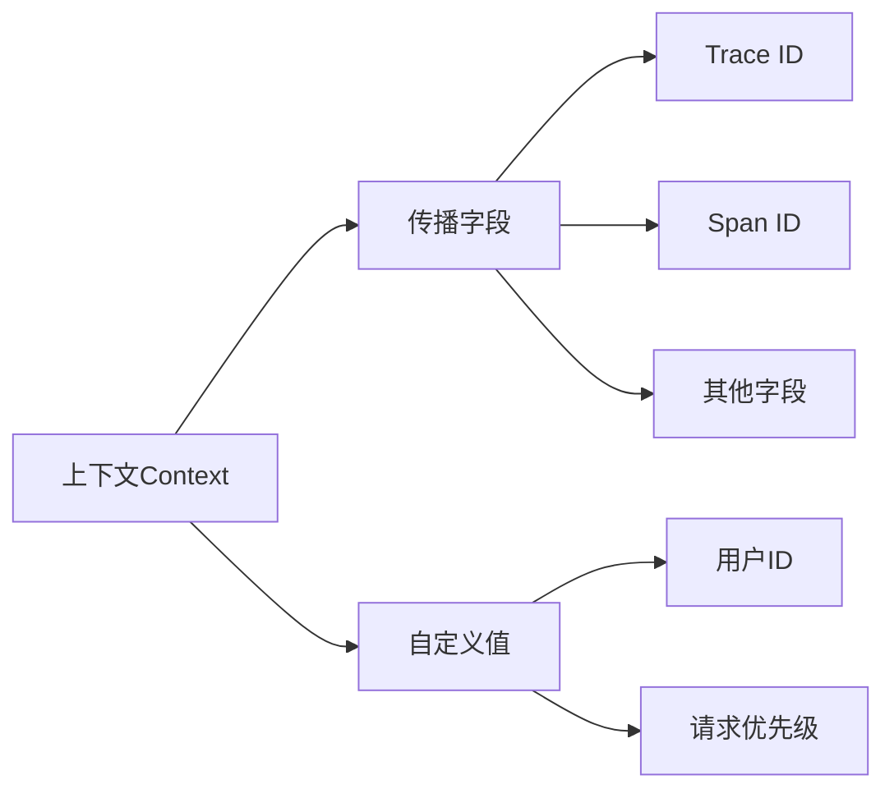

# OpenTelemetry 上下文(Context)

## 介绍

OpenTelemetry中的**上下文(Context)**是一个核心概念，它允许在分布式系统的不同组件之间传递共享状态。上下文通常用于存储和传递跟踪信息（如Trace ID和Span ID）、指标标签或其他需要在服务调用链中保持一致的元数据。

想象一下，当你的应用程序处理一个用户请求时，可能需要经过多个服务。上下文就像是一个"信封"，里面装着所有服务都需要知道的信息，确保整个调用链的连贯性。

## 上下文的基本结构

OpenTelemetry上下文是一个键值存储，其中包含两种主要类型的数据：

1. **传播字段(Propagation Fields)**：如Trace ID、Span ID等
2. **自定义上下文值**：应用特定的元数据



## 使用上下文

### 基本操作

OpenTelemetry提供了API来操作上下文。以下是JavaScript中的基本示例：

```javascript
const { context, propagation } = require('@opentelemetry/api');

// 创建一个新上下文并设置值
const ctx = context.active();
const newCtx = ctx.setValue('user_id', '12345');

// 在当前上下文中运行函数
context.with(newCtx, () => {
  console.log('当前用户ID:', context.active().getValue('user_id'));
  // 执行其他操作...
});
```

### 传播上下文

在分布式系统中，上下文需要通过HTTP头或其他协议进行传播：

```javascript
const http = require('http');

// 注入上下文到HTTP头
const headers = {};
propagation.inject(context.active(), headers);

// 使用这些头信息发起请求
http.get({
  hostname: 'example.com',
  headers: headers
}, (res) => {
  // 处理响应
});
```

## 实际应用场景

### 场景1：分布式跟踪

假设你有一个电子商务系统，用户下单会触发以下流程：

1. 前端服务 → 2. 订单服务 → 3. 支付服务 → 4. 库存服务

使用OpenTelemetry上下文，可以确保整个流程使用相同的Trace ID：

```javascript
// 订单服务中处理请求
app.post('/order', (req, res) => {
  // 从请求头中提取上下文
  const ctx = propagation.extract(context.active(), req.headers);
  
  // 使用提取的上下文创建span
  const tracer = trace.getTracer('order-service');
  const span = tracer.startSpan('process-order', undefined, ctx);
  
  // 处理订单逻辑...
  
  // 调用支付服务时传播上下文
  const payHeaders = {};
  propagation.inject(ctx, payHeaders);
  callPaymentService(payHeaders);
  
  span.end();
  res.send('Order processed');
});
```

### 场景2：自定义上下文值

你可以在上下文中存储业务相关数据，如用户偏好：

```javascript
// 中间件中设置用户偏好
app.use((req, res, next) => {
  const userPrefs = getUserPreferences(req.user.id);
  const newCtx = context.active().setValue('user_prefs', userPrefs);
  
  // 使用新上下文继续处理
  context.with(newCtx, next);
});

// 在路由处理中使用上下文值
app.get('/recommendations', (req, res) => {
  const prefs = context.active().getValue('user_prefs');
  const recommendations = getRecommendations(prefs);
  res.json(recommendations);
});
```

## 上下文传播机制

OpenTelemetry使用**传播器(Propagator)**来序列化和反序列化上下文。常见的传播器包括：

1. **W3C Trace Context**：标准化的HTTP头格式
2. **B3 Propagation**：Zipkin使用的格式
3. **Jaeger Propagation**：Jaeger使用的格式

:::tip
在生产环境中，建议使用W3C Trace Context，因为它是OpenTelemetry的默认标准，具有最好的跨平台兼容性。
:::

## 总结

OpenTelemetry上下文是分布式系统中保持请求连贯性的关键机制。通过本指南，你学习了：

- 上下文的基本概念和作用
- 如何操作和传播上下文
- 实际应用场景中的使用方式
- 上下文传播的不同格式

## 进一步学习

1. OpenTelemetry官方文档中的[上下文和传播](https://opentelemetry.io/docs/concepts/context/)章节
2. 尝试在简单微服务架构中实现上下文传播
3. 探索如何在异步操作中保持上下文一致性

:::caution
在异步编程中（如Promise、async/await），需要特别注意上下文的正确传播。某些情况下可能需要使用特定的上下文管理工具。
:::