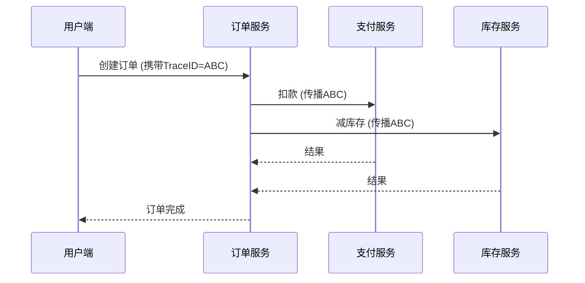

# OpenTelemetry 关联

## 介绍

在分布式系统中，一个用户请求可能跨越多个服务。OpenTelemetry通过**关联（Context Propagation）**机制，将这些分散的操作串联成完整的业务流程。就像用一根"透明绳子"把散落的珠子（服务调用）串成项链（完整事务）。

关联的核心是**上下文（Context）**对象，它携带三种关键信息：
1. **TraceID** - 全局唯一标识符，标记整个事务链
2. **SpanID** - 单个操作的标识符
3. **TraceFlags** - 包含采样决策等元数据

## 基础概念

### 1. 上下文传播方式
OpenTelemetry支持两种传播标准：

- **W3C TraceContext** (现代标准)
  ```http
  traceparent: 00-0af7651916cd43dd8448eb211c80319c-b7ad6b7169203331-01
  ```

- **B3 Propagation** (Zipkin传统格式)
  ```http
  X-B3-TraceId: 0af7651916cd43dd8448eb211c80319c
  X-B3-SpanId: b7ad6b7169203331
  ```

### 2. 代码中的上下文处理

典型工作流程示例（Python）：

```python
from opentelemetry import trace
from opentelemetry.propagate import inject, extract

# 发送请求时注入上下文
headers = {}
inject(headers)  # 自动填充traceparent

# 接收请求时提取上下文
context = extract(headers)
tracer = trace.get_tracer(__name__)
with tracer.start_as_current_span("service-span", context=context):
    # 业务逻辑...
```

## 实际案例

### 电商订单流程
假设用户下单触发以下调用链：



所有服务使用相同的TraceID(`ABC`)，使得监控平台能重组完整流程。

## 常见问题解决

:::caution 上下文丢失场景
当出现以下情况时关联会中断：
- 手动创建线程未传播上下文
- 使用异步框架未正确集成
- 跨进程通信未携带headers

解决方法：
```python
# 正确传递上下文到新线程
from opentelemetry.context import attach
new_context = attach(context)
thread = threading.Thread(target=fn, args=(new_context,))
```
:::

## 总结

关键要点：
- 关联是分布式追踪的基础机制
- TraceID是贯穿所有服务的"事务身份证"
- 需要确保上下文在服务间正确传播

扩展练习：
1. 在本地启动两个服务，模拟上下文传播
2. 故意移除headers观察追踪中断现象
3. 比较W3C和B3格式的差异

附加资源：
- [W3C TraceContext标准](https://www.w3.org/TR/trace-context/)
- [OpenTelemetry传播文档](https://opentelemetry.io/docs/concepts/context/)
``` 

注意：实际使用时需移除最外层的