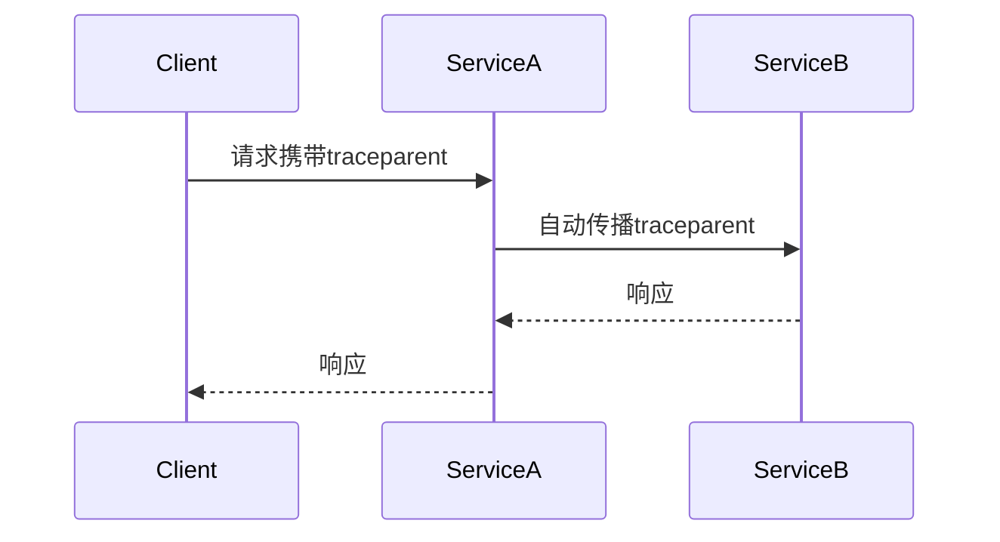
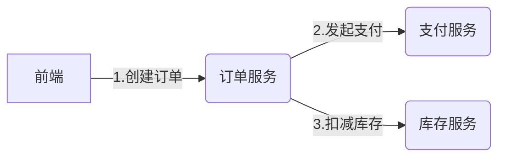

# OpenTelemetry 分布式跟踪原理

## 介绍

在现代分布式系统中，一个用户请求可能跨越多个服务、进程甚至数据中心。**分布式跟踪**通过记录请求在系统中的完整路径（称为"轨迹"），帮助开发者理解系统行为、诊断性能问题。OpenTelemetry是当前云原生领域标准的可观测性框架，其分布式跟踪功能是核心组件之一。

:::note 关键术语
- **Span（跨度）**：代表一个操作或工作单元（如HTTP请求、数据库调用）。
- **Trace（轨迹）**：由多个Span组成的有向无环图，描述请求的完整生命周期。
:::

## 核心原理

### 1. 上下文传播（Context Propagation）

分布式跟踪的核心挑战是如何在服务间传递跟踪上下文。OpenTelemetry使用以下两种标准头部格式：

```text
# W3C TraceContext 示例（HTTP头部）
traceparent: 00-0af7651916cd43dd8448eb211c80319c-b7ad6b7169203331-01
```



### 2. Span的生命周期

每个Span包含以下关键信息：
- 操作名称（如`GET /api/users`）
- 开始/结束时间戳
- 键值对形式的属性（如`http.method=GET`）
- 状态（成功/失败）
- 事件（带时间戳的日志）

示例代码（Python）：

```python
from opentelemetry import trace

tracer = trace.get_tracer("shop.service")

# 创建Span
with tracer.start_as_current_span("process_order") as span:
    span.set_attribute("order.id", 123)
    span.add_event("inventory_checked")
    # 业务逻辑...
```

### 3. 采样策略

为平衡性能与数据完整性，OpenTelemetry支持多种采样策略：

```python
# 示例：设置采样率为50%
from opentelemetry.sdk.trace import TracerProvider
from opentelemetry.sdk.trace.export import (
    ConsoleSpanExporter,
    SimpleSpanProcessor,
)
from opentelemetry.sdk.trace.sampling import TraceIdRatioBased

sampler = TraceIdRatioBased(0.5)  # 50%采样
provider = TracerProvider(sampler=sampler)
```

## 实际案例：电商订单流程

假设一个订单流程涉及以下服务：
1. **前端服务**：接收用户请求
2. **订单服务**：创建订单记录
3. **支付服务**：处理支付
4. **库存服务**：扣减库存



对应的跟踪数据会显示：
- 总耗时及各阶段耗时
- 哪个服务导致延迟（如支付服务响应慢）
- 失败发生在哪个环节（如库存不足）

## 数据导出与分析

OpenTelemetry支持将跟踪数据导出到多种后端：

```python
# 导出到Jaeger的示例
from opentelemetry.exporter.jaeger.thrift import JaegerExporter
from opentelemetry.sdk.trace.export import BatchSpanProcessor

jaeger_exporter = JaegerExporter(
    agent_host_name="localhost",
    agent_port=6831,
)
provider.add_span_processor(BatchSpanProcessor(jaeger_exporter))
```

## 总结

关键要点：
- 分布式跟踪通过**Span**和**Trace**模型记录请求流
- **上下文传播**是跨服务跟踪的基础
- 合理的**采样策略**对生产环境至关重要
- 数据可导出到可视化工具（如Jaeger、Zipkin）

:::tip 练习建议
1. 在本机部署Jaeger（`docker run -d -p 16686:16686 jaegertracing/all-in-one`）
2. 用OpenTelemetry SDK实现一个简单的多服务跟踪
3. 尝试在跟踪中添加自定义属性（如用户ID）
:::

## 扩展资源

- [OpenTelemetry官方文档](https://opentelemetry.io/docs/)
- 《Distributed Tracing in Practice》书籍
- W3C TraceContext标准规范