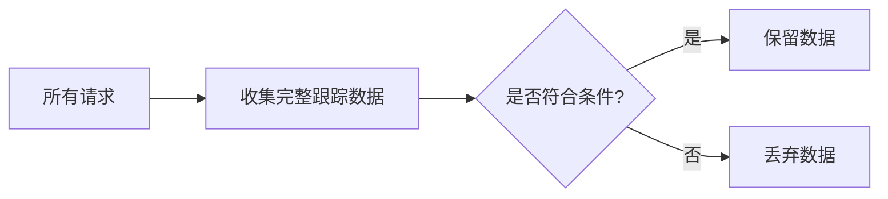

# OpenTelemetry 采样策略

## 介绍

在分布式系统中，收集所有遥测数据（如跟踪、指标和日志）可能会产生高昂的成本和性能开销。**采样（Sampling）**是OpenTelemetry中的一项关键策略，它通过选择性丢弃部分数据来平衡观测需求与系统负载。本文将介绍常见的采样策略、实现方式及实际应用场景。

---

## 为什么需要采样？

- **减少存储成本**：全量存储所有数据可能不经济。
- **降低网络开销**：减少数据传输量。
- **避免性能损耗**：高频数据收集可能影响应用性能。

:::tip
采样不是“丢弃数据”，而是“智能选择最有价值的数据”。
:::

---

## 采样策略类型

### 1. 头部采样（Head Sampling）
在请求开始时决定是否采样，通常基于预定义规则（如随机概率）。

```python
# Python示例：使用概率采样（头部采样）
from opentelemetry.sdk.trace.sampling import TraceIdRatioBasedSampler

sampler = TraceIdRatioBasedSampler(0.1)  # 10%的请求会被采样
```

**输入**：所有请求。<br />
**输出**：约10%的请求生成跟踪数据。

### 2. 尾部采样（Tail Sampling）
在请求完成后根据结果（如延迟、错误状态）决定是否保留数据。



### 3. 动态采样
根据系统负载或业务规则动态调整采样率。

---

## 实际案例

### 案例：电商平台错误分析
- **需求**：监控支付失败请求，但忽略成功请求。
- **策略**：使用尾部采样，仅保留HTTP状态码为4xx/5xx的跟踪数据。

```yaml
# OpenTelemetry Collector配置示例（尾部采样）
processors:
  tail_sampling:
    policies:
      [
        {
          name: error-policy,
          type: status_code,
          status_code: { min: 400 }
        }
      ]
```

---

## 如何选择采样策略？

| 策略类型       | 适用场景                          | 优缺点                     |
|----------------|-----------------------------------|----------------------------|
| **头部采样**   | 高吞吐量系统                      | 简单，但可能丢失关键错误   |
| **尾部采样**   | 需要精准分析错误/延迟的场景       | 资源消耗高，结果更精确     |
| **动态采样**   | 流量波动大的系统                  | 复杂，需动态配置           |

:::caution
避免过度采样！建议从低采样率（如5%）开始，逐步调整。
:::

---

## 总结

- **头部采样**适合简单场景，性能开销低。
- **尾部采样**能捕获关键问题，但需要更多资源。
- 结合业务需求（如错误率、延迟SLA）选择策略。

---

## 扩展练习

1. 在本地OpenTelemetry环境中配置一个概率采样器（采样率20%）。
2. 尝试用Collector实现一个尾部采样规则：保留所有耗时超过1秒的请求。

## 附加资源

- [OpenTelemetry官方采样文档](https://opentelemetry.io/docs/concepts/sampling/)
- 《Distributed Tracing in Practice》第5章