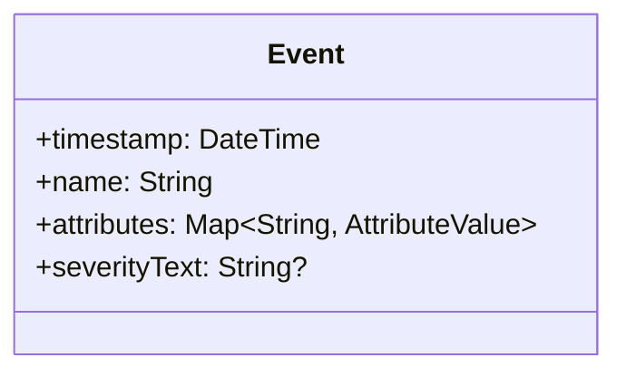

# OpenTelemetry 事件(Events)

## 介绍

OpenTelemetry中的**事件(Events)**是离散的时间点记录，用于描述系统中发生的特定时刻的活动。与持续性的指标(Metrics)或详细的跟踪(Traces)不同，事件是独立的、带有时间戳的数据点，通常包含额外的上下文信息（称为属性）。例如：
- 用户登录/注销
- 订单支付成功
- 系统配置变更

事件帮助开发者快速定位关键时间点的问题或行为，是分布式系统可观测性的重要组成部分。

## 基本概念

### 事件的结构
每个事件包含以下核心字段：
1. **时间戳**：事件发生的精确时间
2. **名称**：描述性标识（如 `user.login`）
3. **属性**（可选）：键值对形式的附加数据
4. **严重级别**（可选）：如 `INFO`, `ERROR` 等



### 与日志(Logs)的区别
:::note
事件 vs 日志：
- **事件**：结构化的业务相关时间点记录
- **日志**：通常是文本形式的操作记录，可能包含非结构化数据
:::

## 代码示例

### 记录事件（Python示例）

```python
from opentelemetry import trace
from opentelemetry.sdk.trace import TracerProvider

# 初始化
provider = TracerProvider()
trace.set_tracer_provider(provider)
tracer = trace.get_tracer("events.example")

# 创建带有事件的span
with tracer.start_as_current_span("checkout") as span:
    # 添加事件
    span.add_event("payment.received", attributes={
        "payment.method": "credit_card",
        "amount": 99.99,
        "currency": "USD"
    })
```

### 输出结果
在Jaeger等可视化工具中，你会看到：
1. 名为 `checkout` 的span
2. 其中包含 `payment.received` 事件
3. 显示所有关联的属性数据

## 实际应用场景

### 案例1：用户注册流程
```python
with tracer.start_as_current_span("user.registration") as span:
    try:
        user = create_user(request)
        span.add_event("user.created", attributes={
            "user.id": user.id,
            "auth.method": "email"
        })
    except Exception as e:
        span.add_event("registration.failed", attributes={
            "error": str(e),
            "input": str(request.data)
        })
        raise
```

### 案例2：微服务通信
当服务A调用服务B时：
```go
// Go语言示例
span := trace.SpanFromContext(ctx)
span.AddEvent("service.call.initiated", trace.WithAttributes(
    attribute.String("target.service", "inventory"),
    attribute.String("api.endpoint", "/stock/check"),
))
```

## 最佳实践

:::tip 事件记录建议
1. **命名规范**：使用`domain.action`格式（如 `cart.checkout`）
2. **属性限制**：避免敏感数据，控制属性数量（通常`<10`个）
3. **错误处理**：为失败操作记录专门的事件类型
4. **采样策略**：对高频事件实施采样避免数据过载
:::

## 总结

OpenTelemetry事件提供了：
- 关键业务时刻的可视化能力
- 精确的问题诊断时间锚点
- 跨服务/组件的关联上下文

## 扩展资源

1. [OpenTelemetry官方文档 - 事件规范](https://opentelemetry.io/docs/concepts/signals/events/)
2. 练习：在现有项目中添加3种不同类型的事件记录
3. 进阶：探索如何将事件与指标(Metrics)关联分析