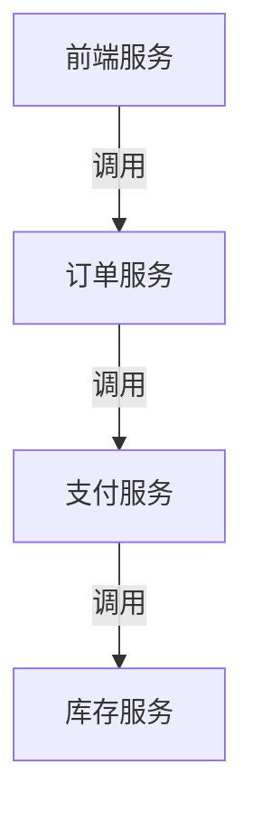

## 介绍

在分布式系统中，当我们需要监控和追踪应用程序行为时，**资源(Resource)**是OpenTelemetry的核心概念之一。资源代表生成遥测数据(telemetry data)的实体，它描述了数据来源的基础设施信息。

:::tip 简单理解
想象资源就像是一份"身份证"，它告诉观测系统："这些数据是由哪个服务/主机/环境产生的"。
:::

## 资源的基本组成

OpenTelemetry资源由一组**属性(Attributes)**构成，这些属性是键值对(key-value pairs)，用于描述资源的特征。常见的属性包括：

- `service.name`：服务名称
- `service.version`：服务版本
- `host.name`：主机名
- `cloud.provider`：云服务提供商

## 资源属性示例

以下是一个典型的资源定义示例（使用Python SDK）：

```python
from opentelemetry.sdk.resources import Resource

resource = Resource.create({
    "service.name": "payment-service",
    "service.version": "1.2.3",
    "host.name": "payment-host-42",
    "cloud.provider": "aws",
    "cloud.region": "us-west-2"
})
```

## 资源在实践中的作用

### 1. 数据关联
资源信息会附加到所有生成的遥测数据上，使得我们可以：
- 区分不同环境的相同服务
- 识别特定主机的问题
- 按云区域聚合指标

### 2. 资源检测(Resource Detection)
OpenTelemetry可以自动检测环境信息：

```python
from opentelemetry.sdk.resources import ResourceDetector
from opentelemetry.semconv.resource import ResourceAttributes

class CustomResourceDetector(ResourceDetector):
    def detect(self) -> Resource:
        return Resource({
            ResourceAttributes.SERVICE_NAME: "my-service",
            "custom.attribute": "value"
        })
```

## 实际应用场景

假设一个电商系统有以下组件：



每个服务的资源定义可能如下：

```go
// 订单服务资源定义
resource := resource.NewWithAttributes(
    semconv.SchemaURL,
    semconv.ServiceNameKey.String("order-service"),
    semconv.ServiceVersionKey.String("v1.3.0"),
    semconv.HostNameKey.String("k8s-node-7"),
    semconv.K8SPodNameKey.String("order-service-pod-xyz"),
)
```

## 资源合并策略

当多个资源被检测到（如环境变量+代码指定+自动检测），OpenTelemetry会按以下优先级合并：

1. 代码中明确指定的资源
2. 环境变量配置的资源
3. 自动检测的资源

合并时会保留更高优先级的属性，不会重复。

## 总结

- 资源是OpenTelemetry中标识遥测数据来源的元数据
- 通过属性键值对描述基础设施信息
- 支持自动检测和手动配置
- 对分布式系统的观测至关重要

## 延伸学习

1. 尝试在你的开发环境中配置资源检测
2. 比较不同服务间的资源属性差异
3. 研究如何通过资源信息过滤监控数据

:::note 练习
创建一个包含以下信息的资源：
- 服务名称：user-profile
- 版本：2.1.0
- 运行在Azure云上
- 区域为east-us
:::