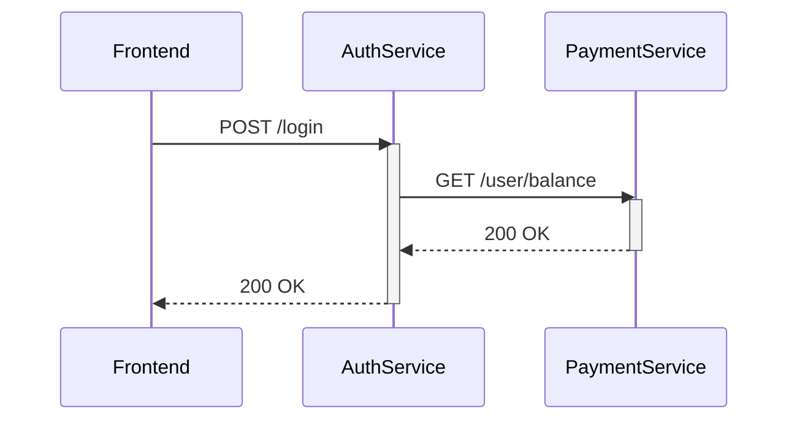

# OpenTelemetry 语义约定

## 介绍

OpenTelemetry语义约定是一组预定义的标准化命名规则，用于描述分布式系统中的**资源(Resources)**、**属性(Attributes)**和**事件(Events)**。它们确保不同团队和工具产生的遥测数据具有一致的格式，使得数据能够被正确解析和关联。

:::tip 为什么需要语义约定？
想象两个服务分别用 `user_id` 和 `userId` 记录用户标识符。没有统一约定时，分析工具会认为这是两个不同的字段！
:::

## 核心概念

### 1. 资源语义约定
描述基础设施实体的元数据，例如：

```go
resource := resource.NewWithAttributes(
    semconv.SchemaURL,
    semconv.ServiceNameKey.String("payment-service"),
    semconv.ServiceVersionKey.String("v1.2.3"),
    semconv.ServiceInstanceIDKey.String("instance-1"),
)
```

### 2. HTTP约定
标准化的HTTP请求字段：

| 属性名 | 示例值 | 说明 |
|--------|--------|------|
| `http.method` | `GET` | HTTP动词 |
| `http.route` | `/users/:id` | 路由模板 |

### 3. 数据库约定
统一数据库操作记录：

```python
tracer.start_as_current_span("db.query", attributes={
    "db.system": "postgresql",
    "db.statement": "SELECT * FROM users",
    "db.operation": "SELECT",
})
```

## 实际案例

### 电商系统追踪示例


对应的语义属性：
- AuthService记录：`http.method="POST"`, `http.route="/login"`
- PaymentService记录：`db.system="mysql"`, `db.operation="SELECT"`

## 自定义约定指南

当标准约定不满足需求时：

1. 优先检查[官方语义约定列表](https://opentelemetry.io/docs/specs/semconv/)
2. 自定义属性应添加前缀避免冲突：
   ```java
   attributes.put("com.mycompany.order.priority", "high");
   ```
3. 在项目文档中明确记录自定义约定

:::caution 警告
避免过度自定义属性，这可能导致后续分析困难
:::

## 总结

关键要点：
- 语义约定确保跨系统的数据一致性
- 覆盖常见技术栈的标准字段（HTTP/DB/RPC等）
- 自定义属性需谨慎并明确文档化

## 扩展练习

1. 在本地OpenTelemetry Collector中配置一个处理器，重命名不符合语义约定的属性
2. 对比使用约定前后，Jaeger界面中的属性显示差异
3. 尝试为你的技术栈查找对应的语义约定（如gRPC/Kafka）

## 附加资源

- [官方语义约定规范](https://github.com/open-telemetry/semantic-conventions)
- [语义约定版本管理指南](https://opentelemetry.io/docs/specs/otel/versioning-and-stability/)
- [社区贡献的新约定提案流程](https://github.com/open-telemetry/semantic-conventions/blob/main/CONTRIBUTING.md)